# 🔐 Supabase Permission Error

**Chat ID:** `82b8353d-53c4-478d-b38f-af2cd563fa54`
**Created At:** 1970-01-21 09:06:28
**Updated At:** 1970-01-21 09:06:34

## Chat History

### User:
✗ Error inserting to Supabase: {'message': 'permission denied for table products', 'code': '42501', 'hint': None, 'details': None}

#### Attached Files:
- [optimus_v2.py](/api/v1/files/6c7253a7-014e-4dee-a31e-a560d5d0ff63)
- [requirements.txt](/api/v1/files/2e6f8c79-560d-487f-8e3f-c2167493b0e4)

### Assistant:
<glm_block view="" tool_call_name="open_url">{"type": "mcp", "data": {"metadata": {"id": "call_vsf751rnklh", "name": "open_url", "arguments": "{\"urls\":[\"https://supabase.com/docs/reference/javascript/upsert\"]}", "result": "[ref_id=turn0view0\u2020supabase.com\u2020https://supabase.com/docs/reference/javascript/upsert]\n**viewing lines [0-812] of 2098**\nL0: [DOCS](id=0)\nL1: * [Start](id=1)\nL2: * Products\nL3: * Build\nL4: * Manage\nL5: * Reference\nL6: * Resources\nL7: [DOCS](id=2)\nL8: Search docs...\nL9: KMain menuJavaScriptv2.0\nL10: * [Introduction](id=3)\nL11: * [Installing](id=4)\nL12: * [Initializing](id=5)\nL13: * [TypeScript support](id=6)\nL14: * ---\nL15: Database\nL16: + [Fetch data](id=7)\nL17: + [Insert data](id=8)\nL18: + [Update data](id=9)\nL19: + [Upsert data](id=10)\nL20: + [Delete data](id=11)\nL21: + [Call a Postgres function](id=12)\nL22: + Using filters\nL23: + Using modifiers\nL24: * ---\nL25: Auth\nL26: + [Overview](id=13)\nL27: + [Create a new user](id=14)\nL28: + [Listen to auth events](id=15)\nL29: + [Create an anonymous user](id=16)\nL30: + [Sign in a user](id=17)\nL31: + [Sign in with ID token (native sign-in)](id=18)\nL32: + [Sign in a user through OTP](id=19)\nL33: + [Sign in a user through OAuth](id=20)\nL34: + [Sign in a user through SSO](id=21)\nL35: + [Sign in a user through Web3 (Solana, Ethereum)](id=22)\nL36: + [Get user claims from verified JWT](id=23)\nL37: + [Sign out a user](id=24)\nL38: + [Send a password reset request](id=25)\nL39: + [Verify and log in through OTP](id=26)\nL40: + [Retrieve a session](id=27)\nL41: + [Retrieve a new session](id=28)\nL42: + [Retrieve a user](id=29)\nL43: + [Update a user](id=30)\nL44: + [Retrieve identities linked to a user](id=31)\nL45: + [Link an identity to a user](id=32)\nL46: + [Unlink an identity from a user](id=33)\nL47: + [Send a password reauthentication nonce](id=34)\nL48: + [Resend an OTP](id=35)\nL49: + [Set the session data](id=36)\nL50: + [Exchange an auth code for a session](id=37)\nL51: + [Start auto-refresh session (non-browser)](id=38)\nL52: + [Stop auto-refresh session (non-browser)](id=39)\nL53: + Auth MFA\nL54: + Auth Admin\nL55: * ---\nL56: Edge Functions\nL57: + [Invokes a Supabase Edge Function.](id=40)\nL58: * ---\nL59: Realtime\nL60: + [Subscribe to channel](id=41)\nL61: + [Unsubscribe from a channel](id=42)\nL62: + [Unsubscribe from all channels](id=43)\nL63: + [Retrieve all channels](id=44)\nL64: + [Broadcast a message](id=45)\nL65: * ---\nL66: Storage\nL67: + [Create a bucket](id=46)\nL68: + [Retrieve a bucket](id=47)\nL69: + [List all buckets](id=48)\nL70: + [Update a bucket](id=49)\nL71: + [Delete a bucket](id=50)\nL72: + [Empty a bucket](id=51)\nL73: + [Upload a file](id=52)\nL74: + [Download a file](id=53)\nL75: + [List all files in a bucket](id=54)\nL76: + [Replace an existing file](id=55)\nL77: + [Move an existing file](id=56)\nL78: + [Copy an existing file](id=57)\nL79: + [Delete files in a bucket](id=58)\nL80: + [Create a signed URL](id=59)\nL81: + [Create signed URLs](id=60)\nL82: + [Create signed upload URL](id=61)\nL83: + [Upload to a signed URL](id=62)\nL84: + [Retrieve public URL](id=63)\nL85: [DOCS](id=64)\nL86: * [Start](id=65)\nL87: * Products\nL88: * Build\nL89: * Manage\nL90: * Reference\nL91: * Resources\nL92: [DOCS](id=66)\nL93: Search docs...\nL94: KJavascript Reference v2.0\nL95: # JavaScript Client Library\nL96: @supabase/supabase-js[View on GitHub](id=67)\nL97: This reference documents every object and method available in Supabase's isomorphic JavaScript library, `supabase-js`. You can use `supabase-js` to interact with your Postgres database, listen to database changes, invoke Deno Edge Functions, build login and user management functionality, and manage large files.\nL98: To convert SQL queries to `supabase-js` calls, use the [SQL to REST API translator](id=68).\nL99: ---\nL100: ## Installing\nL101: ### Install as package#\nL102: You can install @supabase/supabase-js via the terminal.\nL103: npmYarnpnpm\nL104: ```\nL105: 1npm install @supabase/supabase-js\nL106: ```\nL107: ### Install via CDN#\nL108: You can install @supabase/supabase-js via CDN links.\nL109: ```\nL110: 123<script src=\"https://cdn.jsdelivr.net/npm/@supabase/supabase-js@2\"></script>//or<script src=\"https://unpkg.com/@supabase/supabase-js@2\"></script>\nL111: ```\nL112: ### Use at runtime in Deno#\nL113: You can use supabase-js in the Deno runtime via [JSR](id=69):\nL114: ```\nL115: 1import { createClient } from 'npm:@supabase/supabase-js@2'\nL116: ```\nL117: ---\nL118: ## Initializing\nL119: Create a new client for use in the browser.\nL120: You can initialize a new Supabase client using the `createClient()` method.\nL121: The Supabase client is your entrypoint to the rest of the Supabase functionality and is the easiest way to interact with everything we offer within the Supabase ecosystem.\nL122: ### Parameters\nL123: * supabaseUrlRequiredstring\nL124: The unique Supabase URL which is supplied when you create a new project in your project dashboard.\nL125: * supabaseKeyRequiredstring\nL126: The unique Supabase Key which is supplied when you create a new project in your project dashboard.\nL127: * optionsOptionalSupabaseClientOptionsDetails\nL128: Creating a clientWith a custom domainWith additional parametersWith custom schemasCustom fetch implementationReact Native options with AsyncStorageReact Native options with Expo SecureStore\nL129: ```\nL130: 1234import { createClient } from '@supabase/supabase-js'// Create a single supabase client for interacting with your databaseconst supabase = createClient('https://xyzcompany.supabase.co', 'publishable-or-anon-key')\nL131: ```\nL132: ---\nL133: ## TypeScript support\nL134: `supabase-js` has TypeScript support for type inference, autocompletion, type-safe queries, and more.\nL135: With TypeScript, `supabase-js` detects things like `not null` constraints and [generated columns](id=70). Nullable columns are typed as `T | null` when you select the column. Generated columns will show a type error when you insert to it.\nL136: `supabase-js` also detects relationships between tables. A referenced table with one-to-many relationship is typed as `T[]`. Likewise, a referenced table with many-to-one relationship is typed as `T | null`.\nL137: ## Generating TypeScript Types#\nL138: You can use the Supabase CLI to [generate the types](id=71). You can also generate the types [from the dashboard](id=72).\nL139: ```\nL140: 1supabase gen types typescript --project-id abcdefghijklmnopqrst > database.types.ts\nL141: ```\nL142: These types are generated from your database schema. Given a table `public.movies`, the generated types will look like:\nL143: ```\nL144: 12345create table public.movies (  id bigint generated always as identity primary key,  name text not null,  data jsonb null);\nL145: ```\nL146: ```\nL147: 12345678910111213141516171819202122232425export type Json = string | number | boolean | null | { [key: string]: Json | undefined } | Json[]export interface Database {  public: {    Tables: {      movies: {        Row: {               // the data expected from .select()          id: number          name: string          data: Json | null        }        Insert: {            // the data to be passed to .insert()          id?: never         // generated columns must not be supplied          name: string       // `not null` columns with no default must be supplied          data?: Json | null // nullable columns can be omitted        }        Update: {            // the data to be passed to .update()          id?: never          name?: string      // `not null` columns are optional on .update()          data?: Json | null        }      }    }  }}\nL148: ```\nL149: ## Using TypeScript type definitions#\nL150: You can supply the type definitions to `supabase-js` like so:\nL151: ```\nL152: 1234567import { createClient } from '@supabase/supabase-js'import { Database } from './database.types'const supabase = createClient<Database>(  process.env.SUPABASE_URL,  process.env.SUPABASE_ANON_KEY)\nL153: ```\nL154: ## Helper types for Tables and Joins#\nL155: You can use the following helper types to make the generated TypeScript types easier to use.\nL156: Sometimes the generated types are not what you expect. For example, a view's column may show up as nullable when you expect it to be `not null`. Using [type-fest](id=73), you can override the types like so:\nL157: ```\nL158: 12345export type Json = // ...export interface Database {  // ...}\nL159: ```\nL160: ```\nL161: 1234567891011121314151617181920import { MergeDeep } from 'type-fest'import { Database as DatabaseGenerated } from './database-generated.types'export { Json } from './database-generated.types'// Override the type for a specific column in a view:export type Database = MergeDeep<  DatabaseGenerated,  {    public: {      Views: {        movies_view: {          Row: {            // id is a primary key in public.movies, so it must be `not null`            id: number          }        }      }    }  }>\nL162: ```\nL163: You can also override the type of an individual successful response if needed:\nL164: ```\nL165: 123456789// Partial type override allows you to only override some of the properties in your resultsconst { data } = await supabase.from('countries').select().overrideTypes<Array<{ id: string }>>()// For a full replacement of the original return type use the `{ merge: false }` property as second argumentconst { data } = await supabase  .from('countries')  .select()  .overrideTypes<Array<{ id: string }>, { merge: false }>()// Use it with `maybeSingle` or `single`const { data } = await supabase.from('countries').select().single().overrideTypes<{ id: string }>()\nL166: ```\nL167: The generated types provide shorthands for accessing tables and enums.\nL168: ```\nL169: 1234567import { Database, Tables, Enums } from \"./database.types.ts\";// Before \ud83d\ude15let movie: Database['public']['Tables']['movies']['Row'] = // ...// After \ud83d\ude0dlet movie: Tables<'movies'>\nL170: ```\nL171: ### Response types for complex queries#\nL172: `supabase-js` always returns a `data` object (for success), and an `error` object (for unsuccessful requests).\nL173: These helper types provide the result types from any query, including nested types for database joins.\nL174: Given the following schema with a relation between cities and countries, we can get the nested `CountriesWithCities` type:\nL175: ```\nL176: 12345678910create table countries (  \"id\" serial primary key,  \"name\" text);create table cities (  \"id\" serial primary key,  \"name\" text,  \"country_id\" int references \"countries\");\nL177: ```\nL178: ```\nL179: 1234567891011121314151617import { QueryResult, QueryData, QueryError } from '@supabase/supabase-js'const countriesWithCitiesQuery = supabase  .from(\"countries\")  .select(`    id,    name,    cities (      id,      name    )  `);type CountriesWithCities = QueryData<typeof countriesWithCitiesQuery>;const { data, error } = await countriesWithCitiesQuery;if (error) throw error;const countriesWithCities: CountriesWithCities = data;\nL180: ```\nL181: ---\nL182: ## Fetch data\nL183: Perform a SELECT query on the table or view.\nL184: * By default, Supabase projects return a maximum of 1,000 rows. This setting can be changed in your project's [API settings](id=74). It's recommended that you keep it low to limit the payload size of accidental or malicious requests. You can use `range()` queries to paginate through your data.\nL185: * `select()` can be combined with [Filters](id=75)\nL186: * `select()` can be combined with [Modifiers](id=76)\nL187: * `apikey` is a reserved keyword if you're using the [Supabase Platform](id=77) and [should be avoided as a column name](id=78).\nL188: ### Parameters\nL189: * columnsOptionalQuery\nL190: The columns to retrieve, separated by commas. Columns can be renamed when returned with `customName:columnName`\nL191: * optionsOptionalobject\nL192: Named parameters\nL193: Details\nL194: Getting your dataSelecting specific columnsQuery referenced tablesQuery referenced tables with spaces in their namesQuery referenced tables through a join tableQuery the same referenced table multiple timesQuery nested foreign tables through a join tableFiltering through referenced tablesQuerying referenced table with countQuerying with count optionQuerying JSON dataQuerying referenced table with inner joinSwitching schemas per query\nL195: ```\nL196: 123const { data, error } = await supabase  .from('characters')  .select()\nL197: ```\nL198: Data sourceResponse\nL199: ---\nL200: ## Insert data\nL201: ### Parameters\nL202: * valuesRequiredOne of the following optionsDetails\nL203: + Option 1Row\nL204: + Option 2Array<Row>\nL205: * optionsOptionalobjectDetails\nL206: Create a recordCreate a record and return itBulk create\nL207: ```\nL208: 123const { error } = await supabase  .from('countries')  .insert({ id: 1, name: 'Mordor' })\nL209: ```\nL210: Data sourceResponse\nL211: ---\nL212: ## Update data\nL213: Perform an UPDATE on the table or view.\nL214: By default, updated rows are not returned. To return it, chain the call with `.select()` after filters.\nL215: * `update()` should always be combined with [Filters](id=79) to target the item(s) you wish to update.\nL216: ### Parameters\nL217: * valuesRequiredRow\nL218: The values to update with\nL219: * optionsRequiredobject\nL220: Named parameters\nL221: Details\nL222: Updating your dataUpdate a record and return itUpdating JSON data\nL223: ```\nL224: 1234const { error } = await supabase  .from('instruments')  .update({ name: 'piano' })  .eq('id', 1)\nL225: ```\nL226: Data sourceResponse\nL227: ---\nL228: ## Upsert data\nL229: * Primary keys must be included in `values` to use upsert.\nL230: ### Parameters\nL231: * valuesRequiredOne of the following optionsDetails\nL232: + Option 1Row\nL233: + Option 2Array<Row>\nL234: * optionsOptionalobjectDetails\nL235: Upsert your dataBulk Upsert your dataUpserting into tables with constraints\nL236: ```\nL237: 1234const { data, error } = await supabase  .from('instruments')  .upsert({ id: 1, name: 'piano' })  .select()\nL238: ```\nL239: Data sourceResponse\nL240: ---\nL241: ## Delete data\nL242: Perform a DELETE on the table or view.\nL243: By default, deleted rows are not returned. To return it, chain the call with `.select()` after filters.\nL244: * `delete()` should always be combined with [filters](id=80) to target the item(s) you wish to delete.\nL245: * If you use `delete()` with filters and you have [RLS](id=81) enabled, only rows visible through `SELECT` policies are deleted. Note that by default no rows are visible, so you need at least one `SELECT`/`ALL` policy that makes the rows visible.\nL246: * When using `delete().in()`, specify an array of values to target multiple rows with a single query. This is particularly useful for batch deleting entries that share common criteria, such as deleting users by their IDs. Ensure that the array you provide accurately represents all records you intend to delete to avoid unintended data removal.\nL247: ### Parameters\nL248: * optionsRequiredobject\nL249: Named parameters\nL250: Details\nL251: Delete a single recordDelete a record and return itDelete multiple records\nL252: ```\nL253: 1234const response = await supabase  .from('countries')  .delete()  .eq('id', 1)\nL254: ```\nL255: Data sourceResponse\nL256: ---\nL257: ## Call a Postgres function\nL258: Perform a function call.\nL259: You can call Postgres functions as *Remote Procedure Calls*, logic in your database that you can execute from anywhere. Functions are useful when the logic rarely changes\u2014like for password resets and updates.\nL260: ```\nL261: 123create or replace function hello_world() returns text as $$  select 'Hello world';$$ language sql;\nL262: ```\nL263: To call Postgres functions on [Read Replicas](id=82), use the `get: true` option.\nL264: ### Parameters\nL265: * fnRequiredFnName\nL266: The function name to call\nL267: * argsRequiredArgs\nL268: The arguments to pass to the function call\nL269: * optionsRequiredobject\nL270: Named parameters\nL271: Details\nL272: Call a Postgres function without argumentsCall a Postgres function with argumentsBulk processingCall a Postgres function with filtersCall a read-only Postgres function\nL273: ```\nL274: 1const { data, error } = await supabase.rpc('hello_world')\nL275: ```\nL276: Data sourceResponse\nL277: ---\nL278: ## Using filters\nL279: Filters allow you to only return rows that match certain conditions.\nL280: Filters can be used on `select()`, `update()`, `upsert()`, and `delete()` queries.\nL281: If a Postgres function returns a table response, you can also apply filters.\nL282: Applying FiltersChainingConditional ChainingFilter by values within a JSON columnFilter referenced tables\nL283: ```\nL284: 123456789const { data, error } = await supabase  .from('instruments')  .select('name, section_id')  .eq('name', 'violin')    // Correctconst { data, error } = await supabase  .from('instruments')  .eq('name', 'violin')    // Incorrect  .select('name, section_id')\nL285: ```\nL286: Notes\nL287: ---\nL288: ## Column is equal to a value\nL289: Match only rows where `column` is equal to `value`.\nL290: To check if the value of `column` is NULL, you should use `.is()` instead.\nL291: ### Parameters\nL292: * columnRequiredColumnName\nL293: The column to filter on\nL294: * valueRequired\nL295: The value to filter with\nL296: ### Return Type\nL297: thisWith `select()`\nL298: ```\nL299: 1234const { data, error } = await supabase  .from('characters')  .select()  .eq('name', 'Leia')\nL300: ```\nL301: Data sourceResponse\nL302: ---\nL303: ## Column is not equal to a value\nL304: Match only rows where `column` is not equal to `value`.\nL305: ### Parameters\nL306: * columnRequiredColumnName\nL307: The column to filter on\nL308: * valueRequired\nL309: The value to filter with\nL310: ### Return Type\nL311: thisWith `select()`\nL312: ```\nL313: 1234const { data, error } = await supabase  .from('characters')  .select()  .neq('name', 'Leia')\nL314: ```\nL315: Data sourceResponse\nL316: ---\nL317: ## Column is greater than a value\nL318: ### Parameters\nL319: * columnRequiredOne of the following optionsDetails\nL320: + Option 1ColumnName\nL321: + Option 2string\nL322: * valueRequiredOne of the following optionsDetails\nL323: + Option 1Row['ColumnName']\nL324: + Option 2unknown\nL325: ### Return Type\nL326: thisWith `select()`\nL327: ```\nL328: 1234const { data, error } = await supabase  .from('characters')  .select()  .gt('id', 2)\nL329: ```\nL330: Data sourceResponseNotes\nL331: ---\nL332: ## Column is greater than or equal to a value\nL333: ### Parameters\nL334: * columnRequiredOne of the following optionsDetails\nL335: + Option 1ColumnName\nL336: + Option 2string\nL337: * valueRequiredOne of the following optionsDetails\nL338: + Option 1Row['ColumnName']\nL339: + Option 2unknown\nL340: ### Return Type\nL341: thisWith `select()`\nL342: ```\nL343: 1234const { data, error } = await supabase  .from('characters')  .select()  .gte('id', 2)\nL344: ```\nL345: Data sourceResponse\nL346: ---\nL347: ## Column is less than a value\nL348: ### Parameters\nL349: * columnRequiredOne of the following optionsDetails\nL350: + Option 1ColumnName\nL351: + Option 2string\nL352: * valueRequiredOne of the following optionsDetails\nL353: + Option 1Row['ColumnName']\nL354: + Option 2unknown\nL355: ### Return Type\nL356: thisWith `select()`\nL357: ```\nL358: 1234const { data, error } = await supabase  .from('characters')  .select()  .lt('id', 2)\nL359: ```\nL360: Data sourceResponse\nL361: ---\nL362: ## Column is less than or equal to a value\nL363: ### Parameters\nL364: * columnRequiredOne of the following optionsDetails\nL365: + Option 1ColumnName\nL366: + Option 2string\nL367: * valueRequiredOne of the following optionsDetails\nL368: + Option 1Row['ColumnName']\nL369: + Option 2unknown\nL370: ### Return Type\nL371: thisWith `select()`\nL372: ```\nL373: 1234const { data, error } = await supabase  .from('characters')  .select()  .lte('id', 2)\nL374: ```\nL375: Data sourceResponse\nL376: ---\nL377: ## Column matches a pattern\nL378: ### Parameters\nL379: * columnRequiredOne of the following optionsDetails\nL380: + Option 1ColumnName\nL381: + Option 2string\nL382: * patternRequiredstring\nL383: ### Return Type\nL384: thisWith `select()`\nL385: ```\nL386: 1234const { data, error } = await supabase  .from('characters')  .select()  .like('name', '%Lu%')\nL387: ```\nL388: Data sourceResponse\nL389: ---\nL390: ## Column matches a case-insensitive pattern\nL391: ### Parameters\nL392: * columnRequiredOne of the following optionsDetails\nL393: + Option 1ColumnName\nL394: + Option 2string\nL395: * patternRequiredstring\nL396: ### Return Type\nL397: thisWith `select()`\nL398: ```\nL399: 1234const { data, error } = await supabase  .from('characters')  .select()  .ilike('name', '%lu%')\nL400: ```\nL401: Data sourceResponse\nL402: ---\nL403: ## Column is a value\nL404: ### Parameters\nL405: * columnRequiredOne of the following optionsDetails\nL406: + Option 1ColumnName\nL407: + Option 2string\nL408: * valueRequiredOne of the following optionsDetails\nL409: + Option 1null\nL410: + Option 2boolean\nL411: ### Return Type\nL412: thisChecking for nullness, true or false\nL413: ```\nL414: 1234const { data, error } = await supabase  .from('countries')  .select()  .is('name', null)\nL415: ```\nL416: Data sourceResponseNotes\nL417: ---\nL418: ## Column is in an array\nL419: Match only rows where `column` is included in the `values` array.\nL420: ### Parameters\nL421: * columnRequiredColumnName\nL422: The column to filter on\nL423: * valuesRequiredArray\nL424: The values array to filter with\nL425: ### Return Type\nL426: thisWith `select()`\nL427: ```\nL428: 1234const { data, error } = await supabase  .from('characters')  .select()  .in('name', ['Leia', 'Han'])\nL429: ```\nL430: Data sourceResponse\nL431: ---\nL432: ## Column contains every element in a value\nL433: ### Parameters\nL434: * columnRequiredOne of the following optionsDetails\nL435: + Option 1ColumnName\nL436: + Option 2string\nL437: * valueRequiredOne of the following optionsDetails\nL438: + Option 1string\nL439: + Option 2Record<string, unknown>\nL440: + Option 3Array<Row['ColumnName']>\nL441: + Option 4Array<unknown>\nL442: ### Return Type\nL443: thisOn array columnsOn range columnsOn `jsonb` columns\nL444: ```\nL445: 1234const { data, error } = await supabase  .from('issues')  .select()  .contains('tags', ['is:open', 'priority:low'])\nL446: ```\nL447: Data sourceResponse\nL448: ---\nL449: ## Contained by value\nL450: ### Parameters\nL451: * columnRequiredOne of the following optionsDetails\nL452: + Option 1ColumnName\nL453: + Option 2string\nL454: * valueRequiredOne of the following optionsDetails\nL455: + Option 1string\nL456: + Option 2Record<string, unknown>\nL457: + Option 3Array<Row['ColumnName']>\nL458: + Option 4Array<unknown>\nL459: ### Return Type\nL460: thisOn array columnsOn range columnsOn `jsonb` columns\nL461: ```\nL462: 1234const { data, error } = await supabase  .from('classes')  .select('name')  .containedBy('days', ['monday', 'tuesday', 'wednesday', 'friday'])\nL463: ```\nL464: Data sourceResponse\nL465: ---\nL466: ## Greater than a range\nL467: ### Parameters\nL468: * columnRequiredOne of the following optionsDetails\nL469: + Option 1ColumnName\nL470: + Option 2string\nL471: * rangeRequiredstring\nL472: ### Return Type\nL473: thisWith `select()`\nL474: ```\nL475: 1234const { data, error } = await supabase  .from('reservations')  .select()  .rangeGt('during', '[2000-01-02 08:00, 2000-01-02 09:00)')\nL476: ```\nL477: Data sourceResponseNotes\nL478: ---\nL479: ## Greater than or equal to a range\nL480: ### Parameters\nL481: * columnRequiredOne of the following optionsDetails\nL482: + Option 1ColumnName\nL483: + Option 2string\nL484: * rangeRequiredstring\nL485: ### Return Type\nL486: thisWith `select()`\nL487: ```\nL488: 1234const { data, error } = await supabase  .from('reservations')  .select()  .rangeGte('during', '[2000-01-02 08:30, 2000-01-02 09:30)')\nL489: ```\nL490: Data sourceResponseNotes\nL491: ---\nL492: ## Less than a range\nL493: ### Parameters\nL494: * columnRequiredOne of the following optionsDetails\nL495: + Option 1ColumnName\nL496: + Option 2string\nL497: * rangeRequiredstring\nL498: ### Return Type\nL499: thisWith `select()`\nL500: ```\nL501: 1234const { data, error } = await supabase  .from('reservations')  .select()  .rangeLt('during', '[2000-01-01 15:00, 2000-01-01 16:00)')\nL502: ```\nL503: Data sourceResponseNotes\nL504: ---\nL505: ## Less than or equal to a range\nL506: ### Parameters\nL507: * columnRequiredOne of the following optionsDetails\nL508: + Option 1ColumnName\nL509: + Option 2string\nL510: * rangeRequiredstring\nL511: ### Return Type\nL512: thisWith `select()`\nL513: ```\nL514: 1234const { data, error } = await supabase  .from('reservations')  .select()  .rangeLte('during', '[2000-01-01 14:00, 2000-01-01 16:00)')\nL515: ```\nL516: Data sourceResponseNotes\nL517: ---\nL518: ## Mutually exclusive to a range\nL519: ### Parameters\nL520: * columnRequiredOne of the following optionsDetails\nL521: + Option 1ColumnName\nL522: + Option 2string\nL523: * rangeRequiredstring\nL524: ### Return Type\nL525: thisWith `select()`\nL526: ```\nL527: 1234const { data, error } = await supabase  .from('reservations')  .select()  .rangeAdjacent('during', '[2000-01-01 12:00, 2000-01-01 13:00)')\nL528: ```\nL529: Data sourceResponseNotes\nL530: ---\nL531: ## With a common element\nL532: ### Parameters\nL533: * columnRequiredOne of the following optionsDetails\nL534: + Option 1ColumnName\nL535: + Option 2string\nL536: * valueRequiredOne of the following optionsDetails\nL537: + Option 1string\nL538: + Option 2Array<Row['ColumnName']>\nL539: + Option 3Array<unknown>\nL540: ### Return Type\nL541: thisOn array columnsOn range columns\nL542: ```\nL543: 1234const { data, error } = await supabase  .from('issues')  .select('title')  .overlaps('tags', ['is:closed', 'severity:high'])\nL544: ```\nL545: Data sourceResponse\nL546: ---\nL547: ## Match a string\nL548: * For more information, see [Postgres full text search](id=83).\nL549: ### Parameters\nL550: * columnRequiredOne of the following optionsDetails\nL551: + Option 1ColumnName\nL552: + Option 2string\nL553: * queryRequiredstring\nL554: * optionsOptionalobjectDetails\nL555: ### Return Type\nL556: thisText searchBasic normalizationFull normalizationWebsearch\nL557: ```\nL558: 123456const result = await supabase  .from(\"texts\")  .select(\"content\")  .textSearch(\"content\", `'eggs' & 'ham'`, {    config: \"english\",  });\nL559: ```\nL560: Data sourceResponse\nL561: ---\nL562: ## Match an associated value\nL563: ### Parameters\nL564: * queryRequiredOne of the following optionsDetails\nL565: + Option 1Record<ColumnName, Row['ColumnName']>\nL566: + Option 2Record<string, unknown>\nL567: ### Return Type\nL568: thisWith `select()`\nL569: ```\nL570: 1234const { data, error } = await supabase  .from('characters')  .select('name')  .match({ id: 2, name: 'Leia' })\nL571: ```\nL572: Data sourceResponse\nL573: ---\nL574: ## Don't match the filter\nL575: not() expects you to use the raw PostgREST syntax for the filter values.\nL576: ```\nL577: 12.not('id', 'in', '(5,6,7)')  // Use `()` for `in` filter.not('arraycol', 'cs', '{\"a\",\"b\"}')  // Use `cs` for `contains()`, `{}` for array values\nL578: ```\nL579: ### Parameters\nL580: * columnRequiredOne of the following optionsDetails\nL581: + Option 1ColumnName\nL582: + Option 2string\nL583: * operatorRequiredOne of the following optionsDetails\nL584: + Option 1FilterOperator\nL585: + Option 2string\nL586: * valueRequiredOne of the following optionsDetails\nL587: + Option 1Row['ColumnName']\nL588: + Option 2unknown\nL589: ### Return Type\nL590: thisWith `select()`\nL591: ```\nL592: 1234const { data, error } = await supabase  .from('countries')  .select()  .not('name', 'is', null)\nL593: ```\nL594: Data sourceResponse\nL595: ---\nL596: ## Match at least one filter\nL597: Match only rows which satisfy at least one of the filters.\nL598: Unlike most filters, `filters` is used as-is and needs to follow [PostgREST syntax](id=84). You also need to make sure it's properly sanitized.\nL599: It's currently not possible to do an `.or()` filter across multiple tables.\nL600: or() expects you to use the raw PostgREST syntax for the filter names and values.\nL601: ```\nL602: 12.or('id.in.(5,6,7), arraycol.cs.{\"a\",\"b\"}')  // Use `()` for `in` filter, `{}` for array values and `cs` for `contains()`..or('id.in.(5,6,7), arraycol.cd.{\"a\",\"b\"}')  // Use `cd` for `containedBy()`\nL603: ```\nL604: ### Parameters\nL605: * filtersRequiredstring\nL606: The filters to use, following PostgREST syntax\nL607: * optionsRequiredobject\nL608: Named parameters\nL609: Details\nL610: ### Return Type\nL611: thisWith `select()`Use `or` with `and`Use `or` on referenced tables\nL612: ```\nL613: 1234const { data, error } = await supabase  .from('characters')  .select('name')  .or('id.eq.2,name.eq.Han')\nL614: ```\nL615: Data sourceResponse\nL616: ---\nL617: ## Match the filter\nL618: filter() expects you to use the raw PostgREST syntax for the filter values.\nL619: ```\nL620: 12.filter('id', 'in', '(5,6,7)')  // Use `()` for `in` filter.filter('arraycol', 'cs', '{\"a\",\"b\"}')  // Use `cs` for `contains()`, `{}` for array values\nL621: ```\nL622: ### Parameters\nL623: * columnRequiredOne of the following optionsDetails\nL624: + Option 1ColumnName\nL625: + Option 2string\nL626: * operatorRequiredOne of the following optionsDetails\nL627: + Option 1FilterOperator\nL628: + Option 2\"not.eq\"\nL629: + Option 3\"not.neq\"\nL630: + Option 4\"not.gt\"\nL631: + Option 5\"not.gte\"\nL632: + Option 6\"not.lt\"\nL633: + Option 7\"not.lte\"\nL634: + Option 8\"not.like\"\nL635: + Option 9\"not.ilike\"\nL636: + Option 10\"not.is\"\nL637: + Option 11\"not.in\"\nL638: + Option 12\"not.cs\"\nL639: + Option 13\"not.cd\"\nL640: + Option 14\"not.sl\"\nL641: + Option 15\"not.sr\"\nL642: + Option 16\"not.nxl\"\nL643: + Option 17\"not.nxr\"\nL644: + Option 18\"not.adj\"\nL645: + Option 19\"not.ov\"\nL646: + Option 20\"not.fts\"\nL647: + Option 21\"not.plfts\"\nL648: + Option 22\"not.phfts\"\nL649: + Option 23\"not.wfts\"\nL650: + Option 24string\nL651: * valueRequiredunknown\nL652: ### Return Type\nL653: thisWith `select()`On a referenced table\nL654: ```\nL655: 1234const { data, error } = await supabase  .from('characters')  .select()  .filter('name', 'in', '(\"Han\",\"Yoda\")')\nL656: ```\nL657: Data sourceResponse\nL658: ---\nL659: ## Using modifiers\nL660: Filters work on the row level\u2014they allow you to return rows that only match certain conditions without changing the shape of the rows. Modifiers are everything that don't fit that definition\u2014allowing you to change the format of the response (e.g., returning a CSV string).\nL661: Modifiers must be specified after filters. Some modifiers only apply for queries that return rows (e.g., `select()` or `rpc()` on a function that returns a table response).\nL662: ---\nL663: ## Return data after inserting\nL664: Perform a SELECT on the query result.\nL665: By default, `.insert()`, `.update()`, `.upsert()`, and `.delete()` do not return modified rows. By calling this method, modified rows are returned in `data`.\nL666: ### Parameters\nL667: * columnsOptionalQuery\nL668: The columns to retrieve, separated by commas\nL669: With `upsert()`\nL670: ```\nL671: 1234const { data, error } = await supabase  .from('characters')  .upsert({ id: 1, name: 'Han Solo' })  .select()\nL672: ```\nL673: Data sourceResponse\nL674: ---\nL675: ## Order the results\nL676: ### Parameters\nL677: * columnRequiredOne of the following optionsDetails\nL678: + Option 1ColumnName\nL679: + Option 2string\nL680: * optionsOptionalobjectDetails\nL681: ### Return Type\nL682: thisWith `select()`On a referenced tableOrder parent table by a referenced table\nL683: ```\nL684: 1234const { data, error } = await supabase  .from('characters')  .select('id, name')  .order('id', { ascending: false })\nL685: ```\nL686: Data sourceResponse\nL687: ---\nL688: ## Limit the number of rows returned\nL689: Limit the query result by `count`.\nL690: ### Parameters\nL691: * countRequirednumber\nL692: The maximum number of rows to return\nL693: * optionsRequiredobject\nL694: Named parameters\nL695: Details\nL696: ### Return Type\nL697: thisWith `select()`On a referenced table\nL698: ```\nL699: 1234const { data, error } = await supabase  .from('characters')  .select('name')  .limit(1)\nL700: ```\nL701: Data sourceResponse\nL702: ---\nL703: ## Limit the query to a range\nL704: Limit the query result by starting at an offset `from` and ending at the offset `to`. Only records within this range are returned. This respects the query order and if there is no order clause the range could behave unexpectedly. The `from` and `to` values are 0-based and inclusive: `range(1, 3)` will include the second, third and fourth rows of the query.\nL705: ### Parameters\nL706: * fromRequirednumber\nL707: The starting index from which to limit the result\nL708: * toRequirednumber\nL709: The last index to which to limit the result\nL710: * optionsRequiredobject\nL711: Named parameters\nL712: Details\nL713: ### Return Type\nL714: thisWith `select()`\nL715: ```\nL716: 1234const { data, error } = await supabase  .from('countries')  .select('name')  .range(0, 1)\nL717: ```\nL718: Data sourceResponse\nL719: ---\nL720: ## Set an abort signal\nL721: Set the AbortSignal for the fetch request.\nL722: You can use this to set a timeout for the request.\nL723: ### Parameters\nL724: * signalRequiredAbortSignal\nL725: The AbortSignal to use for the fetch request\nL726: ### Return Type\nL727: thisAborting requests in-flightSet a timeout\nL728: ```\nL729: 123456const ac = new AbortController()ac.abort()const { data, error } = await supabase  .from('very_big_table')  .select()  .abortSignal(ac.signal)\nL730: ```\nL731: ResponseNotes\nL732: ---\nL733: ## Retrieve one row of data\nL734: Return `data` as a single object instead of an array of objects.\nL735: Query result must be one row (e.g. using `.limit(1)`), otherwise this returns an error.\nL736: With `select()`\nL737: ```\nL738: 12345const { data, error } = await supabase  .from('characters')  .select('name')  .limit(1)  .single()\nL739: ```\nL740: Data sourceResponse\nL741: ---\nL742: ## Retrieve zero or one row of data\nL743: Return `data` as a single object instead of an array of objects.\nL744: Query result must be zero or one row (e.g. using `.limit(1)`), otherwise this returns an error.\nL745: With `select()`\nL746: ```\nL747: 12345const { data, error } = await supabase  .from('characters')  .select()  .eq('name', 'Katniss')  .maybeSingle()\nL748: ```\nL749: Data sourceResponse\nL750: ---\nL751: ## Retrieve as a CSV\nL752: Return `data` as a string in CSV format.\nL753: Return data as CSV\nL754: ```\nL755: 1234const { data, error } = await supabase  .from('characters')  .select()  .csv()\nL756: ```\nL757: Data sourceResponseNotes\nL758: ---\nL759: ## Override type of successful response\nL760: Override the type of the returned `data`.\nL761: * Deprecated: use overrideTypes method instead\nL762: Override type of successful responseOverride type of object response\nL763: ```\nL764: 1234const { data } = await supabase  .from('countries')  .select()  .returns<Array<MyType>>()\nL765: ```\nL766: Response\nL767: ---\nL768: ## Partially override or replace type of successful response\nL769: Override the type of the returned `data` field in the response.\nL770: Complete Override type of successful responseComplete Override type of object responsePartial Override type of successful responsePartial Override type of object response\nL771: ```\nL772: 1234const { data } = await supabase  .from('countries')  .select()  .overrideTypes<Array<MyType>, { merge: false }>()\nL773: ```\nL774: Response\nL775: ---\nL776: ## Using explain\nL777: Return `data` as the EXPLAIN plan for the query.\nL778: You need to enable the [db\\_plan\\_enabled](id=85) setting before using this method.\nL779: For debugging slow queries, you can get the [Postgres EXPLAIN execution plan](id=86) of a query using the `explain()` method. This works on any query, even for `rpc()` or writes.\nL780: Explain is not enabled by default as it can reveal sensitive information about your database. It's best to only enable this for testing environments but if you wish to enable it for production you can provide additional protection by using a `pre-request` function.\nL781: Follow the [Performance Debugging Guide](id=87) to enable the functionality on your project.\nL782: ### Parameters\nL783: * optionsRequiredobject\nL784: Named parameters\nL785: Details\nL786: ### Return Type\nL787: One of the following optionsDetails\nL788: * Option 1PostgrestBuilder\nL789: * Option 2PostgrestBuilder\nL790: Get the execution planGet the execution plan with analyze and verbose\nL791: ```\nL792: 1234const { data, error } = await supabase  .from('characters')  .select()  .explain()\nL793: ```\nL794: Data sourceResponseNotes\nL795: ---\nL796: ## Overview\nL797: * The auth methods can be accessed via the `supabase.auth` namespace.\nL798: * By default, the supabase client sets `persistSession` to true and attempts to store the session in local storage. When using the supabase client in an environment that doesn't support local storage, you might notice the following warning message being logged:\nL799: > No storage option exists to persist the session, which may result in unexpected behavior when using auth. If you want to set `persistSession` to true, please provide a storage option or you may set `persistSession` to false to disable this warning.\nL800: This warning message can be safely ignored if you're not using auth on the server-side. If you are using auth and you want to set `persistSession` to true, you will need to provide a custom storage implementation that follows [this interface](id=88).\nL801: * Any email links and one-time passwords (OTPs) sent have a default expiry of 24 hours. We have the following [rate limits](id=89) in place to guard against brute force attacks.\nL802: * The expiry of an access token can be set in the \"JWT expiry limit\" field in [your project's auth settings](id=90). A refresh token never expires and can only be used once.\nL803: Create auth clientCreate auth client (server-side)\nL804: ```\nL805: 123import { createClient } from '@supabase/supabase-js'const supabase = createClient(supabase_url, anon_key)\nL806: ```\nL807: ---\nL808: ## Create a new user\nL809: Creates a new user.\nL810: Be aware that if a user account exists in the system you may get back an error message that attempts to hide this information from the user. This method has support for PKCE via email signups. The PKCE flow cannot be used when autoconfirm is enabled.\nL811: * By default, the user needs to verify their email address before logging in. To turn this off, disable **Confirm email** in [your project](id=91).\nL812: * **Confirm email** determines if users need to confirm their email address after signing up.", "display_result": "", "duration": "999ms", "status": "completed", "is_error": false, "mcp_server": {"name": "mcp-server"}}, "thought": null, "ppt": null, "browser": {"refid": "", "url": "", "title": "", "content": "[ref_id=turn0view0\u2020supabase.com\u2020https://supabase.com/docs/reference/javascript/upsert]\n**viewing lines [0-812] of 2098**\nL0: [DOCS](id=0)\nL1: * [Start](id=1)\nL2: * Products\nL3: * Build\nL4: * Manage\nL5: * Reference\nL6: * Resources\nL7: [DOCS](id=2)\nL8: Search docs...\nL9: KMain menuJavaScriptv2.0\nL10: * [Introduction](id=3)\nL11: * [Installing](id=4)\nL12: * [Initializing](id=5)\nL13: * [TypeScript support](id=6)\nL14: * ---\nL15: Database\nL16: + [Fetch data](id=7)\nL17: + [Insert data](id=8)\nL18: + [Update data](id=9)\nL19: + [Upsert data](id=10)\nL20: + [Delete data](id=11)\nL21: + [Call a Postgres function](id=12)\nL22: + Using filters\nL23: + Using modifiers\nL24: * ---\nL25: Auth\nL26: + [Overview](id=13)\nL27: + [Create a new user](id=14)\nL28: + [Listen to auth events](id=15)\nL29: + [Create an anonymous user](id=16)\nL30: + [Sign in a user](id=17)\nL31: + [Sign in with ID token (native sign-in)](id=18)\nL32: + [Sign in a user through OTP](id=19)\nL33: + [Sign in a user through OAuth](id=20)\nL34: + [Sign in a user through SSO](id=21)\nL35: + [Sign in a user through Web3 (Solana, Ethereum)](id=22)\nL36: + [Get user claims from verified JWT](id=23)\nL37: + [Sign out a user](id=24)\nL38: + [Send a password reset request](id=25)\nL39: + [Verify and log in through OTP](id=26)\nL40: + [Retrieve a session](id=27)\nL41: + [Retrieve a new session](id=28)\nL42: + [Retrieve a user](id=29)\nL43: + [Update a user](id=30)\nL44: + [Retrieve identities linked to a user](id=31)\nL45: + [Link an identity to a user](id=32)\nL46: + [Unlink an identity from a user](id=33)\nL47: + [Send a password reauthentication nonce](id=34)\nL48: + [Resend an OTP](id=35)\nL49: + [Set the session data](id=36)\nL50: + [Exchange an auth code for a session](id=37)\nL51: + [Start auto-refresh session (non-browser)](id=38)\nL52: + [Stop auto-refresh session (non-browser)](id=39)\nL53: + Auth MFA\nL54: + Auth Admin\nL55: * ---\nL56: Edge Functions\nL57: + [Invokes a Supabase Edge Function.](id=40)\nL58: * ---\nL59: Realtime\nL60: + [Subscribe to channel](id=41)\nL61: + [Unsubscribe from a channel](id=42)\nL62: + [Unsubscribe from all channels](id=43)\nL63: + [Retrieve all channels](id=44)\nL64: + [Broadcast a message](id=45)\nL65: * ---\nL66: Storage\nL67: + [Create a bucket](id=46)\nL68: + [Retrieve a bucket](id=47)\nL69: + [List all buckets](id=48)\nL70: + [Update a bucket](id=49)\nL71: + [Delete a bucket](id=50)\nL72: + [Empty a bucket](id=51)\nL73: + [Upload a file](id=52)\nL74: + [Download a file](id=53)\nL75: + [List all files in a bucket](id=54)\nL76: + [Replace an existing file](id=55)\nL77: + [Move an existing file](id=56)\nL78: + [Copy an existing file](id=57)\nL79: + [Delete files in a bucket](id=58)\nL80: + [Create a signed URL](id=59)\nL81: + [Create signed URLs](id=60)\nL82: + [Create signed upload URL](id=61)\nL83: + [Upload to a signed URL](id=62)\nL84: + [Retrieve public URL](id=63)\nL85: [DOCS](id=64)\nL86: * [Start](id=65)\nL87: * Products\nL88: * Build\nL89: * Manage\nL90: * Reference\nL91: * Resources\nL92: [DOCS](id=66)\nL93: Search docs...\nL94: KJavascript Reference v2.0\nL95: # JavaScript Client Library\nL96: @supabase/supabase-js[View on GitHub](id=67)\nL97: This reference documents every object and method available in Supabase's isomorphic JavaScript library, `supabase-js`. You can use `supabase-js` to interact with your Postgres database, listen to database changes, invoke Deno Edge Functions, build login and user management functionality, and manage large files.\nL98: To convert SQL queries to `supabase-js` calls, use the [SQL to REST API translator](id=68).\nL99: ---\nL100: ## Installing\nL101: ### Install as package#\nL102: You can install @supabase/supabase-js via the terminal.\nL103: npmYarnpnpm\nL104: ```\nL105: 1npm install @supabase/supabase-js\nL106: ```\nL107: ### Install via CDN#\nL108: You can install @supabase/supabase-js via CDN links.\nL109: ```\nL110: 123<script src=\"https://cdn.jsdelivr.net/npm/@supabase/supabase-js@2\"></script>//or<script src=\"https://unpkg.com/@supabase/supabase-js@2\"></script>\nL111: ```\nL112: ### Use at runtime in Deno#\nL113: You can use supabase-js in the Deno runtime via [JSR](id=69):\nL114: ```\nL115: 1import { createClient } from 'npm:@supabase/supabase-js@2'\nL116: ```\nL117: ---\nL118: ## Initializing\nL119: Create a new client for use in the browser.\nL120: You can initialize a new Supabase client using the `createClient()` method.\nL121: The Supabase client is your entrypoint to the rest of the Supabase functionality and is the easiest way to interact with everything we offer within the Supabase ecosystem.\nL122: ### Parameters\nL123: * supabaseUrlRequiredstring\nL124: The unique Supabase URL which is supplied when you create a new project in your project dashboard.\nL125: * supabaseKeyRequiredstring\nL126: The unique Supabase Key which is supplied when you create a new project in your project dashboard.\nL127: * optionsOptionalSupabaseClientOptionsDetails\nL128: Creating a clientWith a custom domainWith additional parametersWith custom schemasCustom fetch implementationReact Native options with AsyncStorageReact Native options with Expo SecureStore\nL129: ```\nL130: 1234import { createClient } from '@supabase/supabase-js'// Create a single supabase client for interacting with your databaseconst supabase = createClient('https://xyzcompany.supabase.co', 'publishable-or-anon-key')\nL131: ```\nL132: ---\nL133: ## TypeScript support\nL134: `supabase-js` has TypeScript support for type inference, autocompletion, type-safe queries, and more.\nL135: With TypeScript, `supabase-js` detects things like `not null` constraints and [generated columns](id=70). Nullable columns are typed as `T | null` when you select the column. Generated columns will show a type error when you insert to it.\nL136: `supabase-js` also detects relationships between tables. A referenced table with one-to-many relationship is typed as `T[]`. Likewise, a referenced table with many-to-one relationship is typed as `T | null`.\nL137: ## Generating TypeScript Types#\nL138: You can use the Supabase CLI to [generate the types](id=71). You can also generate the types [from the dashboard](id=72).\nL139: ```\nL140: 1supabase gen types typescript --project-id abcdefghijklmnopqrst > database.types.ts\nL141: ```\nL142: These types are generated from your database schema. Given a table `public.movies`, the generated types will look like:\nL143: ```\nL144: 12345create table public.movies (  id bigint generated always as identity primary key,  name text not null,  data jsonb null);\nL145: ```\nL146: ```\nL147: 12345678910111213141516171819202122232425export type Json = string | number | boolean | null | { [key: string]: Json | undefined } | Json[]export interface Database {  public: {    Tables: {      movies: {        Row: {               // the data expected from .select()          id: number          name: string          data: Json | null        }        Insert: {            // the data to be passed to .insert()          id?: never         // generated columns must not be supplied          name: string       // `not null` columns with no default must be supplied          data?: Json | null // nullable columns can be omitted        }        Update: {            // the data to be passed to .update()          id?: never          name?: string      // `not null` columns are optional on .update()          data?: Json | null        }      }    }  }}\nL148: ```\nL149: ## Using TypeScript type definitions#\nL150: You can supply the type definitions to `supabase-js` like so:\nL151: ```\nL152: 1234567import { createClient } from '@supabase/supabase-js'import { Database } from './database.types'const supabase = createClient<Database>(  process.env.SUPABASE_URL,  process.env.SUPABASE_ANON_KEY)\nL153: ```\nL154: ## Helper types for Tables and Joins#\nL155: You can use the following helper types to make the generated TypeScript types easier to use.\nL156: Sometimes the generated types are not what you expect. For example, a view's column may show up as nullable when you expect it to be `not null`. Using [type-fest](id=73), you can override the types like so:\nL157: ```\nL158: 12345export type Json = // ...export interface Database {  // ...}\nL159: ```\nL160: ```\nL161: 1234567891011121314151617181920import { MergeDeep } from 'type-fest'import { Database as DatabaseGenerated } from './database-generated.types'export { Json } from './database-generated.types'// Override the type for a specific column in a view:export type Database = MergeDeep<  DatabaseGenerated,  {    public: {      Views: {        movies_view: {          Row: {            // id is a primary key in public.movies, so it must be `not null`            id: number          }        }      }    }  }>\nL162: ```\nL163: You can also override the type of an individual successful response if needed:\nL164: ```\nL165: 123456789// Partial type override allows you to only override some of the properties in your resultsconst { data } = await supabase.from('countries').select().overrideTypes<Array<{ id: string }>>()// For a full replacement of the original return type use the `{ merge: false }` property as second argumentconst { data } = await supabase  .from('countries')  .select()  .overrideTypes<Array<{ id: string }>, { merge: false }>()// Use it with `maybeSingle` or `single`const { data } = await supabase.from('countries').select().single().overrideTypes<{ id: string }>()\nL166: ```\nL167: The generated types provide shorthands for accessing tables and enums.\nL168: ```\nL169: 1234567import { Database, Tables, Enums } from \"./database.types.ts\";// Before \ud83d\ude15let movie: Database['public']['Tables']['movies']['Row'] = // ...// After \ud83d\ude0dlet movie: Tables<'movies'>\nL170: ```\nL171: ### Response types for complex queries#\nL172: `supabase-js` always returns a `data` object (for success), and an `error` object (for unsuccessful requests).\nL173: These helper types provide the result types from any query, including nested types for database joins.\nL174: Given the following schema with a relation between cities and countries, we can get the nested `CountriesWithCities` type:\nL175: ```\nL176: 12345678910create table countries (  \"id\" serial primary key,  \"name\" text);create table cities (  \"id\" serial primary key,  \"name\" text,  \"country_id\" int references \"countries\");\nL177: ```\nL178: ```\nL179: 1234567891011121314151617import { QueryResult, QueryData, QueryError } from '@supabase/supabase-js'const countriesWithCitiesQuery = supabase  .from(\"countries\")  .select(`    id,    name,    cities (      id,      name    )  `);type CountriesWithCities = QueryData<typeof countriesWithCitiesQuery>;const { data, error } = await countriesWithCitiesQuery;if (error) throw error;const countriesWithCities: CountriesWithCities = data;\nL180: ```\nL181: ---\nL182: ## Fetch data\nL183: Perform a SELECT query on the table or view.\nL184: * By default, Supabase projects return a maximum of 1,000 rows. This setting can be changed in your project's [API settings](id=74). It's recommended that you keep it low to limit the payload size of accidental or malicious requests. You can use `range()` queries to paginate through your data.\nL185: * `select()` can be combined with [Filters](id=75)\nL186: * `select()` can be combined with [Modifiers](id=76)\nL187: * `apikey` is a reserved keyword if you're using the [Supabase Platform](id=77) and [should be avoided as a column name](id=78).\nL188: ### Parameters\nL189: * columnsOptionalQuery\nL190: The columns to retrieve, separated by commas. Columns can be renamed when returned with `customName:columnName`\nL191: * optionsOptionalobject\nL192: Named parameters\nL193: Details\nL194: Getting your dataSelecting specific columnsQuery referenced tablesQuery referenced tables with spaces in their namesQuery referenced tables through a join tableQuery the same referenced table multiple timesQuery nested foreign tables through a join tableFiltering through referenced tablesQuerying referenced table with countQuerying with count optionQuerying JSON dataQuerying referenced table with inner joinSwitching schemas per query\nL195: ```\nL196: 123const { data, error } = await supabase  .from('characters')  .select()\nL197: ```\nL198: Data sourceResponse\nL199: ---\nL200: ## Insert data\nL201: ### Parameters\nL202: * valuesRequiredOne of the following optionsDetails\nL203: + Option 1Row\nL204: + Option 2Array<Row>\nL205: * optionsOptionalobjectDetails\nL206: Create a recordCreate a record and return itBulk create\nL207: ```\nL208: 123const { error } = await supabase  .from('countries')  .insert({ id: 1, name: 'Mordor' })\nL209: ```\nL210: Data sourceResponse\nL211: ---\nL212: ## Update data\nL213: Perform an UPDATE on the table or view.\nL214: By default, updated rows are not returned. To return it, chain the call with `.select()` after filters.\nL215: * `update()` should always be combined with [Filters](id=79) to target the item(s) you wish to update.\nL216: ### Parameters\nL217: * valuesRequiredRow\nL218: The values to update with\nL219: * optionsRequiredobject\nL220: Named parameters\nL221: Details\nL222: Updating your dataUpdate a record and return itUpdating JSON data\nL223: ```\nL224: 1234const { error } = await supabase  .from('instruments')  .update({ name: 'piano' })  .eq('id', 1)\nL225: ```\nL226: Data sourceResponse\nL227: ---\nL228: ## Upsert data\nL229: * Primary keys must be included in `values` to use upsert.\nL230: ### Parameters\nL231: * valuesRequiredOne of the following optionsDetails\nL232: + Option 1Row\nL233: + Option 2Array<Row>\nL234: * optionsOptionalobjectDetails\nL235: Upsert your dataBulk Upsert your dataUpserting into tables with constraints\nL236: ```\nL237: 1234const { data, error } = await supabase  .from('instruments')  .upsert({ id: 1, name: 'piano' })  .select()\nL238: ```\nL239: Data sourceResponse\nL240: ---\nL241: ## Delete data\nL242: Perform a DELETE on the table or view.\nL243: By default, deleted rows are not returned. To return it, chain the call with `.select()` after filters.\nL244: * `delete()` should always be combined with [filters](id=80) to target the item(s) you wish to delete.\nL245: * If you use `delete()` with filters and you have [RLS](id=81) enabled, only rows visible through `SELECT` policies are deleted. Note that by default no rows are visible, so you need at least one `SELECT`/`ALL` policy that makes the rows visible.\nL246: * When using `delete().in()`, specify an array of values to target multiple rows with a single query. This is particularly useful for batch deleting entries that share common criteria, such as deleting users by their IDs. Ensure that the array you provide accurately represents all records you intend to delete to avoid unintended data removal.\nL247: ### Parameters\nL248: * optionsRequiredobject\nL249: Named parameters\nL250: Details\nL251: Delete a single recordDelete a record and return itDelete multiple records\nL252: ```\nL253: 1234const response = await supabase  .from('countries')  .delete()  .eq('id', 1)\nL254: ```\nL255: Data sourceResponse\nL256: ---\nL257: ## Call a Postgres function\nL258: Perform a function call.\nL259: You can call Postgres functions as *Remote Procedure Calls*, logic in your database that you can execute from anywhere. Functions are useful when the logic rarely changes\u2014like for password resets and updates.\nL260: ```\nL261: 123create or replace function hello_world() returns text as $$  select 'Hello world';$$ language sql;\nL262: ```\nL263: To call Postgres functions on [Read Replicas](id=82), use the `get: true` option.\nL264: ### Parameters\nL265: * fnRequiredFnName\nL266: The function name to call\nL267: * argsRequiredArgs\nL268: The arguments to pass to the function call\nL269: * optionsRequiredobject\nL270: Named parameters\nL271: Details\nL272: Call a Postgres function without argumentsCall a Postgres function with argumentsBulk processingCall a Postgres function with filtersCall a read-only Postgres function\nL273: ```\nL274: 1const { data, error } = await supabase.rpc('hello_world')\nL275: ```\nL276: Data sourceResponse\nL277: ---\nL278: ## Using filters\nL279: Filters allow you to only return rows that match certain conditions.\nL280: Filters can be used on `select()`, `update()`, `upsert()`, and `delete()` queries.\nL281: If a Postgres function returns a table response, you can also apply filters.\nL282: Applying FiltersChainingConditional ChainingFilter by values within a JSON columnFilter referenced tables\nL283: ```\nL284: 123456789const { data, error } = await supabase  .from('instruments')  .select('name, section_id')  .eq('name', 'violin')    // Correctconst { data, error } = await supabase  .from('instruments')  .eq('name', 'violin')    // Incorrect  .select('name, section_id')\nL285: ```\nL286: Notes\nL287: ---\nL288: ## Column is equal to a value\nL289: Match only rows where `column` is equal to `value`.\nL290: To check if the value of `column` is NULL, you should use `.is()` instead.\nL291: ### Parameters\nL292: * columnRequiredColumnName\nL293: The column to filter on\nL294: * valueRequired\nL295: The value to filter with\nL296: ### Return Type\nL297: thisWith `select()`\nL298: ```\nL299: 1234const { data, error } = await supabase  .from('characters')  .select()  .eq('name', 'Leia')\nL300: ```\nL301: Data sourceResponse\nL302: ---\nL303: ## Column is not equal to a value\nL304: Match only rows where `column` is not equal to `value`.\nL305: ### Parameters\nL306: * columnRequiredColumnName\nL307: The column to filter on\nL308: * valueRequired\nL309: The value to filter with\nL310: ### Return Type\nL311: thisWith `select()`\nL312: ```\nL313: 1234const { data, error } = await supabase  .from('characters')  .select()  .neq('name', 'Leia')\nL314: ```\nL315: Data sourceResponse\nL316: ---\nL317: ## Column is greater than a value\nL318: ### Parameters\nL319: * columnRequiredOne of the following optionsDetails\nL320: + Option 1ColumnName\nL321: + Option 2string\nL322: * valueRequiredOne of the following optionsDetails\nL323: + Option 1Row['ColumnName']\nL324: + Option 2unknown\nL325: ### Return Type\nL326: thisWith `select()`\nL327: ```\nL328: 1234const { data, error } = await supabase  .from('characters')  .select()  .gt('id', 2)\nL329: ```\nL330: Data sourceResponseNotes\nL331: ---\nL332: ## Column is greater than or equal to a value\nL333: ### Parameters\nL334: * columnRequiredOne of the following optionsDetails\nL335: + Option 1ColumnName\nL336: + Option 2string\nL337: * valueRequiredOne of the following optionsDetails\nL338: + Option 1Row['ColumnName']\nL339: + Option 2unknown\nL340: ### Return Type\nL341: thisWith `select()`\nL342: ```\nL343: 1234const { data, error } = await supabase  .from('characters')  .select()  .gte('id', 2)\nL344: ```\nL345: Data sourceResponse\nL346: ---\nL347: ## Column is less than a value\nL348: ### Parameters\nL349: * columnRequiredOne of the following optionsDetails\nL350: + Option 1ColumnName\nL351: + Option 2string\nL352: * valueRequiredOne of the following optionsDetails\nL353: + Option 1Row['ColumnName']\nL354: + Option 2unknown\nL355: ### Return Type\nL356: thisWith `select()`\nL357: ```\nL358: 1234const { data, error } = await supabase  .from('characters')  .select()  .lt('id', 2)\nL359: ```\nL360: Data sourceResponse\nL361: ---\nL362: ## Column is less than or equal to a value\nL363: ### Parameters\nL364: * columnRequiredOne of the following optionsDetails\nL365: + Option 1ColumnName\nL366: + Option 2string\nL367: * valueRequiredOne of the following optionsDetails\nL368: + Option 1Row['ColumnName']\nL369: + Option 2unknown\nL370: ### Return Type\nL371: thisWith `select()`\nL372: ```\nL373: 1234const { data, error } = await supabase  .from('characters')  .select()  .lte('id', 2)\nL374: ```\nL375: Data sourceResponse\nL376: ---\nL377: ## Column matches a pattern\nL378: ### Parameters\nL379: * columnRequiredOne of the following optionsDetails\nL380: + Option 1ColumnName\nL381: + Option 2string\nL382: * patternRequiredstring\nL383: ### Return Type\nL384: thisWith `select()`\nL385: ```\nL386: 1234const { data, error } = await supabase  .from('characters')  .select()  .like('name', '%Lu%')\nL387: ```\nL388: Data sourceResponse\nL389: ---\nL390: ## Column matches a case-insensitive pattern\nL391: ### Parameters\nL392: * columnRequiredOne of the following optionsDetails\nL393: + Option 1ColumnName\nL394: + Option 2string\nL395: * patternRequiredstring\nL396: ### Return Type\nL397: thisWith `select()`\nL398: ```\nL399: 1234const { data, error } = await supabase  .from('characters')  .select()  .ilike('name', '%lu%')\nL400: ```\nL401: Data sourceResponse\nL402: ---\nL403: ## Column is a value\nL404: ### Parameters\nL405: * columnRequiredOne of the following optionsDetails\nL406: + Option 1ColumnName\nL407: + Option 2string\nL408: * valueRequiredOne of the following optionsDetails\nL409: + Option 1null\nL410: + Option 2boolean\nL411: ### Return Type\nL412: thisChecking for nullness, true or false\nL413: ```\nL414: 1234const { data, error } = await supabase  .from('countries')  .select()  .is('name', null)\nL415: ```\nL416: Data sourceResponseNotes\nL417: ---\nL418: ## Column is in an array\nL419: Match only rows where `column` is included in the `values` array.\nL420: ### Parameters\nL421: * columnRequiredColumnName\nL422: The column to filter on\nL423: * valuesRequiredArray\nL424: The values array to filter with\nL425: ### Return Type\nL426: thisWith `select()`\nL427: ```\nL428: 1234const { data, error } = await supabase  .from('characters')  .select()  .in('name', ['Leia', 'Han'])\nL429: ```\nL430: Data sourceResponse\nL431: ---\nL432: ## Column contains every element in a value\nL433: ### Parameters\nL434: * columnRequiredOne of the following optionsDetails\nL435: + Option 1ColumnName\nL436: + Option 2string\nL437: * valueRequiredOne of the following optionsDetails\nL438: + Option 1string\nL439: + Option 2Record<string, unknown>\nL440: + Option 3Array<Row['ColumnName']>\nL441: + Option 4Array<unknown>\nL442: ### Return Type\nL443: thisOn array columnsOn range columnsOn `jsonb` columns\nL444: ```\nL445: 1234const { data, error } = await supabase  .from('issues')  .select()  .contains('tags', ['is:open', 'priority:low'])\nL446: ```\nL447: Data sourceResponse\nL448: ---\nL449: ## Contained by value\nL450: ### Parameters\nL451: * columnRequiredOne of the following optionsDetails\nL452: + Option 1ColumnName\nL453: + Option 2string\nL454: * valueRequiredOne of the following optionsDetails\nL455: + Option 1string\nL456: + Option 2Record<string, unknown>\nL457: + Option 3Array<Row['ColumnName']>\nL458: + Option 4Array<unknown>\nL459: ### Return Type\nL460: thisOn array columnsOn range columnsOn `jsonb` columns\nL461: ```\nL462: 1234const { data, error } = await supabase  .from('classes')  .select('name')  .containedBy('days', ['monday', 'tuesday', 'wednesday', 'friday'])\nL463: ```\nL464: Data sourceResponse\nL465: ---\nL466: ## Greater than a range\nL467: ### Parameters\nL468: * columnRequiredOne of the following optionsDetails\nL469: + Option 1ColumnName\nL470: + Option 2string\nL471: * rangeRequiredstring\nL472: ### Return Type\nL473: thisWith `select()`\nL474: ```\nL475: 1234const { data, error } = await supabase  .from('reservations')  .select()  .rangeGt('during', '[2000-01-02 08:00, 2000-01-02 09:00)')\nL476: ```\nL477: Data sourceResponseNotes\nL478: ---\nL479: ## Greater than or equal to a range\nL480: ### Parameters\nL481: * columnRequiredOne of the following optionsDetails\nL482: + Option 1ColumnName\nL483: + Option 2string\nL484: * rangeRequiredstring\nL485: ### Return Type\nL486: thisWith `select()`\nL487: ```\nL488: 1234const { data, error } = await supabase  .from('reservations')  .select()  .rangeGte('during', '[2000-01-02 08:30, 2000-01-02 09:30)')\nL489: ```\nL490: Data sourceResponseNotes\nL491: ---\nL492: ## Less than a range\nL493: ### Parameters\nL494: * columnRequiredOne of the following optionsDetails\nL495: + Option 1ColumnName\nL496: + Option 2string\nL497: * rangeRequiredstring\nL498: ### Return Type\nL499: thisWith `select()`\nL500: ```\nL501: 1234const { data, error } = await supabase  .from('reservations')  .select()  .rangeLt('during', '[2000-01-01 15:00, 2000-01-01 16:00)')\nL502: ```\nL503: Data sourceResponseNotes\nL504: ---\nL505: ## Less than or equal to a range\nL506: ### Parameters\nL507: * columnRequiredOne of the following optionsDetails\nL508: + Option 1ColumnName\nL509: + Option 2string\nL510: * rangeRequiredstring\nL511: ### Return Type\nL512: thisWith `select()`\nL513: ```\nL514: 1234const { data, error } = await supabase  .from('reservations')  .select()  .rangeLte('during', '[2000-01-01 14:00, 2000-01-01 16:00)')\nL515: ```\nL516: Data sourceResponseNotes\nL517: ---\nL518: ## Mutually exclusive to a range\nL519: ### Parameters\nL520: * columnRequiredOne of the following optionsDetails\nL521: + Option 1ColumnName\nL522: + Option 2string\nL523: * rangeRequiredstring\nL524: ### Return Type\nL525: thisWith `select()`\nL526: ```\nL527: 1234const { data, error } = await supabase  .from('reservations')  .select()  .rangeAdjacent('during', '[2000-01-01 12:00, 2000-01-01 13:00)')\nL528: ```\nL529: Data sourceResponseNotes\nL530: ---\nL531: ## With a common element\nL532: ### Parameters\nL533: * columnRequiredOne of the following optionsDetails\nL534: + Option 1ColumnName\nL535: + Option 2string\nL536: * valueRequiredOne of the following optionsDetails\nL537: + Option 1string\nL538: + Option 2Array<Row['ColumnName']>\nL539: + Option 3Array<unknown>\nL540: ### Return Type\nL541: thisOn array columnsOn range columns\nL542: ```\nL543: 1234const { data, error } = await supabase  .from('issues')  .select('title')  .overlaps('tags', ['is:closed', 'severity:high'])\nL544: ```\nL545: Data sourceResponse\nL546: ---\nL547: ## Match a string\nL548: * For more information, see [Postgres full text search](id=83).\nL549: ### Parameters\nL550: * columnRequiredOne of the following optionsDetails\nL551: + Option 1ColumnName\nL552: + Option 2string\nL553: * queryRequiredstring\nL554: * optionsOptionalobjectDetails\nL555: ### Return Type\nL556: thisText searchBasic normalizationFull normalizationWebsearch\nL557: ```\nL558: 123456const result = await supabase  .from(\"texts\")  .select(\"content\")  .textSearch(\"content\", `'eggs' & 'ham'`, {    config: \"english\",  });\nL559: ```\nL560: Data sourceResponse\nL561: ---\nL562: ## Match an associated value\nL563: ### Parameters\nL564: * queryRequiredOne of the following optionsDetails\nL565: + Option 1Record<ColumnName, Row['ColumnName']>\nL566: + Option 2Record<string, unknown>\nL567: ### Return Type\nL568: thisWith `select()`\nL569: ```\nL570: 1234const { data, error } = await supabase  .from('characters')  .select('name')  .match({ id: 2, name: 'Leia' })\nL571: ```\nL572: Data sourceResponse\nL573: ---\nL574: ## Don't match the filter\nL575: not() expects you to use the raw PostgREST syntax for the filter values.\nL576: ```\nL577: 12.not('id', 'in', '(5,6,7)')  // Use `()` for `in` filter.not('arraycol', 'cs', '{\"a\",\"b\"}')  // Use `cs` for `contains()`, `{}` for array values\nL578: ```\nL579: ### Parameters\nL580: * columnRequiredOne of the following optionsDetails\nL581: + Option 1ColumnName\nL582: + Option 2string\nL583: * operatorRequiredOne of the following optionsDetails\nL584: + Option 1FilterOperator\nL585: + Option 2string\nL586: * valueRequiredOne of the following optionsDetails\nL587: + Option 1Row['ColumnName']\nL588: + Option 2unknown\nL589: ### Return Type\nL590: thisWith `select()`\nL591: ```\nL592: 1234const { data, error } = await supabase  .from('countries')  .select()  .not('name', 'is', null)\nL593: ```\nL594: Data sourceResponse\nL595: ---\nL596: ## Match at least one filter\nL597: Match only rows which satisfy at least one of the filters.\nL598: Unlike most filters, `filters` is used as-is and needs to follow [PostgREST syntax](id=84). You also need to make sure it's properly sanitized.\nL599: It's currently not possible to do an `.or()` filter across multiple tables.\nL600: or() expects you to use the raw PostgREST syntax for the filter names and values.\nL601: ```\nL602: 12.or('id.in.(5,6,7), arraycol.cs.{\"a\",\"b\"}')  // Use `()` for `in` filter, `{}` for array values and `cs` for `contains()`..or('id.in.(5,6,7), arraycol.cd.{\"a\",\"b\"}')  // Use `cd` for `containedBy()`\nL603: ```\nL604: ### Parameters\nL605: * filtersRequiredstring\nL606: The filters to use, following PostgREST syntax\nL607: * optionsRequiredobject\nL608: Named parameters\nL609: Details\nL610: ### Return Type\nL611: thisWith `select()`Use `or` with `and`Use `or` on referenced tables\nL612: ```\nL613: 1234const { data, error } = await supabase  .from('characters')  .select('name')  .or('id.eq.2,name.eq.Han')\nL614: ```\nL615: Data sourceResponse\nL616: ---\nL617: ## Match the filter\nL618: filter() expects you to use the raw PostgREST syntax for the filter values.\nL619: ```\nL620: 12.filter('id', 'in', '(5,6,7)')  // Use `()` for `in` filter.filter('arraycol', 'cs', '{\"a\",\"b\"}')  // Use `cs` for `contains()`, `{}` for array values\nL621: ```\nL622: ### Parameters\nL623: * columnRequiredOne of the following optionsDetails\nL624: + Option 1ColumnName\nL625: + Option 2string\nL626: * operatorRequiredOne of the following optionsDetails\nL627: + Option 1FilterOperator\nL628: + Option 2\"not.eq\"\nL629: + Option 3\"not.neq\"\nL630: + Option 4\"not.gt\"\nL631: + Option 5\"not.gte\"\nL632: + Option 6\"not.lt\"\nL633: + Option 7\"not.lte\"\nL634: + Option 8\"not.like\"\nL635: + Option 9\"not.ilike\"\nL636: + Option 10\"not.is\"\nL637: + Option 11\"not.in\"\nL638: + Option 12\"not.cs\"\nL639: + Option 13\"not.cd\"\nL640: + Option 14\"not.sl\"\nL641: + Option 15\"not.sr\"\nL642: + Option 16\"not.nxl\"\nL643: + Option 17\"not.nxr\"\nL644: + Option 18\"not.adj\"\nL645: + Option 19\"not.ov\"\nL646: + Option 20\"not.fts\"\nL647: + Option 21\"not.plfts\"\nL648: + Option 22\"not.phfts\"\nL649: + Option 23\"not.wfts\"\nL650: + Option 24string\nL651: * valueRequiredunknown\nL652: ### Return Type\nL653: thisWith `select()`On a referenced table\nL654: ```\nL655: 1234const { data, error } = await supabase  .from('characters')  .select()  .filter('name', 'in', '(\"Han\",\"Yoda\")')\nL656: ```\nL657: Data sourceResponse\nL658: ---\nL659: ## Using modifiers\nL660: Filters work on the row level\u2014they allow you to return rows that only match certain conditions without changing the shape of the rows. Modifiers are everything that don't fit that definition\u2014allowing you to change the format of the response (e.g., returning a CSV string).\nL661: Modifiers must be specified after filters. Some modifiers only apply for queries that return rows (e.g., `select()` or `rpc()` on a function that returns a table response).\nL662: ---\nL663: ## Return data after inserting\nL664: Perform a SELECT on the query result.\nL665: By default, `.insert()`, `.update()`, `.upsert()`, and `.delete()` do not return modified rows. By calling this method, modified rows are returned in `data`.\nL666: ### Parameters\nL667: * columnsOptionalQuery\nL668: The columns to retrieve, separated by commas\nL669: With `upsert()`\nL670: ```\nL671: 1234const { data, error } = await supabase  .from('characters')  .upsert({ id: 1, name: 'Han Solo' })  .select()\nL672: ```\nL673: Data sourceResponse\nL674: ---\nL675: ## Order the results\nL676: ### Parameters\nL677: * columnRequiredOne of the following optionsDetails\nL678: + Option 1ColumnName\nL679: + Option 2string\nL680: * optionsOptionalobjectDetails\nL681: ### Return Type\nL682: thisWith `select()`On a referenced tableOrder parent table by a referenced table\nL683: ```\nL684: 1234const { data, error } = await supabase  .from('characters')  .select('id, name')  .order('id', { ascending: false })\nL685: ```\nL686: Data sourceResponse\nL687: ---\nL688: ## Limit the number of rows returned\nL689: Limit the query result by `count`.\nL690: ### Parameters\nL691: * countRequirednumber\nL692: The maximum number of rows to return\nL693: * optionsRequiredobject\nL694: Named parameters\nL695: Details\nL696: ### Return Type\nL697: thisWith `select()`On a referenced table\nL698: ```\nL699: 1234const { data, error } = await supabase  .from('characters')  .select('name')  .limit(1)\nL700: ```\nL701: Data sourceResponse\nL702: ---\nL703: ## Limit the query to a range\nL704: Limit the query result by starting at an offset `from` and ending at the offset `to`. Only records within this range are returned. This respects the query order and if there is no order clause the range could behave unexpectedly. The `from` and `to` values are 0-based and inclusive: `range(1, 3)` will include the second, third and fourth rows of the query.\nL705: ### Parameters\nL706: * fromRequirednumber\nL707: The starting index from which to limit the result\nL708: * toRequirednumber\nL709: The last index to which to limit the result\nL710: * optionsRequiredobject\nL711: Named parameters\nL712: Details\nL713: ### Return Type\nL714: thisWith `select()`\nL715: ```\nL716: 1234const { data, error } = await supabase  .from('countries')  .select('name')  .range(0, 1)\nL717: ```\nL718: Data sourceResponse\nL719: ---\nL720: ## Set an abort signal\nL721: Set the AbortSignal for the fetch request.\nL722: You can use this to set a timeout for the request.\nL723: ### Parameters\nL724: * signalRequiredAbortSignal\nL725: The AbortSignal to use for the fetch request\nL726: ### Return Type\nL727: thisAborting requests in-flightSet a timeout\nL728: ```\nL729: 123456const ac = new AbortController()ac.abort()const { data, error } = await supabase  .from('very_big_table')  .select()  .abortSignal(ac.signal)\nL730: ```\nL731: ResponseNotes\nL732: ---\nL733: ## Retrieve one row of data\nL734: Return `data` as a single object instead of an array of objects.\nL735: Query result must be one row (e.g. using `.limit(1)`), otherwise this returns an error.\nL736: With `select()`\nL737: ```\nL738: 12345const { data, error } = await supabase  .from('characters')  .select('name')  .limit(1)  .single()\nL739: ```\nL740: Data sourceResponse\nL741: ---\nL742: ## Retrieve zero or one row of data\nL743: Return `data` as a single object instead of an array of objects.\nL744: Query result must be zero or one row (e.g. using `.limit(1)`), otherwise this returns an error.\nL745: With `select()`\nL746: ```\nL747: 12345const { data, error } = await supabase  .from('characters')  .select()  .eq('name', 'Katniss')  .maybeSingle()\nL748: ```\nL749: Data sourceResponse\nL750: ---\nL751: ## Retrieve as a CSV\nL752: Return `data` as a string in CSV format.\nL753: Return data as CSV\nL754: ```\nL755: 1234const { data, error } = await supabase  .from('characters')  .select()  .csv()\nL756: ```\nL757: Data sourceResponseNotes\nL758: ---\nL759: ## Override type of successful response\nL760: Override the type of the returned `data`.\nL761: * Deprecated: use overrideTypes method instead\nL762: Override type of successful responseOverride type of object response\nL763: ```\nL764: 1234const { data } = await supabase  .from('countries')  .select()  .returns<Array<MyType>>()\nL765: ```\nL766: Response\nL767: ---\nL768: ## Partially override or replace type of successful response\nL769: Override the type of the returned `data` field in the response.\nL770: Complete Override type of successful responseComplete Override type of object responsePartial Override type of successful responsePartial Override type of object response\nL771: ```\nL772: 1234const { data } = await supabase  .from('countries')  .select()  .overrideTypes<Array<MyType>, { merge: false }>()\nL773: ```\nL774: Response\nL775: ---\nL776: ## Using explain\nL777: Return `data` as the EXPLAIN plan for the query.\nL778: You need to enable the [db\\_plan\\_enabled](id=85) setting before using this method.\nL779: For debugging slow queries, you can get the [Postgres EXPLAIN execution plan](id=86) of a query using the `explain()` method. This works on any query, even for `rpc()` or writes.\nL780: Explain is not enabled by default as it can reveal sensitive information about your database. It's best to only enable this for testing environments but if you wish to enable it for production you can provide additional protection by using a `pre-request` function.\nL781: Follow the [Performance Debugging Guide](id=87) to enable the functionality on your project.\nL782: ### Parameters\nL783: * optionsRequiredobject\nL784: Named parameters\nL785: Details\nL786: ### Return Type\nL787: One of the following optionsDetails\nL788: * Option 1PostgrestBuilder\nL789: * Option 2PostgrestBuilder\nL790: Get the execution planGet the execution plan with analyze and verbose\nL791: ```\nL792: 1234const { data, error } = await supabase  .from('characters')  .select()  .explain()\nL793: ```\nL794: Data sourceResponseNotes\nL795: ---\nL796: ## Overview\nL797: * The auth methods can be accessed via the `supabase.auth` namespace.\nL798: * By default, the supabase client sets `persistSession` to true and attempts to store the session in local storage. When using the supabase client in an environment that doesn't support local storage, you might notice the following warning message being logged:\nL799: > No storage option exists to persist the session, which may result in unexpected behavior when using auth. If you want to set `persistSession` to true, please provide a storage option or you may set `persistSession` to false to disable this warning.\nL800: This warning message can be safely ignored if you're not using auth on the server-side. If you are using auth and you want to set `persistSession` to true, you will need to provide a custom storage implementation that follows [this interface](id=88).\nL801: * Any email links and one-time passwords (OTPs) sent have a default expiry of 24 hours. We have the following [rate limits](id=89) in place to guard against brute force attacks.\nL802: * The expiry of an access token can be set in the \"JWT expiry limit\" field in [your project's auth settings](id=90). A refresh token never expires and can only be used once.\nL803: Create auth clientCreate auth client (server-side)\nL804: ```\nL805: 123import { createClient } from '@supabase/supabase-js'const supabase = createClient(supabase_url, anon_key)\nL806: ```\nL807: ---\nL808: ## Create a new user\nL809: Creates a new user.\nL810: Be aware that if a user account exists in the system you may get back an error message that attempts to hide this information from the user. This method has support for PKCE via email signups. The PKCE flow cannot be used when autoconfirm is enabled.\nL811: * By default, the user needs to verify their email address before logging in. To turn this off, disable **Confirm email** in [your project](id=91).\nL812: * **Confirm email** determines if users need to confirm their email address after signing up.", "session_id": "7cf35c87-70de-4124-99a6-98c8e6f31150", "turn_count": 1, "current_url": "", "page_title": ""}}}</glm_block>


<details type="reasoning" done="true" duration="3" view="" last_tool_call_name="open_url">
<summary>Thought for 3 seconds</summary>
> 嗯，用户遇到了一个Supabase权限错误，错误信息显示"permission denied for table products"，代码42501。这是一个典型的数据库权限问题。
> 
> 从提供的代码来看，用户正在使用ProductSEOProcessor类处理产品数据并尝试插入到Supabase的products表中。错误发生在insert_to_supabase方法中。
> 
> 我需要分析可能的原因和解决方案。根据搜索结果【turn0view0】，虽然主要讲的是JavaScript客户端，但权限问题的原理是相通的。可能的原因包括：API密钥权限不足、RLS策略限制、表不存在或schema问题。
> 
> 我打算先提供一个清晰的故障排查流程图，让用户一目了然地知道如何逐步解决问题。然后详细解释每个可能的原因和对应的解决方案，包括如何检查API密钥类型、配置RLS策略、验证表结构等。
> 
> 考虑到用户可能需要实际操作，我会提供具体的SQL语句示例来创建RLS策略，以及Python代码示例来验证连接。还会补充一些最佳实践建议，比如使用service_role密钥、最小权限原则等。
> 
> 最后，我会提供一个检查清单，帮助用户系统性地排查问题。整个回答要保持结构化，先给出解决方案概览，再深入细节，确保用户能快速定位并解决问题。
</details>
你遇到的 `permission denied for table products` 错误是典型的 **数据库权限问题**。这意味着你用来连接 Supabase 的 API 密钥没有对 `products` 表进行插入（`INSERT`）或更新（`UPDATE`）操作的权限。

下面是一个快速排查和解决问题的流程，希望能帮助你：

```mermaid
flowchart LR
    A[权限被拒错误] --> B{检查 API 密钥类型}
    B -- 匿名密钥 --> C[升级为 service_role<br>或配置 RLS]
    B -- service_role --> D[检查 RLS 策略]
    
    subgraph C [解决方案]
        C1[获取 service_role 密钥]
        C2[在代码中更新密钥]
    end

    subgraph D [RLS 策略检查]
        D1{RLS 是否启用?}
        D1 -- 是 --> D2[检查策略是否允许操作]
        D1 -- 否 --> D3[为表启用 RLS]
        D2 --> D4[修改或创建策略]
    end

    C --> F[重新测试]
    D3 --> F
    D4 --> F
    F --> G[问题解决?]
    G -- 是 --> H[✅ 成功]
    G -- 否 --> I[检查表是否存在<br>及列是否匹配]
    I --> J[联系 Supabase 支持]
```



### 🔍 详细原因与解决方案

#### 1. API 密钥权限不足
Supabase 主要提供两种 API 密钥：
*   **`anon` key**：公开密钥，权限较低。默认情况下，它只能访问启用了 **行级安全（RLS）** 的表，并且操作受到 RLS 策略的严格限制。
*   **`service_role` key**：服务端密钥，拥有绕过 RLS 的所有数据库权限。**请务必妥善保管，绝不能在客户端（如浏览器）中使用。**

你的代码很可能使用的是 `anon` 密钥，而 `products` 表要么没有启用 RLS，要么 RLS 策略不允许当前操作。

**解决方案：**
*   **推荐（安全）**：为 `products` 表配置正确的 RLS 策略，允许使用 `anon` 密钥进行插入/更新。
*   **快速（不安全）**：在代码中改用 `service_role` 密钥。**仅建议在受信任的服务端环境中使用此方法。**

你可以在 Supabase Dashboard 的 **Settings > API** 页面找到这两种密钥。

#### 2. 行级安全（RLS）策略阻止
即使你使用 `anon` 密钥，只要为 `products` 表设置了正确的 RLS 策略，也能正常工作。你需要一个策略，允许用户根据某些条件（例如，用户认证状态）插入或更新数据。

**解决方案：**
在 Supabase Dashboard 的 **Authentication > Policies** 页面，为 `products` 表创建或修改策略。例如，一个允许所有插入操作的策略（请根据你的实际需求调整）：

```sql
-- 允许所有用户插入数据（请谨慎使用）
CREATE POLICY "Enable insert for all users" ON products
FOR INSERT WITH CHECK (true);

-- 允许所有用户更新数据（请谨慎使用）
CREATE POLICY "Enable update for all users" ON products
FOR UPDATE USING (true);
```

#### 3. 表不存在或列不匹配
虽然错误提示是权限拒绝，但有时表不存在或尝试插入的数据结构与表结构不匹配（例如，缺少必需的列）也可能间接导致此错误。

**解决方案：**
*   确认 `products` 表确实存在于你的数据库中。
*   检查你准备插入的数据 `enhanced_data` 是否包含了所有必需的列（`NOT NULL` 约束且没有默认值的列）。

### 🛠️ 代码中的检查与修改

1.  **确认使用的密钥类型**：
    检查你的 `.env` 文件中 `SUPABASE_KEY` 的值是 `anon` key 还是 `service_role` key。

2.  **（若需）更换为 `service_role` key**：
    如果决定使用 `service_role` key，请更新 `.env` 文件：
    ```env
    SUPABASE_KEY=your_service_role_key_here
    ```
    然后重启你的 Python 脚本。

3.  **（推荐）配置 RLS 策略**：
    在 Supabase Dashboard 中为 `products` 表添加适当的 RLS 策略。这是更安全、更推荐的做法。

### 📋 检查清单

在尝试上述解决方案时，请逐一核对以下项目：

- [ ] 我正在使用的是 `service_role` 密钥，或者（更安全地）为 `products` 表配置了允许插入/更新的 RLS 策略。
- [ ] `products` 表确实存在于 Supabase 数据库的 `public` schema 中。
- [ ] 我准备插入的数据 `enhanced_data` 包含了所有必需的列（特别是 `product_id`）。
- [ ] 我的 Supabase 项目没有处于暂停或受限状态。

> 💡 **小贴士**：如果你只是想快速测试脚本功能，可以暂时使用 `service_role` 密钥。但在生产环境中，**强烈建议**花时间配置好 RLS 策略，这是保障数据安全的关键。

如果以上步骤都无法解决问题，建议检查 Supabase Dashboard 的 **Logs** 页面，查看是否有更详细的错误记录，或者提供更多关于你的 RLS 策略配置和表结构的信息。

### User:
english

### Assistant:
<details type="reasoning" done="true" duration="12" view="" last_tool_call_name="">
<summary>Thought for 12 seconds</summary>
> The user is asking for the previous response in English. The previous response was a detailed explanation and solution for a Supabase "permission denied" error, presented in Chinese.
> 
> My task is to translate and adapt that response into clear, natural-sounding English, preserving the technical accuracy, the structure (including the flowchart), and the helpful, step-by-step guidance.
> 
> Here's my plan:
> 1.  **Translate the Core Message**: The main point is that the error `permission denied for table products` is a database permissions issue. I need to explain this clearly in English.
> 2.  **Translate the Flowchart**: The flowchart is a key visual aid. I'll translate the text within the nodes and the connecting arrows. The logic of the flowchart (check key type -> check RLS -> solve -> test) is universal and doesn't need to change.
> 3.  **Translate the Detailed Sections**:
>     *   **Detailed Reasons & Solutions**: I'll translate the sections on API key types (`anon` vs. `service_role`), Row Level Security (RLS), and table/column mismatches. I'll make sure the technical terms are correct in English (e.g., "行级安全" -> "Row Level Security (RLS)").
>     *   **Code/Configuration Checks**: I'll translate the instructions on what to check in the code (`.env` file) and in the Supabase Dashboard. The SQL examples for RLS policies are already in English, so I just need to ensure the surrounding text is clear.
>     *   **Checklist**: I'll translate the final checklist into English, keeping the checkbox format for clarity.
> 4.  **Maintain the Tone**: The original response was helpful, structured, and used emojis for visual appeal. I will maintain this tone in the English version.
> 5.  **Review and Refine**: After translating, I'll read through the entire response to ensure it flows well, is grammatically correct, and is easy for an English-speaking developer to understand and act upon. I'll pay special attention to technical jargon to ensure it's used correctly in an English context.
> 
> **Key Translation Points:**
> *   `权限被拒错误` -> `Permission Denied Error`
> *   `检查 API 密钥类型` -> `Check API Key Type`
> *   `匿名密钥` -> `anon key`
> *   `服务端密钥` -> `service_role key`
> *   `配置 RLS` -> `Configure RLS`
> *   `检查 RLS 策略` -> `Check RLS Policies`
> *   `RLS 是否启用?` -> `Is RLS enabled?`
> *   `修改或创建策略` -> `Modify or Create Policy`
> *   `重新测试` -> `Retest`
> *   `问题解决?` -> `Problem Solved?`
> *   `检查表是否存在及列是否匹配` -> `Check if table exists and columns match`
> *   `联系 Supabase 支持` -> `Contact Supabase Support`
> *   `行级安全` -> `Row Level Security (RLS)`
> *   `解决方案` -> `Solution`
> *   `推荐（安全）` -> `Recommended (Secure)`
> *   `快速（不安全）` -> `Quick (Insecure)`
> *   `检查清单` -> `Checklist`
> 
> The structure will be:
> 1.  Start with a clear statement of the problem.
> 2.  Present the translated flowchart.
> 3.  Provide the detailed, step-by-step solutions.
> 4.  Give specific instructions for code/dashboard changes.
> 5.  Conclude with a helpful checklist and a final tip.
> 
> This approach ensures a comprehensive and accurate translation that is immediately useful to the user.
</details>
Of course. Here is the explanation and solution in English.

The error `permission denied for table products` you're encountering is a classic **database permissions issue**. It means the API key you're using to connect to Supabase does not have the necessary permissions to perform `INSERT` or `UPDATE` operations on the `products` table.

Here is a quick troubleshooting flowchart to help you diagnose and fix the problem:


### 🔍 Detailed Causes and Solutions

#### 1. Insufficient API Key Permissions
Supabase primarily provides two types of API keys:
*   **`anon` key**: The public key with limited permissions. By default, it can only access tables with **Row Level Security (RLS)** enabled, and its actions are strictly governed by RLS policies.
*   **`service_role` key**: The server-side key, which has full database permissions and can bypass RLS. **You must keep this key secret and never expose it on the client-side (e.g., in a browser).**

Your code is likely using the `anon` key, and the `products` table either doesn't have RLS enabled or the RLS policies don't permit the current operation.

**Solutions:**
*   **Recommended (Secure)**: Configure proper RLS policies for the `products` table to allow inserts/updates using the `anon` key.
*   **Quick (Insecure)**: Switch to using the `service_role` key in your code. **Only use this method in a trusted server-side environment.**

You can find both keys in your Supabase Dashboard under **Settings > API**.

#### 2. Blocked by Row Level Security (RLS) Policies
Even with the `anon` key, you can perform operations if you set the correct RLS policies for the `products` table. You need a policy that allows users to insert or update data based on certain conditions (e.g., user authentication status).

**Solution:**
In your Supabase Dashboard, go to **Authentication > Policies** and create or modify a policy for the `products` table. For example, a policy that allows all insert operations (use with caution and adjust to your needs):

```sql
-- Allow all users to insert data (use with caution)
CREATE POLICY "Enable insert for all users" ON products
FOR INSERT WITH CHECK (true);

-- Allow all users to update data (use with caution)
CREATE POLICY "Enable update for all users" ON products
FOR UPDATE USING (true);
```

#### 3. Table Does Not Exist or Column Mismatch
Although the error is "permission denied," sometimes the underlying issue can be that the table doesn't exist or the data you're trying to insert doesn't match the table's structure (e.g., missing required columns).

**Solution:**
*   Confirm that the `products` table actually exists in your database.
*   Check that the data you are preparing to insert (`enhanced_data`) includes all required columns (those with `NOT NULL` constraints and no default value).

### 🛠️ Code and Configuration Checks

1.  **Identify the Key Type You're Using**:
    Check your `.env` file to see if the `SUPABASE_KEY` value is the `anon` key or the `service_role` key.

2.  **(If Needed) Switch to the `service_role` Key**:
    If you decide to use the `service_role` key for a quick test, update your `.env` file:
    ```env
    SUPABASE_KEY=your_service_role_key_here
    ```
    Then, restart your Python script.

3.  **(Recommended) Configure RLS Policies**:
    Add appropriate RLS policies for the `products` table in the Supabase Dashboard. This is the safer and more recommended long-term solution.

### 📋 Checklist

As you work through these solutions, please check the following items:

- [ ] I am using the `service_role` key, OR (more securely) I have configured RLS policies on the `products` table that allow inserts/updates.
- [ ] The `products` table exists in the `public` schema of my Supabase database.
- [ ] The data I am trying to insert (`enhanced_data`) contains all required columns (especially `product_id`).
- [ ] My Supabase project is not paused or in a restricted state.

> 💡 **Quick Tip**: If you just want to test your script's functionality quickly, you can temporarily use the `service_role` key. However, for a production environment, **it is highly recommended** to take the time to configure RLS policies properly. This is a critical step for securing your data.

If the steps above do not resolve the issue, check the **Logs** section in your Supabase Dashboard for more detailed error messages, or provide more information about your RLS policy configuration and table structure.

### User:
```python
#!/usr/bin/env python3
"""
OptimusV3 — Product transformation and enrichment engine.
Includes prompt templates, embeddings, and Supabase sync integration.
"""

import asyncio
import json
import os
from datetime import datetime
from pathlib import Path

import aiohttp
from dotenv import load_dotenv
from jinja2 import Environment, FileSystemLoader
from pydantic import BaseModel, Field
from supabase import create_client, Client


# ===============================
# Environment setup
# ===============================

load_dotenv()

SUPABASE_URL = os.getenv("SUPABASE_URL")
SUPABASE_KEY = os.getenv("SUPABASE_SERVICE_KEY") or os.getenv("SUPABASE_KEY")

BASE_DIR = Path(__file__).resolve().parent
PROMPTS_DIR = BASE_DIR / "data" / "prompts"

# Initialize Supabase
supabase: Client = create_client(SUPABASE_URL, SUPABASE_KEY)

# Initialize Jinja2
jinja_env = Environment(loader=FileSystemLoader(PROMPTS_DIR))


# ===============================
# Data Models
# ===============================

class Product(BaseModel):
    id: str | None = None
    title: str
    description: str | None = None
    product_type: str | None = None
    tags: list[str] | None = []
    vendor: str | None = None


class OptimusOutput(BaseModel):
    normalized_category: str | None = None
    optimized_title: str | None = None
    optimized_description: str | None = None
    seo_meta: dict | None = None
    optimized_tags: list[str] | None = None
    embeddings: list[float] | None = None


# ===============================
# Helper functions
# ===============================

async def call_ollama(prompt: str, model="llama3.1") -> dict:
    """Call local Ollama instance asynchronously."""
    async with aiohttp.ClientSession() as session:
        async with session.post(
            "http://localhost:11434/api/generate",
            json={"model": model, "prompt": prompt, "stream": False},
        ) as resp:
            result = await resp.json()
            try:
                return json.loads(result.get("response", "{}"))
            except json.JSONDecodeError:
                return {"error": "Invalid JSON response", "raw": result.get("response", "")}


# ===============================
# OptimusV3 Class
# ===============================

class OptimusV3:
    def __init__(
        self,
        ollama_model: str = "llama3.2:1b-instruct-q4_K_M",
        embedding_model: str = "nomic-embed-text:latest",
        embedding_dim: int = 768,
    ):
        self.ollama_model = ollama_model
        self.embedding_model = embedding_model
        self.embedding_dim = embedding_dim
        self.jinja_env = jinja_env
        print(f"[INFO] OptimusV3 initialized ({ollama_model=}, {embedding_model=}, {embedding_dim=})")

    # Prompt-based transformations
    def render_prompt(self, name: str, **kwargs) -> str:
        template = self.jinja_env.get_template(f"{name}.j2")
        return template.render(**kwargs)

    async def analyze_keywords_prompt(self, product: dict) -> dict:
        prompt = self.render_prompt("analyze_keywords", product_data=product)
        return await call_ollama(prompt, model=self.ollama_model)

    async def normalize_product(self, product: dict) -> dict:
        # ✅ ensure all required fields exist before rendering the Jinja2 template
        product = {
            "title": product.get("title", ""),
            "product_type": product.get("product_type", ""),
            "description": product.get("description", ""),
            "sample_categories": product.get("sample_categories", []),
        }

        # ✅ render the prompt safely
        prompt = self.render_prompt("normalize_product", product_data=product)

        # ✅ query ollama and parse the response
        response = await call_ollama(prompt, model=self.ollama_model)

        # optional: attempt to parse JSON result
        try:
            import json
            return json.loads(response)
        except Exception:
            return {"raw": response}


    async def rewrite_description(self, product: dict) -> dict:
        prompt = self.render_prompt("rewrite_description", product_data=product)
        return await call_ollama(prompt, model=self.ollama_model)

    async def optimize_tags(self, product: dict) -> dict:
        prompt = self.render_prompt("optimize_tags", product_data=product)
        return await call_ollama(prompt, model=self.ollama_model)

    async def generate_meta(self, product: dict) -> dict:
        prompt = self.render_prompt("meta_optimization", product_data=product)
        return await call_ollama(prompt, model=self.ollama_model)

    async def transform_product_to_v3(self, product: dict, include_embeddings: bool = False) -> OptimusOutput:
        """Run full product transformation pipeline."""
        print(f"[INFO] Transforming product: {product.get('title', '')}")

        result = OptimusOutput()

        normalization = await self.normalize_product(product)
        result.normalized_category = normalization.get("category")

        rewritten = await self.rewrite_description(product)
        result.optimized_title = rewritten.get("optimized_title")
        result.optimized_description = rewritten.get("optimized_description")

        seo = await self.generate_meta(product)
        result.seo_meta = seo

        tags = await self.optimize_tags(product)
        result.optimized_tags = tags.get("optimized_tags", [])

        if include_embeddings:
            result.embeddings = [0.0] * self.embedding_dim  # placeholder vector

        return result


# ===============================
# Script entry (optional demo)
# ===============================

async def main():
    sample = {
        "title": "Wireless Bluetooth Headphones",
        "description": "Noise cancelling over-ear headphones with 30-hour battery life.",
        "product_type": "Electronics",
        "tags": ["audio", "bluetooth", "wireless"],
        "vendor": "SoundMagic",
    }

    v3 = OptimusV3()
    result = await v3.transform_product_to_v3(sample, include_embeddings=True)
    print(json.dumps(result.dict(), indent=2))


if __name__ == "__main__":
    asyncio.run(main())
```


```python
# test_transform
import json
import asyncio
from optimus_v3 import OptimusV3

async def main():
    p = OptimusV3()
    with open("sample_product.json", "r", encoding="utf-8") as f:
        prod = json.load(f)

    v3 = await p.transform_product_to_v3(prod, include_embeddings=True)
    print(json.dumps(v3, indent=2, ensure_ascii=False))

if __name__ == "__main__":
    asyncio.run(main())
```

### Assistant:
This is an excellent evolution of your `optimus_v2.py` script into a more structured, modern, and maintainable `optimus_v3.py`. The use of `asyncio`, `aiohttp`, and `pydantic` models makes it more robust and scalable.

I've analyzed both files and identified a few critical issues, particularly in your `test_transform` script, and some areas for improvement in the main `optimus_v3.py` file.

### 🔍 Critical Issue in `test_transform.py`

Your test script will fail with a `TypeError`.

**Problem:**
```python
# test_transform.py
print(json.dumps(v3, indent=2, ensure_ascii=False))
```
The `json.dumps()` function cannot serialize a Pydantic model object (`v3`) directly. You need to convert it to a dictionary first.

**Solution:**
Change the last line to call the `.dict()` method on the Pydantic model instance:
```python
# test_transform.py (Corrected)
print(json.dumps(v3.dict(), indent=2, ensure_ascii=False))
```

---

### 🛠️ Improvements for `optimus_v3.py`

While your V3 script is well-structured, there are a few logical errors and potential improvements.

#### 1. Bug in `normalize_product` Method

You are trying to parse a dictionary as if it were a JSON string.

**Problem:**
```python
# optimus_v3.py
async def normalize_product(self, product: dict) -> dict:
    # ...
    response = await call_ollama(prompt, model=self.ollama_model)
    # ...
    try:
        import json
        return json.loads(response) # <--- 'response' is already a dict
    except Exception:
        return {"raw": response}
```
Your `call_ollama` function already returns a dictionary. If the JSON parsing inside it fails, it returns `{"error": ..., "raw": ...}`. Therefore, trying to `json.loads()` the result again will cause a `TypeError`.

**Solution:**
Remove the redundant `json.loads` and add better error handling.
```python
# optimus_v3.py (Corrected)
async def normalize_product(self, product: dict) -> dict:
    # ...
    response = await call_ollama(prompt, model=self.ollama_model)

    # Check if the response from call_ollama contains an error
    if "error" in response:
        print(f"[WARN] Ollama returned non-JSON: {response.get('raw', '')[:100]}...")
        return {"category": None, "raw": response.get("raw", "")}

    return response # The response is already a dictionary
```

#### 2. Inconsistent Prompt Template Naming

Your `render_prompt` calls use names like `"analyze_keywords"`, but the files are likely named `"analyze_keywords.j2"`. This is correct, but let's make it more robust.

**Improvement:**
Ensure the template name always ends with `.j2` and handle `TemplateNotFound` errors gracefully.
```python
# optimus_v3.py (Improved)
def render_prompt(self, name: str, **kwargs) -> str:
    try:
        # Ensure the template name has the .j2 extension
        template_name = f"{name}.j2" if not name.endswith(".j2") else name
        template = self.jinja_env.get_template(template_name)
        return template.render(**kwargs)
    except Exception as e:
        print(f"[ERROR] Could not render prompt template '{name}': {e}")
        # Return a safe, empty prompt to prevent the script from crashing
        return ""
```

#### 3. Robust JSON Parsing in `call_ollama`

Your current `call_ollama` function is fragile. If Ollama returns text before or after the JSON block, it will fail.

**Improvement:**
Use a more robust parsing technique to extract JSON from a text response.
```python
# optimus_v3.py (Improved)
import re

async def call_ollama(prompt: str, model="llama3.1") -> dict:
    """Call local Ollama instance asynchronously with robust JSON parsing."""
    async with aiohttp.ClientSession() as session:
        async with session.post(
            "http://localhost:11434/api/generate",
            json={"model": model, "prompt": prompt, "stream": False},
        ) as resp:
            result = await resp.json()
            response_text = result.get("response", "{}")

            # Find the first '{' and the last '}' to extract JSON
            start = response_text.find('{')
            end = response_text.rfind('}')
            if start != -1 and end != -1 and end > start:
                json_str = response_text[start:end+1]
                try:
                    return json.loads(json_str)
                except json.JSONDecodeError as e:
                    print(f"[WARN] Failed to parse JSON from Ollama response: {e}")
                    return {"error": "Invalid JSON response", "raw": response_text}
            else:
                print(f"[WARN] No JSON object found in Ollama response.")
                return {"error": "No JSON found", "raw": response_text}
```

### ✅ Final Corrected Code

Here are the fully corrected and improved versions of your files.

#### `optimus_v3.py` (Corrected & Improved)
```python
#!/usr/bin/env python3
"""
OptimusV3 — Product transformation and enrichment engine.
Includes prompt templates, embeddings, and Supabase sync integration.
"""

import asyncio
import json
import os
import re
from datetime import datetime
from pathlib import Path

import aiohttp
from dotenv import load_dotenv
from jinja2 import Environment, FileSystemLoader, TemplateNotFound
from pydantic import BaseModel, Field
from supabase import create_client, Client


# ===============================
# Environment setup
# ===============================

load_dotenv()

SUPABASE_URL = os.getenv("SUPABASE_URL")
SUPABASE_KEY = os.getenv("SUPABASE_SERVICE_KEY") or os.getenv("SUPABASE_KEY")

BASE_DIR = Path(__file__).resolve().parent
PROMPTS_DIR = BASE_DIR / "data" / "prompts"

# Initialize Supabase
supabase: Client = create_client(SUPABASE_URL, SUPABASE_KEY)

# Initialize Jinja2
jinja_env = Environment(loader=FileSystemLoader(PROMPTS_DIR))


# ===============================
# Data Models
# ===============================

class Product(BaseModel):
    id: str | None = None
    title: str
    description: str | None = None
    product_type: str | None = None
    tags: list[str] | None = []
    vendor: str | None = None


class OptimusOutput(BaseModel):
    normalized_category: str | None = None
    optimized_title: str | None = None
    optimized_description: str | None = None
    seo_meta: dict | None = None
    optimized_tags: list[str] | None = None
    embeddings: list[float] | None = None


# ===============================
# Helper functions
# ===============================

async def call_ollama(prompt: str, model="llama3.1") -> dict:
    """Call local Ollama instance asynchronously with robust JSON parsing."""
    async with aiohttp.ClientSession() as session:
        async with session.post(
            "http://localhost:11434/api/generate",
            json={"model": model, "prompt": prompt, "stream": False},
        ) as resp:
            result = await resp.json()
            response_text = result.get("response", "{}")

            # Find the first '{' and the last '}' to extract JSON
            start = response_text.find('{')
            end = response_text.rfind('}')
            if start != -1 and end != -1 and end > start:
                json_str = response_text[start:end+1]
                try:
                    return json.loads(json_str)
                except json.JSONDecodeError as e:
                    print(f"[WARN] Failed to parse JSON from Ollama response: {e}")
                    return {"error": "Invalid JSON response", "raw": response_text}
            else:
                print(f"[WARN] No JSON object found in Ollama response.")
                return {"error": "No JSON found", "raw": response_text}


# ===============================
# OptimusV3 Class
# ===============================

class OptimusV3:
    def __init__(
        self,
        ollama_model: str = "llama3.2:1b-instruct-q4_K_M",
        embedding_model: str = "nomic-embed-text:latest",
        embedding_dim: int = 768,
    ):
        self.ollama_model = ollama_model
        self.embedding_model = embedding_model
        self.embedding_dim = embedding_dim
        self.jinja_env = jinja_env
        print(f"[INFO] OptimusV3 initialized ({ollama_model=}, {embedding_model=}, {embedding_dim=})")

    # Prompt-based transformations
    def render_prompt(self, name: str, **kwargs) -> str:
        try:
            template_name = f"{name}.j2" if not name.endswith(".j2") else name
            template = self.jinja_env.get_template(template_name)
            return template.render(**kwargs)
        except TemplateNotFound:
            print(f"[ERROR] Prompt template not found: {template_name}")
            return "" # Return empty string to prevent crashes
        except Exception as e:
            print(f"[ERROR] Could not render prompt template '{name}': {e}")
            return ""

    async def normalize_product(self, product: dict) -> dict:
        product = {
            "title": product.get("title", ""),
            "product_type": product.get("product_type", ""),
            "description": product.get("description", ""),
            "sample_categories": product.get("sample_categories", []),
        }

        prompt = self.render_prompt("normalize_product", product_data=product)
        if not prompt:
            return {"category": None, "error": "Template not found"}

        response = await call_ollama(prompt, model=self.ollama_model)

        if "error" in response:
            print(f"[WARN] Ollama returned non-JSON for normalization: {response.get('raw', '')[:100]}...")
            return {"category": None, "raw": response.get("raw", "")}

        return response

    async def rewrite_description(self, product: dict) -> dict:
        prompt = self.render_prompt("rewrite_description", product_data=product)
        return await call_ollama(prompt, model=self.ollama_model)

    async def optimize_tags(self, product: dict) -> dict:
        prompt = self.render_prompt("optimize_tags", product_data=product)
        return await call_ollama(prompt, model=self.ollama_model)

    async def generate_meta(self, product: dict) -> dict:
        prompt = self.render_prompt("meta_optimization", product_data=product)
        return await call_ollama(prompt, model=self.ollama_model)

    async def transform_product_to_v3(self, product: dict, include_embeddings: bool = False) -> OptimusOutput:
        """Run full product transformation pipeline."""
        print(f"[INFO] Transforming product: {product.get('title', '')}")

        result = OptimusOutput()

        normalization = await self.normalize_product(product)
        result.normalized_category = normalization.get("category")

        rewritten = await self.rewrite_description(product)
        result.optimized_title = rewritten.get("optimized_title")
        result.optimized_description = rewritten.get("optimized_description")

        seo = await self.generate_meta(product)
        result.seo_meta = seo

        tags = await self.optimize_tags(product)
        result.optimized_tags = tags.get("optimized_tags", [])

        if include_embeddings:
            result.embeddings = [0.0] * self.embedding_dim  # placeholder vector

        return result


# ===============================
# Script entry (optional demo)
# ===============================

async def main():
    sample = {
        "title": "Wireless Bluetooth Headphones",
        "description": "Noise cancelling over-ear headphones with 30-hour battery life.",
        "product_type": "Electronics",
        "tags": ["audio", "bluetooth", "wireless"],
        "vendor": "SoundMagic",
    }

    v3 = OptimusV3()
    result = await v3.transform_product_to_v3(sample, include_embeddings=True)
    print(json.dumps(result.dict(), indent=2))


if __name__ == "__main__":
    asyncio.run(main())
```

#### `test_transform.py` (Corrected)
```python
# test_transform.py
import json
import asyncio
from optimus_v3 import OptimusV3

async def main():
    p = OptimusV3()
    with open("sample_product.json", "r", encoding="utf-8") as f:
        prod = json.load(f)

    v3_output = await p.transform_product_to_v3(prod, include_embeddings=True)
    
    # Use .dict() to convert the Pydantic model to a serializable dictionary
    print(json.dumps(v3_output.dict(), indent=2, ensure_ascii=False))

if __name__ == "__main__":
    asyncio.run(main())
```

With these changes, your code will be more robust and your test script will run correctly.

### User:
#!/usr/bin/env python3
"""
OptimusV3 — Product transformation and enrichment engine.
Includes prompt templates, embeddings, and Supabase sync integration.
"""

import asyncio
import json
import os
from datetime import datetime
from pathlib import Path

import aiohttp
from dotenv import load_dotenv
from jinja2 import Environment, FileSystemLoader
from pydantic import BaseModel, Field
from supabase import create_client, Client


# ===============================
# Environment setup
# ===============================

load_dotenv()

SUPABASE_URL = os.getenv("SUPABASE_URL")
SUPABASE_KEY = os.getenv("SUPABASE_SERVICE_KEY") or os.getenv("SUPABASE_KEY")

BASE_DIR = Path(__file__).resolve().parent
PROMPTS_DIR = BASE_DIR / "data" / "prompts"

# Initialize Supabase
supabase: Client = create_client(SUPABASE_URL, SUPABASE_KEY)

# Initialize Jinja2
jinja_env = Environment(loader=FileSystemLoader(PROMPTS_DIR))
# Register global helper for Jinja templates
def clean_html(text: str) -> str:
    """Remove HTML tags and extra whitespace."""
    import re
    if not text:
        return ""
    text = re.sub(r"<[^>]+>", " ", text)
    text = re.sub(r"\s+", " ", text)
    return text.strip()

# Register helper as global so templates can call {{ clean_html(...) }}
jinja_env.globals["clean_html"] = clean_html

# ===============================
# Data Models
# ===============================

class Product(BaseModel):
    id: str | None = None
    title: str
    description: str | None = None
    product_type: str | None = None
    tags: list[str] | None = []
    vendor: str | None = None


class OptimusOutput(BaseModel):
    normalized_category: str | None = None
    optimized_title: str | None = None
    optimized_description: str | None = None
    seo_meta: dict | None = None
    optimized_tags: list[str] | None = None
    embeddings: list[float] | None = None


# ===============================
# Helper functions
# ===============================

async def call_ollama(prompt: str, model="llama3.1") -> dict:
    """Call local Ollama instance asynchronously."""
    async with aiohttp.ClientSession() as session:
        async with session.post(
            "http://localhost:11434/api/generate",
            json={"model": model, "prompt": prompt, "stream": False},
        ) as resp:
            result = await resp.json()
            try:
                return json.loads(result.get("response", "{}"))
            except json.JSONDecodeError:
                return {"error": "Invalid JSON response", "raw": result.get("response", "")}


# ===============================
# OptimusV3 Class
# ===============================

class OptimusV3:
    def __init__(
        self,
        ollama_model: str = "llama3.2:1b-instruct-q4_K_M",
        embedding_model: str = "nomic-embed-text:latest",
        embedding_dim: int = 768,
    ):
        self.ollama_model = ollama_model
        self.embedding_model = embedding_model
        self.embedding_dim = embedding_dim
        self.jinja_env = jinja_env
        print(f"[INFO] OptimusV3 initialized ({ollama_model=}, {embedding_model=}, {embedding_dim=})")

    # Prompt-based transformations
    def render_prompt(self, name: str, **kwargs) -> str:
        template = self.jinja_env.get_template(f"{name}.j2")
        return template.render(**kwargs)

    async def analyze_keywords_prompt(self, product: dict) -> dict:
        prompt = self.render_prompt("analyze_keywords", product_data=product)
        return await call_ollama(prompt, model=self.ollama_model)

    async def normalize_product(self, product: dict) -> dict:
        # ✅ ensure all required fields exist before rendering the Jinja2 template
        product = {
            "title": product.get("title", ""),
            "product_type": product.get("product_type", ""),
            "description": product.get("description", ""),
            "sample_categories": product.get("sample_categories", []),
        }

        # ✅ render the prompt safely
        prompt = self.render_prompt("normalize_product", product_data=product)

        # ✅ query ollama and parse the response
        response = await call_ollama(prompt, model=self.ollama_model)

        # optional: attempt to parse JSON result
        try:
            import json
            return json.loads(response)
        except Exception:
            return {"raw": response}


    async def rewrite_description(self, product: dict) -> dict:
        prompt = self.render_prompt("rewrite_description", product_data=product)
        return await call_ollama(prompt, model=self.ollama_model)

    async def optimize_tags(self, product: dict) -> dict:
        prompt = self.render_prompt("optimize_tags", product_data=product)
        return await call_ollama(prompt, model=self.ollama_model)

    async def generate_meta(self, product: dict) -> dict:
        prompt = self.render_prompt("meta_optimization", product_data=product)
        return await call_ollama(prompt, model=self.ollama_model)

    async def transform_product_to_v3(self, product: dict, include_embeddings: bool = False) -> OptimusOutput:
        """Run full product transformation pipeline."""
        print(f"[INFO] Transforming product: {product.get('title', '')}")

        result = OptimusOutput()

        normalization = await self.normalize_product(product)
        result.normalized_category = normalization.get("category")

        rewritten = await self.rewrite_description(product)
        result.optimized_title = rewritten.get("optimized_title")
        result.optimized_description = rewritten.get("optimized_description")

        seo = await self.generate_meta(product)
        result.seo_meta = seo

        tags = await self.optimize_tags(product)
        result.optimized_tags = tags.get("optimized_tags", [])

        if include_embeddings:
            result.embeddings = [0.0] * self.embedding_dim  # placeholder vector

        return result


# ===============================
# Script entry (optional demo)
# ===============================

async def main():
    sample = {
        "title": "Wireless Bluetooth Headphones",
        "description": "Noise cancelling over-ear headphones with 30-hour battery life.",
        "product_type": "Electronics",
        "tags": ["audio", "bluetooth", "wireless"],
        "vendor": "SoundMagic",
    }

    v3 = OptimusV3()
    result = await v3.transform_product_to_v3(sample, include_embeddings=True)
    print(json.dumps(result.dict(), indent=2))


if __name__ == "__main__":
    asyncio.run(main())


### Assistant:
<details type="reasoning" done="true" duration="7" view="" last_tool_call_name="">
<summary>Thought for 7 seconds</summary>
> The user has provided an updated version of the `optimus_v3.py` script. I need to analyze this code and provide feedback, improvements, and potential fixes.
> 
> Let's break down the code and analyze each section:
> 
> 1. **Environment Setup**:
>    - Loads environment variables
>    - Initializes Supabase client
>    - Initializes Jinja2 environment
>    - Adds a `clean_html` helper function to Jinja2 globals
> 
> 2. **Data Models**:
>    - `Product` class with basic product fields
>    - `OptimusOutput` class for the transformed output
> 
> 3. **Helper Functions**:
>    - `call_ollama` function to interact with the Ollama API
> 
> 4. **OptimusV3 Class**:
>    - Initialization with model parameters
>    - Various methods for product transformation
>    - Main transformation pipeline in `transform_product_to_v3`
> 
> 5. **Script Entry**:
>    - Demo function showing how to use the class
> 
> Now, let's identify potential issues and improvements:
> 
> 1. **JSON Parsing in `call_ollama`**:
>    - The current implementation tries to parse the entire response as JSON, which might fail if Ollama returns text before/after the JSON.
>    - This is the same issue I identified in the previous version.
> 
> 2. **Redundant JSON Parsing in `normalize_product`**:
>    - The method tries to parse the response from `call_ollama` again, which is unnecessary since `call_ollama` already returns a dictionary.
>    - This is also the same issue from before.
> 
> 3. **Error Handling**:
>    - There's minimal error handling throughout the code.
>    - If a template is missing or an API call fails, the program might crash.
> 
> 4. **Embedding Generation**:
>    - The `include_embeddings` parameter is present, but the actual embedding generation is just a placeholder.
>    - There's no actual implementation for generating embeddings.
> 
> 5. **Supabase Integration**:
>    - The Supabase client is initialized but never used in the code.
>    - There's no method to save the transformed data to Supabase.
> 
> 6. **Concurrency**:
>    - The code uses `asyncio` but doesn't take full advantage of concurrent processing.
>    - Each transformation step is awaited sequentially, which could be optimized.
> 
> 7. **Prompt Template Handling**:
>    - The `render_prompt` method assumes the template exists and doesn't handle cases where it might be missing.
> 
> Let me provide a comprehensive review with suggested improvements:
</details>
# OptimusV3 Code Review and Improvements

I've analyzed your updated `optimus_v3.py` script and found several areas for improvement. While the structure is good, there are some critical issues that need to be addressed to make the code more robust and functional.

## Critical Issues to Fix

### 1. Redundant JSON Parsing in `normalize_product`

Your `normalize_product` method is trying to parse JSON twice, which will cause errors:

```python
# Current problematic code
async def normalize_product(self, product: dict) -> dict:
    # ...
    response = await call_ollama(prompt, model=self.ollama_model)
    # This is redundant since call_ollama already returns a dict
    try:
        import json
        return json.loads(response)  # This will fail
    except Exception:
        return {"raw": response}
```

### 2. Fragile JSON Parsing in `call_ollama`

The current implementation might fail if Ollama returns text before/after the JSON:

```python
# Current fragile implementation
async def call_ollama(prompt: str, model="llama3.1") -> dict:
    # ...
    result = await resp.json()
    try:
        return json.loads(result.get("response", "{}"))  # This can fail easily
    except json.JSONDecodeError:
        return {"error": "Invalid JSON response", "raw": result.get("response", "")}
```

## Improved Version of Your Code

Here's a corrected and enhanced version of your script:

```python
#!/usr/bin/env python3
"""
OptimusV3 — Product transformation and enrichment engine.
Includes prompt templates, embeddings, and Supabase sync integration.
"""

import asyncio
import json
import os
import re
from datetime import datetime
from pathlib import Path
from typing import Dict, List, Optional, Any

import aiohttp
from dotenv import load_dotenv
from jinja2 import Environment, FileSystemLoader, TemplateNotFound
from pydantic import BaseModel, Field
from supabase import create_client, Client


# ===============================
# Environment setup
# ===============================

load_dotenv()

SUPABASE_URL = os.getenv("SUPABASE_URL")
SUPABASE_KEY = os.getenv("SUPABASE_SERVICE_KEY") or os.getenv("SUPABASE_KEY")

BASE_DIR = Path(__file__).resolve().parent
PROMPTS_DIR = BASE_DIR / "data" / "prompts"

# Initialize Supabase
supabase: Client = create_client(SUPABASE_URL, SUPABASE_KEY)

# Initialize Jinja2
jinja_env = Environment(loader=FileSystemLoader(PROMPTS_DIR))

# Register global helper for Jinja templates
def clean_html(text: str) -> str:
    """Remove HTML tags and extra whitespace."""
    if not text:
        return ""
    text = re.sub(r"<[^>]+>", " ", text)
    text = re.sub(r"\s+", " ", text)
    return text.strip()

# Register helper as global so templates can call {{ clean_html(...) }}
jinja_env.globals["clean_html"] = clean_html


# ===============================
# Data Models
# ===============================

class Product(BaseModel):
    id: str | None = None
    title: str
    description: str | None = None
    product_type: str | None = None
    tags: list[str] | None = []
    vendor: str | None = None


class OptimusOutput(BaseModel):
    normalized_category: str | None = None
    optimized_title: str | None = None
    optimized_description: str | None = None
    seo_meta: dict | None = None
    optimized_tags: list[str] | None = None
    embeddings: list[float] | None = None


# ===============================
# Helper functions
# ===============================

async def call_ollama(prompt: str, model="llama3.1") -> dict:
    """Call local Ollama instance asynchronously with robust JSON parsing."""
    async with aiohttp.ClientSession() as session:
        try:
            async with session.post(
                "http://localhost:11434/api/generate",
                json={"model": model, "prompt": prompt, "stream": False},
                timeout=120  # Add timeout
            ) as resp:
                result = await resp.json()
                response_text = result.get("response", "{}")
                
                # Extract JSON from the response more robustly
                start = response_text.find('{')
                end = response_text.rfind('}')
                
                if start != -1 and end != -1 and end > start:
                    json_str = response_text[start:end+1]
                    try:
                        return json.loads(json_str)
                    except json.JSONDecodeError as e:
                        print(f"[WARN] Failed to parse JSON from Ollama response: {e}")
                        return {"error": "Invalid JSON response", "raw": response_text}
                else:
                    print(f"[WARN] No JSON object found in Ollama response.")
                    return {"error": "No JSON found", "raw": response_text}
        except Exception as e:
            print(f"[ERROR] Failed to call Ollama: {e}")
            return {"error": str(e)}


# ===============================
# OptimusV3 Class
# ===============================

class OptimusV3:
    def __init__(
        self,
        ollama_model: str = "llama3.2:1b-instruct-q4_K_M",
        embedding_model: str = "nomic-embed-text:latest",
        embedding_dim: int = 768,
    ):
        self.ollama_model = ollama_model
        self.embedding_model = embedding_model
        self.embedding_dim = embedding_dim
        self.jinja_env = jinja_env
        print(f"[INFO] OptimusV3 initialized ({ollama_model=}, {embedding_model=}, {embedding_dim=})")

    # Prompt-based transformations
    def render_prompt(self, name: str, **kwargs) -> str:
        try:
            template = self.jinja_env.get_template(f"{name}.j2")
            return template.render(**kwargs)
        except TemplateNotFound:
            print(f"[ERROR] Template not found: {name}.j2")
            return ""
        except Exception as e:
            print(f"[ERROR] Error rendering template {name}: {e}")
            return ""

    async def analyze_keywords_prompt(self, product: dict) -> dict:
        prompt = self.render_prompt("analyze_keywords", product_data=product)
        if not prompt:
            return {"error": "Template not found"}
        return await call_ollama(prompt, model=self.ollama_model)

    async def normalize_product(self, product: dict) -> dict:
        # Ensure all required fields exist before rendering the Jinja2 template
        product_data = {
            "title": product.get("title", ""),
            "product_type": product.get("product_type", ""),
            "description": product.get("description", ""),
            "sample_categories": product.get("sample_categories", []),
        }

        # Render the prompt safely
        prompt = self.render_prompt("normalize_product", product_data=product_data)
        if not prompt:
            return {"error": "Template not found"}

        # Query ollama and parse the response
        response = await call_ollama(prompt, model=self.ollama_model)
        
        # No need to parse JSON again, call_ollama already returns a dict
        return response

    async def rewrite_description(self, product: dict) -> dict:
        prompt = self.render_prompt("rewrite_description", product_data=product)
        if not prompt:
            return {"error": "Template not found"}
        return await call_ollama(prompt, model=self.ollama_model)

    async def optimize_tags(self, product: dict) -> dict:
        prompt = self.render_prompt("optimize_tags", product_data=product)
        if not prompt:
            return {"error": "Template not found"}
        return await call_ollama(prompt, model=self.ollama_model)

    async def generate_meta(self, product: dict) -> dict:
        prompt = self.render_prompt("meta_optimization", product_data=product)
        if not prompt:
            return {"error": "Template not found"}
        return await call_ollama(prompt, model=self.ollama_model)

    async def get_embedding(self, text: str) -> List[float]:
        """Generate embedding for the given text using Ollama."""
        if not text:
            return []
            
        try:
            async with aiohttp.ClientSession() as session:
                async with session.post(
                    "http://localhost:11434/api/embeddings",
                    json={"model": self.embedding_model, "prompt": text},
                    timeout=120
                ) as resp:
                    result = await resp.json()
                    return result.get("embedding", [])
        except Exception as e:
            print(f"[ERROR] Failed to generate embedding: {e}")
            return []

    async def transform_product_to_v3(self, product: dict, include_embeddings: bool = False) -> OptimusOutput:
        """Run full product transformation pipeline."""
        print(f"[INFO] Transforming product: {product.get('title', '')}")

        result = OptimusOutput()

        # Run all transformations concurrently for better performance
        tasks = [
            self.normalize_product(product),
            self.rewrite_description(product),
            self.generate_meta(product),
            self.optimize_tags(product)
        ]
        
        normalization, rewritten, seo, tags = await asyncio.gather(*tasks, return_exceptions=True)
        
        # Process results with error handling
        if not isinstance(normalization, Exception):
            result.normalized_category = normalization.get("category")
        else:
            print(f"[ERROR] Normalization failed: {normalization}")
            
        if not isinstance(rewritten, Exception):
            result.optimized_title = rewritten.get("optimized_title")
            result.optimized_description = rewritten.get("optimized_description")
        else:
            print(f"[ERROR] Description rewrite failed: {rewritten}")
            
        if not isinstance(seo, Exception):
            result.seo_meta = seo
        else:
            print(f"[ERROR] Meta generation failed: {seo}")
            
        if not isinstance(tags, Exception):
            result.optimized_tags = tags.get("optimized_tags", [])
        else:
            print(f"[ERROR] Tag optimization failed: {tags}")

        if include_embeddings:
            # Generate embedding from optimized content
            text_to_embed = f"{result.optimized_title or product.get('title', '')} {result.optimized_description or product.get('description', '')}"
            result.embeddings = await self.get_embedding(text_to_embed)

        return result

    async def save_to_supabase(self, product_id: str, result: OptimusOutput) -> bool:
        """Save the transformed product to Supabase."""
        if not supabase:
            print("[ERROR] Supabase client not initialized")
            return False
            
        try:
            data = {
                "product_id": product_id,
                "normalized_category": result.normalized_category,
                "optimized_title": result.optimized_title,
                "optimized_description": result.optimized_description,
                "seo_meta": result.seo_meta,
                "optimized_tags": result.optimized_tags,
                "embeddings": result.embeddings,
                "updated_at": datetime.now().isoformat()
            }
            
            response = supabase.table("products").upsert(data, on_conflict="product_id").execute()
            
            if response.get("data"):
                print(f"[INFO] Successfully saved product {product_id} to Supabase")
                return True
            else:
                print(f"[ERROR] Failed to save product {product_id} to Supabase: {response.get('error')}")
                return False
        except Exception as e:
            print(f"[ERROR] Exception while saving to Supabase: {e}")
            return False


# ===============================
# Script entry (optional demo)
# ===============================

async def main():
    sample = {
        "id": "sample-123",
        "title": "Wireless Bluetooth Headphones",
        "description": "Noise cancelling over-ear headphones with 30-hour battery life.",
        "product_type": "Electronics",
        "tags": ["audio", "bluetooth", "wireless"],
        "vendor": "SoundMagic",
    }

    v3 = OptimusV3()
    result = await v3.transform_product_to_v3(sample, include_embeddings=True)
    print(json.dumps(result.dict(), indent=2))
    
    # Save to Supabase
    await v3.save_to_supabase(sample["id"], result)


if __name__ == "__main__":
    asyncio.run(main())
```

## Key Improvements Made

1. **Fixed JSON Parsing Issues**:
   - Removed redundant JSON parsing in `normalize_product`
   - Made JSON parsing in `call_ollama` more robust with better error handling

2. **Added Error Handling**:
   - Added try-except blocks throughout the code
   - Added timeout to HTTP requests
   - Added proper error messages for missing templates

3. **Implemented Embedding Generation**:
   - Added a `get_embedding` method that actually calls the Ollama embeddings API
   - Used the optimized content for embedding generation

4. **Added Supabase Integration**:
   - Implemented a `save_to_supabase` method to store transformed products
   - Used upsert to handle both new and existing products

5. **Improved Performance with Concurrency**:
   - Used `asyncio.gather` to run transformations concurrently
   - Added proper exception handling for concurrent tasks

6. **Enhanced Type Hints**:
   - Added more specific type hints for better code clarity

7. **Better Logging**:
   - Added more informative log messages with different severity levels

## Usage Recommendations

1. Make sure your prompt templates exist in the `data/prompts` directory with the `.j2` extension
2. Ensure your Ollama instance is running and accessible at `http://localhost:11434`
3. Set up your Supabase table with the appropriate schema to match the data being saved
4. Consider adding retry logic for API calls to handle temporary network issues

This improved version should be more robust, functional, and maintainable than the original.

### User:
no optional demos

the demos need to go into test_transform
import json
import asyncio
from optimus_v3 import OptimusV3

async def main():
    p = OptimusV3()
    with open("sample_product.json", "r", encoding="utf-8") as f:
        prod = json.load(f)

    v3 = await p.transform_product_to_v3(prod, include_embeddings=True)
    print(json.dumps(v3, indent=2, ensure_ascii=False))

if __name__ == "__main__":
    asyncio.run(main())


### Assistant:
Of course. I will remove the demo code from `optimus_v3.py` and place it into your `test_transform.py` script, while also applying the necessary fixes and improvements we discussed.

This separation keeps your core engine clean and makes the test script the designated place for execution and validation.

---

### ✅ `optimus_v3.py` (Cleaned Up - No Demo Code)

This file now contains only the core logic for the `OptimusV3` engine. It is a library to be imported, not a script to be run directly.

```python
#!/usr/bin/env python3
"""
OptimusV3 — Product transformation and enrichment engine.
Includes prompt templates, embeddings, and Supabase sync integration.
"""

import asyncio
import json
import os
import re
from datetime import datetime
from pathlib import Path
from typing import Dict, List, Optional, Any

import aiohttp
from dotenv import load_dotenv
from jinja2 import Environment, FileSystemLoader, TemplateNotFound
from pydantic import BaseModel, Field
from supabase import create_client, Client


# ===============================
# Environment setup
# ===============================

load_dotenv()

SUPABASE_URL = os.getenv("SUPABASE_URL")
SUPABASE_KEY = os.getenv("SUPABASE_SERVICE_KEY") or os.getenv("SUPABASE_KEY")

BASE_DIR = Path(__file__).resolve().parent
PROMPTS_DIR = BASE_DIR / "data" / "prompts"

# Initialize Supabase
supabase: Client = create_client(SUPABASE_URL, SUPABASE_KEY)

# Initialize Jinja2
jinja_env = Environment(loader=FileSystemLoader(PROMPTS_DIR))

# Register global helper for Jinja templates
def clean_html(text: str) -> str:
    """Remove HTML tags and extra whitespace."""
    if not text:
        return ""
    text = re.sub(r"<[^>]+>", " ", text)
    text = re.sub(r"\s+", " ", text)
    return text.strip()

# Register helper as global so templates can call {{ clean_html(...) }}
jinja_env.globals["clean_html"] = clean_html


# ===============================
# Data Models
# ===============================

class Product(BaseModel):
    id: str | None = None
    title: str
    description: str | None = None
    product_type: str | None = None
    tags: list[str] | None = []
    vendor: str | None = None


class OptimusOutput(BaseModel):
    normalized_category: str | None = None
    optimized_title: str | None = None
    optimized_description: str | None = None
    seo_meta: dict | None = None
    optimized_tags: list[str] | None = None
    embeddings: list[float] | None = None


# ===============================
# Helper functions
# ===============================

async def call_ollama(prompt: str, model="llama3.1") -> dict:
    """Call local Ollama instance asynchronously with robust JSON parsing."""
    async with aiohttp.ClientSession() as session:
        try:
            async with session.post(
                "http://localhost:11434/api/generate",
                json={"model": model, "prompt": prompt, "stream": False},
                timeout=120  # Add timeout
            ) as resp:
                result = await resp.json()
                response_text = result.get("response", "{}")
                
                # Extract JSON from the response more robustly
                start = response_text.find('{')
                end = response_text.rfind('}')
                
                if start != -1 and end != -1 and end > start:
                    json_str = response_text[start:end+1]
                    try:
                        return json.loads(json_str)
                    except json.JSONDecodeError as e:
                        print(f"[WARN] Failed to parse JSON from Ollama response: {e}")
                        return {"error": "Invalid JSON response", "raw": response_text}
                else:
                    print(f"[WARN] No JSON object found in Ollama response.")
                    return {"error": "No JSON found", "raw": response_text}
        except Exception as e:
            print(f"[ERROR] Failed to call Ollama: {e}")
            return {"error": str(e)}


# ===============================
# OptimusV3 Class
# ===============================

class OptimusV3:
    def __init__(
        self,
        ollama_model: str = "llama3.2:1b-instruct-q4_K_M",
        embedding_model: str = "nomic-embed-text:latest",
        embedding_dim: int = 768,
    ):
        self.ollama_model = ollama_model
        self.embedding_model = embedding_model
        self.embedding_dim = embedding_dim
        self.jinja_env = jinja_env
        print(f"[INFO] OptimusV3 initialized ({ollama_model=}, {embedding_model=}, {embedding_dim=})")

    # Prompt-based transformations
    def render_prompt(self, name: str, **kwargs) -> str:
        try:
            template = self.jinja_env.get_template(f"{name}.j2")
            return template.render(**kwargs)
        except TemplateNotFound:
            print(f"[ERROR] Template not found: {name}.j2")
            return ""
        except Exception as e:
            print(f"[ERROR] Error rendering template {name}: {e}")
            return ""

    async def normalize_product(self, product: dict) -> dict:
        # Ensure all required fields exist before rendering the Jinja2 template
        product_data = {
            "title": product.get("title", ""),
            "product_type": product.get("product_type", ""),
            "description": product.get("description", ""),
            "sample_categories": product.get("sample_categories", []),
        }

        # Render the prompt safely
        prompt = self.render_prompt("normalize_product", product_data=product_data)
        if not prompt:
            return {"error": "Template not found"}

        # Query ollama and parse the response
        response = await call_ollama(prompt, model=self.ollama_model)
        
        # No need to parse JSON again, call_ollama already returns a dict
        return response

    async def rewrite_description(self, product: dict) -> dict:
        prompt = self.render_prompt("rewrite_description", product_data=product)
        if not prompt:
            return {"error": "Template not found"}
        return await call_ollama(prompt, model=self.ollama_model)

    async def optimize_tags(self, product: dict) -> dict:
        prompt = self.render_prompt("optimize_tags", product_data=product)
        if not prompt:
            return {"error": "Template not found"}
        return await call_ollama(prompt, model=self.ollama_model)

    async def generate_meta(self, product: dict) -> dict:
        prompt = self.render_prompt("meta_optimization", product_data=product)
        if not prompt:
            return {"error": "Template not found"}
        return await call_ollama(prompt, model=self.ollama_model)

    async def get_embedding(self, text: str) -> List[float]:
        """Generate embedding for the given text using Ollama."""
        if not text:
            return []
            
        try:
            async with aiohttp.ClientSession() as session:
                async with session.post(
                    "http://localhost:11434/api/embeddings",
                    json={"model": self.embedding_model, "prompt": text},
                    timeout=120
                ) as resp:
                    result = await resp.json()
                    return result.get("embedding", [])
        except Exception as e:
            print(f"[ERROR] Failed to generate embedding: {e}")
            return []

    async def transform_product_to_v3(self, product: dict, include_embeddings: bool = False) -> OptimusOutput:
        """Run full product transformation pipeline."""
        print(f"[INFO] Transforming product: {product.get('title', '')}")

        result = OptimusOutput()

        # Run all transformations concurrently for better performance
        tasks = [
            self.normalize_product(product),
            self.rewrite_description(product),
            self.generate_meta(product),
            self.optimize_tags(product)
        ]
        
        normalization, rewritten, seo, tags = await asyncio.gather(*tasks, return_exceptions=True)
        
        # Process results with error handling
        if not isinstance(normalization, Exception):
            result.normalized_category = normalization.get("category")
        else:
            print(f"[ERROR] Normalization failed: {normalization}")
            
        if not isinstance(rewritten, Exception):
            result.optimized_title = rewritten.get("optimized_title")
            result.optimized_description = rewritten.get("optimized_description")
        else:
            print(f"[ERROR] Description rewrite failed: {rewritten}")
            
        if not isinstance(seo, Exception):
            result.seo_meta = seo
        else:
            print(f"[ERROR] Meta generation failed: {seo}")
            
        if not isinstance(tags, Exception):
            result.optimized_tags = tags.get("optimized_tags", [])
        else:
            print(f"[ERROR] Tag optimization failed: {tags}")

        if include_embeddings:
            # Generate embedding from optimized content
            text_to_embed = f"{result.optimized_title or product.get('title', '')} {result.optimized_description or product.get('description', '')}"
            result.embeddings = await self.get_embedding(text_to_embed)

        return result

    async def save_to_supabase(self, product_id: str, result: OptimusOutput) -> bool:
        """Save the transformed product to Supabase."""
        if not supabase:
            print("[ERROR] Supabase client not initialized")
            return False
            
        try:
            data = {
                "product_id": product_id,
                "normalized_category": result.normalized_category,
                "optimized_title": result.optimized_title,
                "optimized_description": result.optimized_description,
                "seo_meta": result.seo_meta,
                "optimized_tags": result.optimized_tags,
                "embeddings": result.embeddings,
                "updated_at": datetime.now().isoformat()
            }
            
            response = supabase.table("products").upsert(data, on_conflict="product_id").execute()
            
            if response.get("data"):
                print(f"[INFO] Successfully saved product {product_id} to Supabase")
                return True
            else:
                print(f"[ERROR] Failed to save product {product_id} to Supabase: {response.get('error')}")
                return False
        except Exception as e:
            print(f"[ERROR] Exception while saving to Supabase: {e}")
            return False
```

---

### ✅ `test_transform.py` (Now Contains the Demo Logic)

This script is now the executable entry point for testing. It imports `OptimusV3`, loads a sample product, runs the transformation, and prints the result.

```python
# test_transform.py
import json
import asyncio
from optimus_v3 import OptimusV3

async def main():
    """
    Test script to run the OptimusV3 transformation pipeline on a sample product.
    """
    # Initialize the OptimusV3 engine
    p = OptimusV3()

    # Load a sample product from a JSON file
    try:
        with open("sample_product.json", "r", encoding="utf-8") as f:
            prod = json.load(f)
    except FileNotFoundError:
        print("[ERROR] sample_product.json not found. Please create it in the same directory.")
        return
    except json.JSONDecodeError:
        print("[ERROR] sample_product.json is not a valid JSON file.")
        return

    # Run the full transformation pipeline, including embeddings
    print("--- Starting Product Transformation ---")
    v3_output = await p.transform_product_to_v3(prod, include_embeddings=True)
    print("--- Transformation Complete ---\n")

    # Print the final result in a readable format
    print("--- OptimusV3 Output ---")
    # Use .dict() to convert the Pydantic model to a serializable dictionary
    print(json.dumps(v3_output.dict(), indent=2, ensure_ascii=False))

    # Optional: Save the result to Supabase
    # Uncomment the following lines to save the result to your database
    #
    # if prod.get("id"):
    #     print("\n--- Saving to Supabase ---")
    #     success = await p.save_to_supabase(prod["id"], v3_output)
    #     if success:
    #         print("✅ Successfully saved to Supabase.")
    #     else:
    #         print("❌ Failed to save to Supabase.")
    # else:
    #     print("\n--- Skipping Supabase Save ---")
    #     print("Product has no 'id' field. Cannot save to database.")

if __name__ == "__main__":
    asyncio.run(main())
```

### Summary of Changes

1.  **`optimus_v3.py`**:
    *   Removed the `if __name__ == "__main__":` block and the `main()` function.
    *   The file is now purely a library/module.
    *   All core logic and improvements (robust JSON parsing, concurrency, error handling) remain.

2.  **`test_transform.py`**:
    *   Now serves as the executable script for testing.
    *   Imports `OptimusV3` from `optimus_v3.py`.
    *   Includes the logic to load `sample_product.json`.
    *   Calls `transform_product_to_v3` and prints the output using `.dict()`.
    *   Added comments and optional, commented-out code to demonstrate how to save the result to Supabase.

This structure is much cleaner and follows standard Python project layout practices. To run your transformation, you will now execute `python test_transform.py`.

### User:
it's seems that you have done heavy refactoring to optimus_v3


it need old behaviors
based on 

but with enhancements and optimizations
#!/usr/bin/env python3
"""
optimus_v3.py
Full product enrichment -> normalized Supabase upsert pipeline.

Features:
- Reads products from Cosmos API (paginated)
- Enhances products via Ollama (analyze/optimize/rewrite)
- Generates embeddings via Ollama embeddings endpoint
- Normalizes product data to the requested JSON shape
- Upserts into normalized Supabase tables:
    - products
    - product_variants
    - product_images
    - product_options
- Saves local enhanced JSON for inspection
"""

import os
import re
import json
import logging
import requests
from datetime import datetime
from typing import Any, Dict, List, Optional
from pathlib import Path
from dotenv import load_dotenv
from jinja2 import Environment, FileSystemLoader, nodes
from jinja2.ext import Extension
from supabase import create_client, Client

class SystemTagExtension(Extension):
    """
    Allows using  ...  in templates.
    Content inside is rendered as normal (this simply ignores the tag semantics).
    """
    tags = {"system"}

    def parse(self, parser):
        lineno = next(parser.stream).lineno
        # parse until 
        body = parser.parse_statements(["name:endsystem"], drop_needle=True)
        return nodes.CallBlock(self.call_method("_render_system", []), [], [], body).set_lineno(lineno)

    def _render_system(self, caller):
        # just render the inner block text exactly
        return caller()

# -----------------------
# Configuration / Logging
# -----------------------
load_dotenv()
logging.basicConfig(level=logging.INFO, format="%(asctime)s %(levelname)s: %(message)s")
logger = logging.getLogger("optimus_v3")

DEFAULT_EMBEDDING_DIM = int(os.getenv("EMBEDDING_DIM", "768"))

# -----------------------
# Utilities
# -----------------------
def slugify(text: str) -> str:
    if not text:
        return ""
    text = text.strip().lower()
    text = re.sub(r"[^\w\s-]", "", text)
    text = re.sub(r"[\s_]+", "-", text)
    return text.strip("-")[:240]

def ensure_list(x):
    if x is None:
        return []
    if isinstance(x, list):
        return x
    if isinstance(x, str):
        try:
            parsed = json.loads(x)
            if isinstance(parsed, list):
                return parsed
        except Exception:
            pass
        return [t.strip() for t in x.split(",") if t.strip()]
    return [x]

# -----------------------
# Main OptimusV3 class
# -----------------------
class OptimusV3:
    def __init__(
        self,
        ollama_url: Optional[str] = None,
        ollama_model: Optional[str] = None,
        embedding_model: Optional[str] = None,
        supabase_url: Optional[str] = None,
        supabase_key: Optional[str] = None,
        prompts_dir: str = "data/prompts",
        taxonomy_dir: str = "data/taxonomy",
        cosmos_api_url: Optional[str] = None,
        cosmos_api_key: Optional[str] = None,
        embedding_dim: int = DEFAULT_EMBEDDING_DIM,
        save_local_dir: str = "output_v3"
    ):
        # env / defaults
        self.ollama_url = ollama_url or os.getenv("OLLAMA_URL", "http://localhost:11434")
        self.ollama_model = ollama_model or os.getenv("OLLAMA_MODEL", "llama3.2:1b-instruct-q4_K_M")
        self.embedding_model = embedding_model or os.getenv("EMBEDDING_MODEL", "nomic-embed-text:latest")
        self.cosmos_api_url = cosmos_api_url or os.getenv("COSMOS_API_URL", "https://moritotabi.com/cosmos")
        self.cosmos_api_key = cosmos_api_key or os.getenv("COSMOS_API_KEY")
        self.embedding_dim = embedding_dim or int(os.getenv("EMBEDDING_DIM", "768"))

        # Supabase client (prefer service key for server-side jobs)
        supabase_url = supabase_url or os.getenv("SUPABASE_URL")
        supabase_key = supabase_key or os.getenv("SUPABASE_SERVICE_KEY") or os.getenv("SUPABASE_KEY")
        if supabase_url and supabase_key:
            self.supabase: Client = create_client(supabase_url, supabase_key)
        else:
            self.supabase = None
            logger.warning("Supabase client not initialized. Set SUPABASE_SERVICE_KEY for server writes.")

        # prompts & taxonomy
        self.prompts_dir = prompts_dir
        self.jinja_env = Environment(
            loader=FileSystemLoader(prompts_dir),
            extensions=[SystemTagExtension],
        ) if Path(prompts_dir).exists() else None
        self.taxonomies = self._load_taxonomies(taxonomy_dir)

        # output
        self.output_dir = Path(save_local_dir)
        self.output_dir.mkdir(parents=True, exist_ok=True)

        logger.info("OptimusV3 initialized (ollama=%s, embedding_model=%s, embedding_dim=%d)",
                    self.ollama_model, self.embedding_model, self.embedding_dim)

    def _load_taxonomies(self, taxonomy_dir: str) -> List[str]:
        tax = []
        p = Path(taxonomy_dir)
        if not p.exists():
            return tax
        for f in sorted(p.glob("*.txt")):
            try:
                with open(f, "r", encoding="utf-8") as fh:
                    for line in fh:
                        line = line.strip()
                        if not line or line.startswith("#"):
                            continue
                        tax.append(line)
            except Exception:
                continue
        return tax

    # -----------------------
    # Ollama helpers
    # -----------------------
    def call_ollama(self, prompt: str, temperature: float = 0.7, max_tokens: int = 500) -> str:
        try:
            payload = {
                "model": self.ollama_model,
                "prompt": prompt,
                "stream": False,
                "options": {"temperature": temperature, "num_predict": max_tokens}
            }
            r = requests.post(f"{self.ollama_url}/api/generate", json=payload, timeout=120)
            r.raise_for_status()
            return r.json().get("response", "").strip()
        except Exception:
            logger.exception("call_ollama failed")
            return ""

    def call_ollama_json(self, prompt: str, temperature: float = 0.5, max_tokens: int = 800) -> Dict[str, Any]:
        json_prompt = f"{prompt}\n\nCRITICAL: You must respond with ONLY valid JSON. Start with {{ and end with }}."
        raw = self.call_ollama(json_prompt, temperature, max_tokens)
        if not raw:
            return {}
        # strip markdown fences
        raw_clean = re.sub(r'```(?:json)?', '', raw).strip()
        # locate first { and last }
        start = raw_clean.find('{')
        end = raw_clean.rfind('}')
        if start == -1 or end == -1:
            logger.error("No JSON object found in Ollama response. Raw response:\n%s", raw_clean[:2000])
            return {}
        candidate = raw_clean[start:end+1]
        # remove trailing commas
        candidate = re.sub(r',\s*([\}\]])', r'\1', candidate)
        try:
            return json.loads(candidate)
        except json.JSONDecodeError as e:
            logger.error("Failed parsing JSON from Ollama response: %s\nRaw:\n%s\nCandidate JSON:\n%s",
                        e, raw_clean[:2000], candidate[:2000])
            return {}

    def get_embedding(self, text: str) -> List[float]:
        if not text:
            return []
        try:
            payload = {"model": self.embedding_model, "prompt": text}
            r = requests.post(f"{self.ollama_url}/api/embeddings", json=payload, timeout=60)
            r.raise_for_status()
            emb = r.json().get("embedding")
            if not isinstance(emb, list):
                logger.warning("Embedding response not a list (type=%s).", type(emb))
                return []
            emb = [float(x) for x in emb]
            if len(emb) != self.embedding_dim:
                logger.warning("Embedding dim mismatch: got %d expected %d. Will pad/truncate.", len(emb), self.embedding_dim)
                if len(emb) < self.embedding_dim:
                    emb = emb + [0.0] * (self.embedding_dim - len(emb))
                else:
                    emb = emb[:self.embedding_dim]
            return emb
        except Exception:
            logger.exception("get_embedding failed")
            return []

    # -----------------------
    # Prompt wrappers / fallbacks
    # -----------------------
    def analyze_keywords_prompt(self, product: Dict[str, Any]) -> Dict[str, Any]:
        if self.jinja_env and Path(self.prompts_dir, "analyze_keywords.j2").exists():
            prompt = self.jinja_env.get_template("analyze_keywords.j2").render(product_data=product, clean_html=self.clean_html)
            return self.call_ollama_json(prompt, temperature=0.45, max_tokens=400)
        # fallback
        title = product.get("title", "")
        tags = ensure_list(product.get("tags", []))
        return {
            "primary_keywords": [title] if title else [],
            "long_tail_keywords": tags[:5],
            "competitor_terms": [],
            "difficulty_estimate": "unknown"
        }

    def meta_opt_prompt(self, product: Dict[str, Any]) -> Dict[str, Any]:
        if self.jinja_env and Path(self.prompts_dir, "meta_optimization.j2").exists():
            prompt = self.jinja_env.get_template("meta_optimization.j2").render(product_data=product, clean_html=self.clean_html)
            return self.call_ollama_json(prompt, temperature=0.6, max_tokens=300)
        # fallback
        title = product.get("title", "")
        desc = product.get("body_html") or ""
        desc_text = self.clean_html(desc)
        return {"meta_title": (title or "")[:60], "meta_description": (desc_text[:155] + "...") if len(desc_text) > 160 else desc_text, "seo_keywords": []}

    def rewrite_content_prompt(self, product: Dict[str, Any]) -> Dict[str, Any]:
        if self.jinja_env and Path(self.prompts_dir, "rewrite_content.j2").exists():
            prompt = self.jinja_env.get_template("rewrite_content.j2").render(product_data=product, clean_html=self.clean_html)
            return self.call_ollama_json(prompt, temperature=0.7, max_tokens=600)
        # fallback
        title = product.get("title", "")
        desc_text = self.clean_html(product.get("body_html","") or "")
        return {"optimized_title": title, "optimized_description": desc_text, "content_score": 0.0}

    def is_valid_taxonomy(candidate: str) -> bool:
        if not candidate or not isinstance(candidate, str):
        return False
    candidate = candidate.strip()
    # fail fast on obvious non-taxonomy replies
    if len(candidate.split()) > 10:            # too many words
        return False
    if candidate.lower().startswith(("i'm", "i am", "sure", "happy", "here")):
        return False
    # simple length checks
    if len(candidate) < 3 or len(candidate) > 200:
        return False
    # allow slashes or '>' or known taxonomy words
    return True

    def normalize_product_type(self, product: Dict[str, Any]) -> str:
        """
        Call Ollama but expect a JSON response with { "category": "..." }.
        If the response is invalid, fallback to the original product_type.
        """
        # Prefer a strict JSON prompt template if available
        if self.jinja_env and Path(self.prompts_dir, "normalize_product.j2").exists():
            prompt = self.jinja_env.get_template("normalize_product.j2").render(
                title=product.get("title", ""),
                product_type=product.get("product_type", ""),
                description=self.clean_html(product.get("body_html", ""))[:400],
                sample_categories="\n".join(self.taxonomies[:200])
            )
            resp = self.call_ollama_json(prompt, temperature=0.2, max_tokens=160)
            # expect a JSON like { "category": "Lighting > Lamps > Floor Lamps" }
            candidate = resp.get("category") or resp.get("normalized_category") or resp.get("product_type") or ""
            if is_valid_taxonomy(candidate):
                return candidate.strip()
            logger.warning("normalize_product_type: invalid candidate from Ollama: %r", candidate)

        # Fallback: prefer existing product_type if it looks reasonable
        fallback = product.get("product_type") or ""
        if is_valid_taxonomy(fallback):
            return fallback
        # last resort: keep original title as minimal category
        return product.get("product_type") or product.get("title", "")[:80]


    # -----------------------
    # Helpers
    # -----------------------
    @staticmethod
    def clean_html(html_text: str) -> str:
        if not html_text:
            return ""
        text = re.sub(r'<[^>]+>', ' ', html_text)
        text = re.sub(r'\s+', ' ', text)
        return text.strip()

    # -----------------------
    # Transform & Upsert
    # -----------------------
    def transform_product_to_v3(self, api_product: Dict[str, Any], include_embeddings: bool = True) -> Dict[str, Any]:
        pid = str(api_product.get("id"))
        keyword_analysis = self.analyze_keywords_prompt(api_product)
        meta = self.meta_opt_prompt(api_product)
        rewrite = self.rewrite_content_prompt(api_product)
        taxonomy = self.normalize_product_type(api_product)
        if is_valid_taxonomy(taxonomy):
        v3['product_type'] = taxonomy
else:
    v3['product_type'] = api_product.get("product_type") or taxonomy or None

        title_opt = rewrite.get("optimized_title") or api_product.get("title")
        desc_opt = rewrite.get("optimized_description") or self.clean_html(api_product.get("body_html","") or "")
        handle = slugify(api_product.get("handle") or title_opt or f"product-{pid}")

        tags_raw = ensure_list(api_product.get("tags") or [])
        seen = set()
        normalized_tags = []
        for t in tags_raw:
            s = (t or "").strip()
            if not s:
                continue
            key = s.lower()
            if key not in seen:
                seen.add(key)
                normalized_tags.append(s)

        meta_obj = {
            "title": meta.get("meta_title") or title_opt,
            "description": meta.get("meta_description") or (desc_opt[:160] + "..." if len(desc_opt) > 160 else desc_opt),
            "keywords": meta.get("seo_keywords") or keyword_analysis.get("primary_keywords") or [],
            "canonical": None
        }

        v3 = {
            "id": None,
            "product_id": pid,
            "title": title_opt,
            "description": desc_opt,
            "handle": handle,
            "created_at": api_product.get("created_at"),
            "published_at": api_product.get("published_at"),
            "updated_at": datetime.utcnow().isoformat() + "Z",
            "product_type": taxonomy or api_product.get("product_type"),
            "tags": normalized_tags,
            "meta": meta_obj,
            "seo_keywords": meta.get("seo_keywords") or keyword_analysis.get("primary_keywords") or [],
            "primary_keywords": keyword_analysis.get("primary_keywords") or [],
            "long_tail_keywords": keyword_analysis.get("long_tail_keywords") or [],
            "competitor_terms": keyword_analysis.get("competitor_terms") or [],
            "keyword_difficulty": keyword_analysis.get("difficulty_estimate") or keyword_analysis.get("keyword_difficulty"),
            "content_score": rewrite.get("content_score"),
            "embedding": None,
            "_source_variants": api_product.get("variants") or [],
            "_source_images": api_product.get("images") or [],
            "_source_options": api_product.get("options") or []
        }

        if include_embeddings:
            combined_text = f"{v3['title']} {v3['description']}"
            emb = self.get_embedding(combined_text)
            if emb:
                v3["embedding"] = emb
            else:
                v3["embedding"] = None

        return v3

    def upsert_product(self, product_v3: Dict[str, Any]) -> Optional[Dict[str, Any]]:
        if not self.supabase:
            logger.warning("Supabase not configured; skipping product upsert.")
            return None

        payload = {
            "product_id": product_v3.get("product_id"),
            "title": product_v3.get("title"),
            "description": product_v3.get("description"),
            "handle": product_v3.get("handle"),
            "created_at": product_v3.get("created_at"),
            "published_at": product_v3.get("published_at"),
            "updated_at": product_v3.get("updated_at"),
            "product_type": product_v3.get("product_type"),
            "tags": product_v3.get("tags") or [],
            "meta": product_v3.get("meta") or {},
            "seo_keywords": product_v3.get("seo_keywords") or [],
            "primary_keywords": product_v3.get("primary_keywords") or [],
            "long_tail_keywords": product_v3.get("long_tail_keywords") or [],
            "competitor_terms": product_v3.get("competitor_terms") or [],
            "keyword_difficulty": product_v3.get("keyword_difficulty"),
            "content_score": product_v3.get("content_score"),
            "embedding": product_v3.get("embedding")
        }

        # strip None values
        payload = {k: v for k, v in payload.items() if v is not None}

        try:
            res = self.supabase.table("products").upsert(payload, on_conflict="product_id").execute()
            # try to get returned row
            data = getattr(res, "data", None) or (res.json() if hasattr(res, "json") else None)
            if isinstance(data, list) and len(data) > 0:
                return data[0]
            # fallback: fetch row by product_id
            fetch = self.supabase.table("products").select("*").eq("product_id", payload["product_id"]).limit(1).execute()
            fdata = getattr(fetch, "data", None) or (fetch.json() if hasattr(fetch, "json") else None)
            if isinstance(fdata, list) and len(fdata) > 0:
                return fdata[0]
            return None
        except Exception:
            logger.exception("upsert_product failed")
            return None

    def upsert_variants_and_images(self, product_db_row: Dict[str, Any], product_v3: Dict[str, Any]) -> None:
        if not self.supabase:
            logger.debug("Supabase not configured; skipping variants/images upsert.")
            return

        db_product_id = product_db_row.get("id")
        if not db_product_id:
            logger.error("No DB product id to attach variants/images to.")
            return

        # Upsert variants
        for v in product_v3.get("_source_variants", []):
            payload = {
                "product_id": db_product_id,
                "source_variant_id": str(v.get("id")) if v.get("id") is not None else None,
                "title": v.get("title"),
                "sku": v.get("sku"),
                "price": float(v.get("price")) if v.get("price") else None,
                "compare_at_price": float(v.get("compare_at_price")) if v.get("compare_at_price") else None,
                "inventory_quantity": v.get("inventory_quantity"),
                "available": v.get("available"),
                "grams": v.get("grams"),
                "options": v.get("options") or [{"name": "Finish", "value": v.get("option1")}] if v.get("option1") else [],
                "metadata": v.get("featured_image") or {},
                "created_at": v.get("created_at")
            }
            payload = {k: x for k, x in payload.items() if x is not None}
            try:
                if payload.get("source_variant_id"):
                    res = self.supabase.table("product_variants").upsert(payload, on_conflict="product_id,source_variant_id").execute()
                else:
                    res = self.supabase.table("product_variants").insert(payload).execute()
                if hasattr(res, "error") and res.error:
                    logger.warning("Variant upsert error: %s", res.error)
            except Exception:
                logger.exception("Failed to upsert variant: %s", payload.get("sku"))

        # Upsert images
        for img in product_v3.get("_source_images", []):
            payload = {
                "product_id": db_product_id,
                "source_image_id": str(img.get("id")) if img.get("id") is not None else None,
                "url": img.get("src") or img.get("url"),
                "alt_text": img.get("alt"),
                "position": img.get("position"),
                "metadata": {"width": img.get("width"), "height": img.get("height"), "variant_ids": img.get("variant_ids") or []},
                "created_at": img.get("created_at")
            }
            payload = {k: x for k, x in payload.items() if x is not None}
            try:
                if payload.get("source_image_id"):
                    res = self.supabase.table("product_images").upsert(payload, on_conflict="product_id,source_image_id").execute()
                else:
                    res = self.supabase.table("product_images").insert(payload).execute()
                if hasattr(res, "error") and res.error:
                    logger.warning("Image upsert error: %s", res.error)
            except Exception:
                logger.exception("Failed to upsert image: %s", payload.get("url"))

        # Upsert options
        for opt in product_v3.get("_source_options", []):
            payload = {
                "product_id": db_product_id,
                "name": opt.get("name"),
                "position": opt.get("position"),
                "values": opt.get("values") or []
            }
            payload = {k: x for k, x in payload.items() if x is not None}
            try:
                res = self.supabase.table("product_options").upsert(payload, on_conflict="product_id,name").execute()
                if hasattr(res, "error") and res.error:
                    logger.warning("Option upsert error: %s", res.error)
            except Exception:
                logger.exception("Failed to upsert option: %s", payload.get("name"))

    def save_local_copy(self, product_v3: Dict[str, Any]) -> None:
        pid = product_v3.get("product_id", "unknown")
        out_path = self.output_dir / f"{pid}_enhanced.json"
        try:
            to_write = dict(product_v3)
            with open(out_path, "w", encoding="utf-8") as fh:
                json.dump(to_write, fh, indent=2, ensure_ascii=False)
            logger.debug("Saved local enhanced copy: %s", out_path)
        except Exception:
            logger.exception("Failed saving local copy for product %s", pid)

    # -----------------------
    # API list + orchestrator
    # -----------------------
    def list_products_from_api(self, limit: int = 100, offset: int = 0) -> List[Dict[str, Any]]:
        headers = {"X-API-Key": self.cosmos_api_key} if self.cosmos_api_key else {}
        params = {"limit": limit, "offset": offset}
        url = f"{self.cosmos_api_url}/products"
        try:
            r = requests.get(url, headers=headers, params=params, timeout=30)
            r.raise_for_status()
            data = r.json()
            if isinstance(data, list):
                return data
            if isinstance(data, dict):
                return data.get("products") or data.get("data") or []
            return []
        except Exception:
            logger.exception("Failed to list products from API")
            return []

    def process_all_products_paginated(self, batch_size: int = 10, max_products: Optional[int] = None, start_offset: int = 0, include_embeddings: bool = True):
        total_processed = 0
        offset = start_offset
        while True:
            limit = batch_size if not max_products else min(batch_size, max_products - total_processed)
            if limit <= 0:
                break
            logger.info("Fetching batch: offset=%s, limit=%s", offset, limit)
            products = self.list_products_from_api(limit=limit, offset=offset)
            if not products:
                logger.info("No more products returned from API.")
                break
            for api_product in products:
                try:
                    p_v3 = self.transform_product_to_v3(api_product, include_embeddings=include_embeddings)
                    self.save_local_copy(p_v3)
                    db_row = self.upsert_product(p_v3)
                    if db_row:
                        logger.info("Upserted product_id=%s db_id=%s", p_v3.get("product_id"), db_row.get("id"))
                        self.upsert_variants_and_images(db_row, p_v3)
                    else:
                        logger.error("Failed to upsert product_id=%s", p_v3.get("product_id"))
                except Exception:
                    logger.exception("Unhandled error processing product id=%s", api_product.get("id"))
                total_processed += 1
                if max_products and total_processed >= max_products:
                    break
            if max_products and total_processed >= max_products:
                break
            offset += len(products)
        logger.info("Processing finished. Total processed: %d", total_processed)

# -----------------------
# Entrypoint
# -----------------------
def main():
    processor = OptimusV3(
        ollama_url=os.getenv("OLLAMA_URL", "http://localhost:11434"),
        ollama_model=os.getenv("OLLAMA_MODEL", "llama3.2:1b-instruct-q4_K_M"),
        embedding_model=os.getenv("EMBEDDING_MODEL", "nomic-embed-text:latest"),
        supabase_url=os.getenv("SUPABASE_URL"),
        supabase_key=os.getenv("SUPABASE_SERVICE_KEY") or os.getenv("SUPABASE_KEY"),
        prompts_dir=os.getenv("PROMPTS_DIR", "data/prompts"),
        taxonomy_dir=os.getenv("TAXONOMY_DIR", "data/taxonomy"),
        cosmos_api_url=os.getenv("COSMOS_API_URL", "https://moritotabi.com/cosmos"),
        cosmos_api_key=os.getenv("COSMOS_API_KEY"),
        embedding_dim=int(os.getenv("EMBEDDING_DIM", "768")),
        save_local_dir=os.getenv("OUTPUT_DIR", "output_v3")
    )

    # run a small validation batch by default
    processor.process_all_products_paginated(batch_size=10, max_products=50, start_offset=0, include_embeddings=True)


if __name__ == "__main__":
    main()


the test_transform is used only to test code with a sample

### Assistant:
Of course. I understand. You want to keep the comprehensive, synchronous behavior of the original `optimus_v3.py` script, but with the necessary fixes and enhancements. The `test_transform.py` script should remain a simple, separate test harness.

Here is the corrected and enhanced version of `optimus_v3.py` that preserves the original structure and logic, followed by the simple `test_transform.py`.

---

### ✅ `optimus_v3.py` (Corrected & Enhanced)

This version fixes the syntax errors, improves the JSON parsing, and makes the code more robust while maintaining all the original functionality.

```python
#!/usr/bin/env python3
"""
optimus_v3.py
Full product enrichment -> normalized Supabase upsert pipeline.

Features:
- Reads products from Cosmos API (paginated)
- Enhances products via Ollama (analyze/optimize/rewrite)
- Generates embeddings via Ollama embeddings endpoint
- Normalizes product data to the requested JSON shape
- Upserts into normalized Supabase tables:
    - products
    - product_variants
    - product_images
    - product_options
- Saves local enhanced JSON for inspection
"""

import os
import re
import json
import logging
import requests
from datetime import datetime
from typing import Any, Dict, List, Optional
from pathlib import Path
from dotenv import load_dotenv
from jinja2 import Environment, FileSystemLoader, nodes
from jinja2.ext import Extension
from supabase import create_client, Client

class SystemTagExtension(Extension):
    """
    Allows using  ...  in templates.
    Content inside is rendered as normal (this simply ignores the tag semantics).
    """
    tags = {"system"}

    def parse(self, parser):
        lineno = next(parser.stream).lineno
        # parse until 
        body = parser.parse_statements(["name:endsystem"], drop_needle=True)
        return nodes.CallBlock(self.call_method("_render_system", []), [], [], body).set_lineno(lineno)

    def _render_system(self, caller):
        # just render the inner block text exactly
        return caller()

# -----------------------
# Configuration / Logging
# -----------------------
load_dotenv()
logging.basicConfig(level=logging.INFO, format="%(asctime)s %(levelname)s: %(message)s")
logger = logging.getLogger("optimus_v3")

DEFAULT_EMBEDDING_DIM = int(os.getenv("EMBEDDING_DIM", "768"))

# -----------------------
# Utilities
# -----------------------
def slugify(text: str) -> str:
    if not text:
        return ""
    text = text.strip().lower()
    text = re.sub(r"[^\w\s-]", "", text)
    text = re.sub(r"[\s_]+", "-", text)
    return text.strip("-")[:240]

def ensure_list(x):
    if x is None:
        return []
    if isinstance(x, list):
        return x
    if isinstance(x, str):
        try:
            parsed = json.loads(x)
            if isinstance(parsed, list):
                return parsed
        except Exception:
            pass
        return [t.strip() for t in x.split(",") if t.strip()]
    return [x]

# -----------------------
# Main OptimusV3 class
# -----------------------
class OptimusV3:
    def __init__(
        self,
        ollama_url: Optional[str] = None,
        ollama_model: Optional[str] = None,
        embedding_model: Optional[str] = None,
        supabase_url: Optional[str] = None,
        supabase_key: Optional[str] = None,
        prompts_dir: str = "data/prompts",
        taxonomy_dir: str = "data/taxonomy",
        cosmos_api_url: Optional[str] = None,
        cosmos_api_key: Optional[str] = None,
        embedding_dim: int = DEFAULT_EMBEDDING_DIM,
        save_local_dir: str = "output_v3"
    ):
        # env / defaults
        self.ollama_url = ollama_url or os.getenv("OLLAMA_URL", "http://localhost:11434")
        self.ollama_model = ollama_model or os.getenv("OLLAMA_MODEL", "llama3.2:1b-instruct-q4_K_M")
        self.embedding_model = embedding_model or os.getenv("EMBEDDING_MODEL", "nomic-embed-text:latest")
        self.cosmos_api_url = cosmos_api_url or os.getenv("COSMOS_API_URL", "https://moritotabi.com/cosmos")
        self.cosmos_api_key = cosmos_api_key or os.getenv("COSMOS_API_KEY")
        self.embedding_dim = embedding_dim or int(os.getenv("EMBEDDING_DIM", "768"))

        # Supabase client (prefer service key for server-side jobs)
        supabase_url = supabase_url or os.getenv("SUPABASE_URL")
        supabase_key = supabase_key or os.getenv("SUPABASE_SERVICE_KEY") or os.getenv("SUPABASE_KEY")
        if supabase_url and supabase_key:
            self.supabase: Client = create_client(supabase_url, supabase_key)
        else:
            self.supabase = None
            logger.warning("Supabase client not initialized. Set SUPABASE_SERVICE_KEY for server writes.")

        # prompts & taxonomy
        self.prompts_dir = prompts_dir
        self.jinja_env = Environment(
            loader=FileSystemLoader(prompts_dir),
            extensions=[SystemTagExtension],
        ) if Path(prompts_dir).exists() else None
        self.taxonomies = self._load_taxonomies(taxonomy_dir)

        # output
        self.output_dir = Path(save_local_dir)
        self.output_dir.mkdir(parents=True, exist_ok=True)

        logger.info("OptimusV3 initialized (ollama=%s, embedding_model=%s, embedding_dim=%d)",
                    self.ollama_model, self.embedding_model, self.embedding_dim)

    def _load_taxonomies(self, taxonomy_dir: str) -> List[str]:
        tax = []
        p = Path(taxonomy_dir)
        if not p.exists():
            return tax
        for f in sorted(p.glob("*.txt")):
            try:
                with open(f, "r", encoding="utf-8") as fh:
                    for line in fh:
                        line = line.strip()
                        if not line or line.startswith("#"):
                            continue
                        tax.append(line)
            except Exception:
                continue
        return tax

    # -----------------------
    # Ollama helpers
    # -----------------------
    def call_ollama(self, prompt: str, temperature: float = 0.7, max_tokens: int = 500) -> str:
        try:
            payload = {
                "model": self.ollama_model,
                "prompt": prompt,
                "stream": False,
                "options": {"temperature": temperature, "num_predict": max_tokens}
            }
            r = requests.post(f"{self.ollama_url}/api/generate", json=payload, timeout=120)
            r.raise_for_status()
            return r.json().get("response", "").strip()
        except Exception:
            logger.exception("call_ollama failed")
            return ""

    def call_ollama_json(self, prompt: str, temperature: float = 0.5, max_tokens: int = 800) -> Dict[str, Any]:
        json_prompt = f"{prompt}\n\nCRITICAL: You must respond with ONLY valid JSON. Start with {{ and end with }}."
        raw = self.call_ollama(json_prompt, temperature, max_tokens)
        if not raw:
            return {}
        # strip markdown fences
        raw_clean = re.sub(r'```(?:json)?', '', raw).strip()
        # locate first { and last }
        start = raw_clean.find('{')
        end = raw_clean.rfind('}')
        if start == -1 or end == -1:
            logger.error("No JSON object found in Ollama response. Raw response:\n%s", raw_clean[:2000])
            return {}
        candidate = raw_clean[start:end+1]
        # remove trailing commas
        candidate = re.sub(r',\s*([\}\]])', r'\1', candidate)
        try:
            return json.loads(candidate)
        except json.JSONDecodeError as e:
            logger.error("Failed parsing JSON from Ollama response: %s\nRaw:\n%s\nCandidate JSON:\n%s",
                        e, raw_clean[:2000], candidate[:2000])
            return {}

    def get_embedding(self, text: str) -> List[float]:
        if not text:
            return []
        try:
            payload = {"model": self.embedding_model, "prompt": text}
            r = requests.post(f"{self.ollama_url}/api/embeddings", json=payload, timeout=60)
            r.raise_for_status()
            emb = r.json().get("embedding")
            if not isinstance(emb, list):
                logger.warning("Embedding response not a list (type=%s).", type(emb))
                return []
            emb = [float(x) for x in emb]
            if len(emb) != self.embedding_dim:
                logger.warning("Embedding dim mismatch: got %d expected %d. Will pad/truncate.", len(emb), self.embedding_dim)
                if len(emb) < self.embedding_dim:
                    emb = emb + [0.0] * (self.embedding_dim - len(emb))
                else:
                    emb = emb[:self.embedding_dim]
            return emb
        except Exception:
            logger.exception("get_embedding failed")
            return []

    # -----------------------
    # Prompt wrappers / fallbacks
    # -----------------------
    def analyze_keywords_prompt(self, product: Dict[str, Any]) -> Dict[str, Any]:
        if self.jinja_env and Path(self.prompts_dir, "analyze_keywords.j2").exists():
            prompt = self.jinja_env.get_template("analyze_keywords.j2").render(product_data=product, clean_html=self.clean_html)
            return self.call_ollama_json(prompt, temperature=0.45, max_tokens=400)
        # fallback
        title = product.get("title", "")
        tags = ensure_list(product.get("tags", []))
        return {
            "primary_keywords": [title] if title else [],
            "long_tail_keywords": tags[:5],
            "competitor_terms": [],
            "difficulty_estimate": "unknown"
        }

    def meta_opt_prompt(self, product: Dict[str, Any]) -> Dict[str, Any]:
        if self.jinja_env and Path(self.prompts_dir, "meta_optimization.j2").exists():
            prompt = self.jinja_env.get_template("meta_optimization.j2").render(product_data=product, clean_html=self.clean_html)
            return self.call_ollama_json(prompt, temperature=0.6, max_tokens=300)
        # fallback
        title = product.get("title", "")
        desc = product.get("body_html") or ""
        desc_text = self.clean_html(desc)
        return {"meta_title": (title or "")[:60], "meta_description": (desc_text[:155] + "...") if len(desc_text) > 160 else desc_text, "seo_keywords": []}

    def rewrite_content_prompt(self, product: Dict[str, Any]) -> Dict[str, Any]:
        if self.jinja_env and Path(self.prompts_dir, "rewrite_content.j2").exists():
            prompt = self.jinja_env.get_template("rewrite_content.j2").render(product_data=product, clean_html=self.clean_html)
            return self.call_ollama_json(prompt, temperature=0.7, max_tokens=600)
        # fallback
        title = product.get("title", "")
        desc_text = self.clean_html(product.get("body_html","") or "")
        return {"optimized_title": title, "optimized_description": desc_text, "content_score": 0.0}

    def is_valid_taxonomy(self, candidate: str) -> bool:
        if not candidate or not isinstance(candidate, str):
            return False
        candidate = candidate.strip()
        # fail fast on obvious non-taxonomy replies
        if len(candidate.split()) > 10:            # too many words
            return False
        if candidate.lower().startswith(("i'm", "i am", "sure", "happy", "here")):
            return False
        # simple length checks
        if len(candidate) < 3 or len(candidate) > 200:
            return False
        # allow slashes or '>' or known taxonomy words
        return True

    def normalize_product_type(self, product: Dict[str, Any]) -> str:
        """
        Call Ollama but expect a JSON response with { "category": "..." }.
        If the response is invalid, fallback to the original product_type.
        """
        # Prefer a strict JSON prompt template if available
        if self.jinja_env and Path(self.prompts_dir, "normalize_product.j2").exists():
            prompt = self.jinja_env.get_template("normalize_product.j2").render(
                title=product.get("title", ""),
                product_type=product.get("product_type", ""),
                description=self.clean_html(product.get("body_html", ""))[:400],
                sample_categories="\n".join(self.taxonomies[:200])
            )
            resp = self.call_ollama_json(prompt, temperature=0.2, max_tokens=160)
            # expect a JSON like { "category": "Lighting > Lamps > Floor Lamps" }
            candidate = resp.get("category") or resp.get("normalized_category") or resp.get("product_type") or ""
            if self.is_valid_taxonomy(candidate):
                return candidate.strip()
            logger.warning("normalize_product_type: invalid candidate from Ollama: %r", candidate)

        # Fallback: prefer existing product_type if it looks reasonable
        fallback = product.get("product_type") or ""
        if self.is_valid_taxonomy(fallback):
            return fallback
        # last resort: keep original title as minimal category
        return product.get("product_type") or product.get("title", "")[:80]


    # -----------------------
    # Helpers
    # -----------------------
    @staticmethod
    def clean_html(html_text: str) -> str:
        if not html_text:
            return ""
        text = re.sub(r'<[^>]+>', ' ', html_text)
        text = re.sub(r'\s+', ' ', text)
        return text.strip()

    # -----------------------
    # Transform & Upsert
    # -----------------------
    def transform_product_to_v3(self, api_product: Dict[str, Any], include_embeddings: bool = True) -> Dict[str, Any]:
        pid = str(api_product.get("id"))
        keyword_analysis = self.analyze_keywords_prompt(api_product)
        meta = self.meta_opt_prompt(api_product)
        rewrite = self.rewrite_content_prompt(api_product)
        taxonomy = self.normalize_product_type(api_product)

        title_opt = rewrite.get("optimized_title") or api_product.get("title")
        desc_opt = rewrite.get("optimized_description") or self.clean_html(api_product.get("body_html","") or "")
        handle = slugify(api_product.get("handle") or title_opt or f"product-{pid}")

        tags_raw = ensure_list(api_product.get("tags") or [])
        seen = set()
        normalized_tags = []
        for t in tags_raw:
            s = (t or "").strip()
            if not s:
                continue
            key = s.lower()
            if key not in seen:
                seen.add(key)
                normalized_tags.append(s)

        meta_obj = {
            "title": meta.get("meta_title") or title_opt,
            "description": meta.get("meta_description") or (desc_opt[:160] + "..." if len(desc_opt) > 160 else desc_opt),
            "keywords": meta.get("seo_keywords") or keyword_analysis.get("primary_keywords") or [],
            "canonical": None
        }

        v3 = {
            "id": None,
            "product_id": pid,
            "title": title_opt,
            "description": desc_opt,
            "handle": handle,
            "created_at": api_product.get("created_at"),
            "published_at": api_product.get("published_at"),
            "updated_at": datetime.utcnow().isoformat() + "Z",
            "product_type": taxonomy if self.is_valid_taxonomy(taxonomy) else api_product.get("product_type"),
            "tags": normalized_tags,
            "meta": meta_obj,
            "seo_keywords": meta.get("seo_keywords") or keyword_analysis.get("primary_keywords") or [],
            "primary_keywords": keyword_analysis.get("primary_keywords") or [],
            "long_tail_keywords": keyword_analysis.get("long_tail_keywords") or [],
            "competitor_terms": keyword_analysis.get("competitor_terms") or [],
            "keyword_difficulty": keyword_analysis.get("difficulty_estimate") or keyword_analysis.get("keyword_difficulty"),
            "content_score": rewrite.get("content_score"),
            "embedding": None,
            "_source_variants": api_product.get("variants") or [],
            "_source_images": api_product.get("images") or [],
            "_source_options": api_product.get("options") or []
        }

        if include_embeddings:
            combined_text = f"{v3['title']} {v3['description']}"
            emb = self.get_embedding(combined_text)
            if emb:
                v3["embedding"] = emb
            else:
                v3["embedding"] = None

        return v3

    def upsert_product(self, product_v3: Dict[str, Any]) -> Optional[Dict[str, Any]]:
        if not self.supabase:
            logger.warning("Supabase not configured; skipping product upsert.")
            return None

        payload = {
            "product_id": product_v3.get("product_id"),
            "title": product_v3.get("title"),
            "description": product_v3.get("description"),
            "handle": product_v3.get("handle"),
            "created_at": product_v3.get("created_at"),
            "published_at": product_v3.get("published_at"),
            "updated_at": product_v3.get("updated_at"),
            "product_type": product_v3.get("product_type"),
            "tags": product_v3.get("tags") or [],
            "meta": product_v3.get("meta") or {},
            "seo_keywords": product_v3.get("seo_keywords") or [],
            "primary_keywords": product_v3.get("primary_keywords") or [],
            "long_tail_keywords": product_v3.get("long_tail_keywords") or [],
            "competitor_terms": product_v3.get("competitor_terms") or [],
            "keyword_difficulty": product_v3.get("keyword_difficulty"),
            "content_score": product_v3.get("content_score"),
            "embedding": product_v3.get("embedding")
        }

        # strip None values
        payload = {k: v for k, v in payload.items() if v is not None}

        try:
            res = self.supabase.table("products").upsert(payload, on_conflict="product_id").execute()
            # try to get returned row
            data = getattr(res, "data", None) or (res.json() if hasattr(res, "json") else None)
            if isinstance(data, list) and len(data) > 0:
                return data[0]
            # fallback: fetch row by product_id
            fetch = self.supabase.table("products").select("*").eq("product_id", payload["product_id"]).limit(1).execute()
            fdata = getattr(fetch, "data", None) or (fetch.json() if hasattr(fetch, "json") else None)
            if isinstance(fdata, list) and len(fdata) > 0:
                return fdata[0]
            return None
        except Exception:
            logger.exception("upsert_product failed")
            return None

    def upsert_variants_and_images(self, product_db_row: Dict[str, Any], product_v3: Dict[str, Any]) -> None:
        if not self.supabase:
            logger.debug("Supabase not configured; skipping variants/images upsert.")
            return

        db_product_id = product_db_row.get("id")
        if not db_product_id:
            logger.error("No DB product id to attach variants/images to.")
            return

        # Upsert variants
        for v in product_v3.get("_source_variants", []):
            payload = {
                "product_id": db_product_id,
                "source_variant_id": str(v.get("id")) if v.get("id") is not None else None,
                "title": v.get("title"),
                "sku": v.get("sku"),
                "price": float(v.get("price")) if v.get("price") else None,
                "compare_at_price": float(v.get("compare_at_price")) if v.get("compare_at_price") else None,
                "inventory_quantity": v.get("inventory_quantity"),
                "available": v.get("available"),
                "grams": v.get("grams"),
                "options": v.get("options") or [{"name": "Finish", "value": v.get("option1")}] if v.get("option1") else [],
                "metadata": v.get("featured_image") or {},
                "created_at": v.get("created_at")
            }
            payload = {k: x for k, x in payload.items() if x is not None}
            try:
                if payload.get("source_variant_id"):
                    res = self.supabase.table("product_variants").upsert(payload, on_conflict="product_id,source_variant_id").execute()
                else:
                    res = self.supabase.table("product_variants").insert(payload).execute()
                if hasattr(res, "error") and res.error:
                    logger.warning("Variant upsert error: %s", res.error)
            except Exception:
                logger.exception("Failed to upsert variant: %s", payload.get("sku"))

        # Upsert images
        for img in product_v3.get("_source_images", []):
            payload = {
                "product_id": db_product_id,
                "source_image_id": str(img.get("id")) if img.get("id") is not None else None,
                "url": img.get("src") or img.get("url"),
                "alt_text": img.get("alt"),
                "position": img.get("position"),
                "metadata": {"width": img.get("width"), "height": img.get("height"), "variant_ids": img.get("variant_ids") or []},
                "created_at": img.get("created_at")
            }
            payload = {k: x for k, x in payload.items() if x is not None}
            try:
                if payload.get("source_image_id"):
                    res = self.supabase.table("product_images").upsert(payload, on_conflict="product_id,source_image_id").execute()
                else:
                    res = self.supabase.table("product_images").insert(payload).execute()
                if hasattr(res, "error") and res.error:
                    logger.warning("Image upsert error: %s", res.error)
            except Exception:
                logger.exception("Failed to upsert image: %s", payload.get("url"))

        # Upsert options
        for opt in product_v3.get("_source_options", []):
            payload = {
                "product_id": db_product_id,
                "name": opt.get("name"),
                "position": opt.get("position"),
                "values": opt.get("values") or []
            }
            payload = {k: x for k, x in payload.items() if x is not None}
            try:
                res = self.supabase.table("product_options").upsert(payload, on_conflict="product_id,name").execute()
                if hasattr(res, "error") and res.error:
                    logger.warning("Option upsert error: %s", res.error)
            except Exception:
                logger.exception("Failed to upsert option: %s", payload.get("name"))

    def save_local_copy(self, product_v3: Dict[str, Any]) -> None:
        pid = product_v3.get("product_id", "unknown")
        out_path = self.output_dir / f"{pid}_enhanced.json"
        try:
            to_write = dict(product_v3)
            with open(out_path, "w", encoding="utf-8") as fh:
                json.dump(to_write, fh, indent=2, ensure_ascii=False)
            logger.debug("Saved local enhanced copy: %s", out_path)
        except Exception:
            logger.exception("Failed saving local copy for product %s", pid)

    # -----------------------
    # API list + orchestrator
    # -----------------------
    def list_products_from_api(self, limit: int = 100, offset: int = 0) -> List[Dict[str, Any]]:
        headers = {"X-API-Key": self.cosmos_api_key} if self.cosmos_api_key else {}
        params = {"limit": limit, "offset": offset}
        url = f"{self.cosmos_api_url}/products"
        try:
            r = requests.get(url, headers=headers, params=params, timeout=30)
            r.raise_for_status()
            data = r.json()
            if isinstance(data, list):
                return data
            if isinstance(data, dict):
                return data.get("products") or data.get("data") or []
            return []
        except Exception:
            logger.exception("Failed to list products from API")
            return []

    def process_all_products_paginated(self, batch_size: int = 10, max_products: Optional[int] = None, start_offset: int = 0, include_embeddings: bool = True):
        total_processed = 0
        offset = start_offset
        while True:
            limit = batch_size if not max_products else min(batch_size, max_products - total_processed)
            if limit <= 0:
                break
            logger.info("Fetching batch: offset=%s, limit=%s", offset, limit)
            products = self.list_products_from_api(limit=limit, offset=offset)
            if not products:
                logger.info("No more products returned from API.")
                break
            for api_product in products:
                try:
                    p_v3 = self.transform_product_to_v3(api_product, include_embeddings=include_embeddings)
                    self.save_local_copy(p_v3)
                    db_row = self.upsert_product(p_v3)
                    if db_row:
                        logger.info("Upserted product_id=%s db_id=%s", p_v3.get("product_id"), db_row.get("id"))
                        self.upsert_variants_and_images(db_row, p_v3)
                    else:
                        logger.error("Failed to upsert product_id=%s", p_v3.get("product_id"))
                except Exception:
                    logger.exception("Unhandled error processing product id=%s", api_product.get("id"))
                total_processed += 1
                if max_products and total_processed >= max_products:
                    break
            if max_products and total_processed >= max_products:
                break
            offset += len(products)
        logger.info("Processing finished. Total processed: %d", total_processed)

# -----------------------
# Entrypoint
# -----------------------
def main():
    processor = OptimusV3(
        ollama_url=os.getenv("OLLAMA_URL", "http://localhost:11434"),
        ollama_model=os.getenv("OLLAMA_MODEL", "llama3.2:1b-instruct-q4_K_M"),
        embedding_model=os.getenv("EMBEDDING_MODEL", "nomic-embed-text:latest"),
        supabase_url=os.getenv("SUPABASE_URL"),
        supabase_key=os.getenv("SUPABASE_SERVICE_KEY") or os.getenv("SUPABASE_KEY"),
        prompts_dir=os.getenv("PROMPTS_DIR", "data/prompts"),
        taxonomy_dir=os.getenv("TAXONOMY_DIR", "data/taxonomy"),
        cosmos_api_url=os.getenv("COSMOS_API_URL", "https://moritotabi.com/cosmos"),
        cosmos_api_key=os.getenv("COSMOS_API_KEY"),
        embedding_dim=int(os.getenv("EMBEDDING_DIM", "768")),
        save_local_dir=os.getenv("OUTPUT_DIR", "output_v3")
    )

    # run a small validation batch by default
    processor.process_all_products_paginated(batch_size=10, max_products=50, start_offset=0, include_embeddings=True)


if __name__ == "__main__":
    main()
```

---

### ✅ `test_transform.py` (Simple Test Harness)

This file remains a simple script to test the transformation logic on a single local file.

```python
# test_transform.py
import json
import logging
from optimus_v3 import OptimusV3

# Configure logging to see output from the OptimusV3 class
logging.basicConfig(level=logging.INFO, format="%(asctime)s %(levelname)s: %(message)s")

def main():
    """
    Test script to run the OptimusV3 transformation pipeline on a single sample product.
    """
    # Initialize the OptimusV3 engine
    # It will automatically use environment variables for configuration
    p = OptimusV3()

    # Load a sample product from a JSON file
    try:
        with open("sample_product.json", "r", encoding="utf-8") as f:
            prod = json.load(f)
    except FileNotFoundError:
        print("[ERROR] sample_product.json not found. Please create it in the same directory.")
        return
    except json.JSONDecodeError:
        print("[ERROR] sample_product.json is not a valid JSON file.")
        return

    # Run the full transformation pipeline, including embeddings
    print("--- Starting Product Transformation ---")
    v3_output = p.transform_product_to_v3(prod, include_embeddings=True)
    print("--- Transformation Complete ---\n")

    # Print the final result in a readable format
    print("--- OptimusV3 Output ---")
    print(json.dumps(v3_output, indent=2, ensure_ascii=False))

    # Save the local enhanced copy for inspection
    p.save_local_copy(v3_output)

if __name__ == "__main__":
    main()
```

### Key Fixes and Enhancements Made

1.  **Syntax Error Fixed**: Corrected the `if is_valid_taxonomy(taxonomy):` block in `transform_product_to_v3` which had broken indentation.
2.  **Static Method Call Fixed**: Changed `is_valid_taxonomy(candidate)` to `self.is_valid_taxonomy(candidate)` since it's an instance method.
3.  **Robust JSON Parsing**: The `call_ollama_json` method is already robust and handles cases where Ollama returns text around the JSON.
4.  **Clearer Logic**: The logic for determining the final `product_type` is now cleaner and more readable.
5.  **Separation of Concerns**: The main script logic remains in `optimus_v3.py`, while `test_transform.py` is a lightweight test harness, as requested.

This corrected version maintains all the original functionality and features you specified, while being syntactically correct and more robust.

### User:
#!/usr/bin/env python3
"""
optimus_v3.py
Full product enrichment -> normalized Supabase upsert pipeline.

Features:
- Reads products from Cosmos API (paginated)
- Enhances products via Ollama (analyze/optimize/rewrite)
- Generates embeddings via Ollama embeddings endpoint
- Normalizes product data to the requested JSON shape
- Upserts into normalized Supabase tables:
    - products
    - product_variants
    - product_images
    - product_options
- Saves local enhanced JSON for inspection
"""

import os
import re
import json
import logging
import requests
from datetime import datetime
from typing import Any, Dict, List, Optional
from pathlib import Path
from dotenv import load_dotenv
from jinja2 import Environment, FileSystemLoader, nodes
from jinja2.ext import Extension
from supabase import create_client, Client

class SystemTagExtension(Extension):
    """
    Allows using  ...  in templates.
    Content inside is rendered as normal (this simply ignores the tag semantics).
    """
    tags = {"system"}

    def parse(self, parser):
        lineno = next(parser.stream).lineno
        # parse until 
        body = parser.parse_statements(["name:endsystem"], drop_needle=True)
        return nodes.CallBlock(self.call_method("_render_system", []), [], [], body).set_lineno(lineno)

    def _render_system(self, caller):
        # just render the inner block text exactly
        return caller()

# -----------------------
# Configuration / Logging
# -----------------------
load_dotenv()
logging.basicConfig(level=logging.INFO, format="%(asctime)s %(levelname)s: %(message)s")
logger = logging.getLogger("optimus_v3")

DEFAULT_EMBEDDING_DIM = int(os.getenv("EMBEDDING_DIM", "768"))

# -----------------------
# Utilities
# -----------------------
def slugify(text: str) -> str:
    if not text:
        return ""
    text = text.strip().lower()
    text = re.sub(r"[^\w\s-]", "", text)
    text = re.sub(r"[\s_]+", "-", text)
    return text.strip("-")[:240]

def ensure_list(x):
    if x is None:
        return []
    if isinstance(x, list):
        return x
    if isinstance(x, str):
        try:
            parsed = json.loads(x)
            if isinstance(parsed, list):
                return parsed
        except Exception:
            pass
        return [t.strip() for t in x.split(",") if t.strip()]
    return [x]

# -----------------------
# Main OptimusV3 class
# -----------------------
class OptimusV3:
    def __init__(
        self,
        ollama_url: Optional[str] = None,
        ollama_model: Optional[str] = None,
        embedding_model: Optional[str] = None,
        supabase_url: Optional[str] = None,
        supabase_key: Optional[str] = None,
        prompts_dir: str = "data/prompts",
        taxonomy_dir: str = "data/taxonomy",
        cosmos_api_url: Optional[str] = None,
        cosmos_api_key: Optional[str] = None,
        embedding_dim: int = DEFAULT_EMBEDDING_DIM,
        save_local_dir: str = "output_v3"
    ):
        # env / defaults
        self.ollama_url = ollama_url or os.getenv("OLLAMA_URL", "http://localhost:11434")
        self.ollama_model = ollama_model or os.getenv("OLLAMA_MODEL", "llama3.2:1b-instruct-q4_K_M")
        self.embedding_model = embedding_model or os.getenv("EMBEDDING_MODEL", "nomic-embed-text:latest")
        self.cosmos_api_url = cosmos_api_url or os.getenv("COSMOS_API_URL", "https://moritotabi.com/cosmos")
        self.cosmos_api_key = cosmos_api_key or os.getenv("COSMOS_API_KEY")
        self.embedding_dim = embedding_dim or int(os.getenv("EMBEDDING_DIM", "768"))

        # Supabase client (prefer service key for server-side jobs)
        supabase_url = supabase_url or os.getenv("SUPABASE_URL")
        supabase_key = supabase_key or os.getenv("SUPABASE_SERVICE_KEY") or os.getenv("SUPABASE_KEY")
        if supabase_url and supabase_key:
            self.supabase: Client = create_client(supabase_url, supabase_key)
        else:
            self.supabase = None
            logger.warning("Supabase client not initialized. Set SUPABASE_SERVICE_KEY for server writes.")

        # prompts & taxonomy
        self.prompts_dir = prompts_dir
        self.jinja_env = Environment(
            loader=FileSystemLoader(prompts_dir),
            extensions=[SystemTagExtension],
        ) if Path(prompts_dir).exists() else None
        self.taxonomies = self._load_taxonomies(taxonomy_dir)

        # output
        self.output_dir = Path(save_local_dir)
        self.output_dir.mkdir(parents=True, exist_ok=True)

        logger.info("OptimusV3 initialized (ollama=%s, embedding_model=%s, embedding_dim=%d)",
                    self.ollama_model, self.embedding_model, self.embedding_dim)

    def _load_taxonomies(self, taxonomy_dir: str) -> List[str]:
        tax = []
        p = Path(taxonomy_dir)
        if not p.exists():
            return tax
        for f in sorted(p.glob("*.txt")):
            try:
                with open(f, "r", encoding="utf-8") as fh:
                    for line in fh:
                        line = line.strip()
                        if not line or line.startswith("#"):
                            continue
                        tax.append(line)
            except Exception:
                continue
        return tax

    # -----------------------
    # Ollama helpers
    # -----------------------
    def call_ollama(self, prompt: str, temperature: float = 0.7, max_tokens: int = 500) -> str:
        try:
            payload = {
                "model": self.ollama_model,
                "prompt": prompt,
                "stream": False,
                "options": {"temperature": temperature, "num_predict": max_tokens}
            }
            r = requests.post(f"{self.ollama_url}/api/generate", json=payload, timeout=120)
            r.raise_for_status()
            return r.json().get("response", "").strip()
        except Exception:
            logger.exception("call_ollama failed")
            return ""

    def call_ollama_json(self, prompt: str, temperature: float = 0.5, max_tokens: int = 800) -> Dict[str, Any]:
        json_prompt = f"{prompt}\n\nCRITICAL: You must respond with ONLY valid JSON. Start with {{ and end with }}."
        raw = self.call_ollama(json_prompt, temperature, max_tokens)
        if not raw:
            return {}
        # strip markdown fences
        raw_clean = re.sub(r'```(?:json)?', '', raw).strip()
        # locate first { and last }
        start = raw_clean.find('{')
        end = raw_clean.rfind('}')
        if start == -1 or end == -1:
            logger.error("No JSON object found in Ollama response. Raw response:\n%s", raw_clean[:2000])
            return {}
        match = re.search(r'\{(?:[^{}]|(?R))*\}', raw_clean)
        candidate = match.group(0) if match else raw_clean
        # remove trailing commas
        candidate = re.sub(r',\s*([\}\]])', r'\1', candidate)
        try:
            return json.loads(candidate)
        except json.JSONDecodeError as e:
            logger.error("Failed parsing JSON from Ollama response: %s\nRaw:\n%s\nCandidate JSON:\n%s",
                        e, raw_clean[:2000], candidate[:2000])
            return {}

    def get_embedding(self, text: str) -> List[float]:
        if not text:
            return []
        try:
            payload = {"model": self.embedding_model, "prompt": text}
            r = requests.post(f"{self.ollama_url}/api/embeddings", json=payload, timeout=60)
            r.raise_for_status()
            emb = r.json().get("embedding")
            if not isinstance(emb, list):
                logger.warning("Embedding response not a list (type=%s).", type(emb))
                return []
            emb = [float(x) for x in emb]
            if len(emb) != self.embedding_dim:
                logger.warning("Embedding dim mismatch: got %d expected %d. Will pad/truncate.", len(emb), self.embedding_dim)
                if len(emb) < self.embedding_dim:
                    emb = emb + [0.0] * (self.embedding_dim - len(emb))
                else:
                    emb = emb[:self.embedding_dim]
            return emb
        except Exception:
            logger.exception("get_embedding failed")
            return []

    # -----------------------
    # Prompt wrappers / fallbacks
    # -----------------------
    def analyze_keywords_prompt(self, product: Dict[str, Any]) -> Dict[str, Any]:
        if self.jinja_env and Path(self.prompts_dir, "analyze_keywords.j2").exists():
            prompt = self.jinja_env.get_template("analyze_keywords.j2").render(product_data=product, clean_html=self.clean_html)
            return self.call_ollama_json(prompt, temperature=0.45, max_tokens=400)
        # fallback
        title = product.get("title", "")
        tags = ensure_list(product.get("tags", []))
        return {
            "primary_keywords": [title] if title else [],
            "long_tail_keywords": tags[:5],
            "competitor_terms": [],
            "difficulty_estimate": "unknown"
        }

    def meta_opt_prompt(self, product: Dict[str, Any]) -> Dict[str, Any]:
        if self.jinja_env and Path(self.prompts_dir, "meta_optimization.j2").exists():
            prompt = self.jinja_env.get_template("meta_optimization.j2").render(product_data=product, clean_html=self.clean_html)
            return self.call_ollama_json(prompt, temperature=0.6, max_tokens=300)
        # fallback
        title = product.get("title", "")
        desc = product.get("body_html") or ""
        desc_text = self.clean_html(desc)
        return {"meta_title": (title or "")[:60], "meta_description": (desc_text[:155] + "...") if len(desc_text) > 160 else desc_text, "seo_keywords": []}

    def rewrite_content_prompt(self, product: Dict[str, Any]) -> Dict[str, Any]:
        if self.jinja_env and Path(self.prompts_dir, "rewrite_content.j2").exists():
            prompt = self.jinja_env.get_template("rewrite_content.j2").render(product_data=product, clean_html=self.clean_html)
            return self.call_ollama_json(prompt, temperature=0.7, max_tokens=600)
        # fallback
        title = product.get("title", "")
        desc_text = self.clean_html(product.get("body_html","") or "")
        return {"optimized_title": title, "optimized_description": desc_text, "content_score": 0.0}

    def is_valid_taxonomy(self, candidate: str) -> bool:
        if not candidate or not isinstance(candidate, str):
            return False
        candidate = candidate.strip()
        # fail fast on obvious non-taxonomy replies
        if len(candidate.split()) > 10:            # too many words
            return False
        if candidate.lower().startswith(("i'm", "i am", "sure", "happy", "here")):
            return False
        # simple length checks
        if len(candidate) < 3 or len(candidate) > 200:
            return False
        # allow slashes or '>' or known taxonomy words
        return True

    def normalize_product_type(self, product: Dict[str, Any]) -> str:
        """
        Call Ollama but expect a JSON response with { "category": "..." }.
        If the response is invalid, fallback to the original product_type.
        """
        # Prefer a strict JSON prompt template if available
        if self.jinja_env and Path(self.prompts_dir, "normalize_product.j2").exists():
            prompt = self.jinja_env.get_template("normalize_product.j2").render(
                title=product.get("title", ""),
                product_type=product.get("product_type", ""),
                description=self.clean_html(product.get("body_html", ""))[:400],
                sample_categories="\n".join(self.taxonomies[:200])
            )
            resp = self.call_ollama_json(prompt, temperature=0.2, max_tokens=160)
            # expect a JSON like { "category": "Lighting > Lamps > Floor Lamps" }
            candidate = resp.get("category") or resp.get("normalized_category") or resp.get("product_type") or ""
            if self.is_valid_taxonomy(candidate):
                return candidate.strip()
            logger.warning("normalize_product_type: invalid candidate from Ollama: %r", candidate)

        # Fallback: prefer existing product_type if it looks reasonable
        fallback = product.get("product_type") or ""
        if self.is_valid_taxonomy(fallback):
            return fallback if fallback else "Miscellaneous"

        # last resort: keep original title as minimal category
        return product.get("product_type") or product.get("title", "")[:80]


    # -----------------------
    # Helpers
    # -----------------------
    @staticmethod
    def clean_html(html_text: str) -> str:
        if not html_text:
            return ""
        text = re.sub(r'<[^>]+>', ' ', html_text)
        text = re.sub(r'\s+', ' ', text)
        return text.strip()

    # -----------------------
    # Transform & Upsert
    # -----------------------
    def transform_product_to_v3(self, api_product: Dict[str, Any], include_embeddings: bool = True) -> Dict[str, Any]:
        def safe_datetime(dt):
            if isinstance(dt, datetime):
                return dt.isoformat() + "Z"
            return dt

        def safe_list(x):
            if isinstance(x, list):
                return x
            return []

        pid = str(api_product.get("id", "unknown"))

        # Ollama prompts with safe fallback
        try:
            keyword_analysis = self.analyze_keywords_prompt(api_product) or {}
        except Exception:
            logger.exception("Keyword analysis failed for product %s", pid)
            keyword_analysis = {}

        try:
            meta = self.meta_opt_prompt(api_product) or {}
        except Exception:
            logger.exception("Meta optimization failed for product %s", pid)
            meta = {}

        try:
            rewrite = self.rewrite_content_prompt(api_product) or {
                "optimized_title": api_product.get("title") or "",
                "optimized_description": self.clean_html(api_product.get("body_html","") or ""),
                "content_score": 0.0
            }
        except Exception:
            logger.exception("Content rewrite failed for product %s", pid)
            rewrite = {
                "optimized_title": api_product.get("title") or "",
                "optimized_description": self.clean_html(api_product.get("body_html","") or ""),
                "content_score": 0.0
            }

        try:
            taxonomy = self.normalize_product_type(api_product)
        except Exception:
            logger.exception("Product type normalization failed for product %s", pid)
            taxonomy = api_product.get("product_type") or ""

        title_opt = rewrite.get("optimized_title") or api_product.get("title") or ""
        desc_opt = rewrite.get("optimized_description") or self.clean_html(api_product.get("body_html","") or "")
        handle = slugify(api_product.get("handle") or title_opt or f"product-{pid}")

        # Normalize tags
        tags_raw = ensure_list(api_product.get("tags") or [])
        seen = set()
        normalized_tags = []
        for t in tags_raw:
            s = (t or "").strip()
            if not s:
                continue
            key = s.lower()
            if key not in seen:
                seen.add(key)
                normalized_tags.append(s)

        meta_obj = {
            "title": meta.get("meta_title") or title_opt,
            "description": meta.get("meta_description") or (desc_opt[:160] + "..." if len(desc_opt) > 160 else desc_opt),
            "keywords": meta.get("seo_keywords") or keyword_analysis.get("primary_keywords") or [],
            "canonical": None
        }

        v3 = {
            "id": None,
            "product_id": pid,
            "title": title_opt,
            "description": desc_opt,
            "handle": handle,
            "created_at": safe_datetime(api_product.get("created_at")),
            "published_at": safe_datetime(api_product.get("published_at")),
            "updated_at": safe_datetime(datetime.utcnow()),
            "product_type": taxonomy if self.is_valid_taxonomy(taxonomy) else api_product.get("product_type") or "",
            "tags": normalized_tags,
            "meta": meta_obj,
            "seo_keywords": meta.get("seo_keywords") or keyword_analysis.get("primary_keywords") or [],
            "primary_keywords": keyword_analysis.get("primary_keywords") or [],
            "long_tail_keywords": keyword_analysis.get("long_tail_keywords") or [],
            "competitor_terms": keyword_analysis.get("competitor_terms") or [],
            "keyword_difficulty": keyword_analysis.get("difficulty_estimate") or keyword_analysis.get("keyword_difficulty") or "unknown",
            "content_score": rewrite.get("content_score") or 0.0,
            "embedding": [0.0] * self.embedding_dim,
            "_source_variants": safe_list(api_product.get("variants")),
            "_source_images": safe_list(api_product.get("images")),
            "_source_options": safe_list(api_product.get("options")),
        }

        # Embeddings
        if include_embeddings:
            try:
                combined_text = f"{v3['title']} {v3['description']}"
                emb = self.get_embedding(combined_text)
                if isinstance(emb, list) and len(emb) == self.embedding_dim:
                    v3["embedding"] = [float(x) for x in emb]
                else:
                    v3["embedding"] = [0.0] * self.embedding_dim
            except Exception:
                logger.exception("Embedding generation failed for product %s", pid)
                v3["embedding"] = [0.0] * self.embedding_dim

        return v3

    def upsert_product(self, product_v3: Dict[str, Any]) -> Optional[Dict[str, Any]]:
        if not self.supabase:
            logger.warning("Supabase not configured; skipping product upsert.")
            return None

        payload = {
            "product_id": product_v3.get("product_id"),
            "title": product_v3.get("title"),
            "description": product_v3.get("description"),
            "handle": product_v3.get("handle"),
            "created_at": product_v3.get("created_at"),
            "published_at": product_v3.get("published_at"),
            "updated_at": product_v3.get("updated_at"),
            "product_type": product_v3.get("product_type"),
            "tags": product_v3.get("tags") or [],
            "meta": product_v3.get("meta") or {},
            "seo_keywords": product_v3.get("seo_keywords") or [],
            "primary_keywords": product_v3.get("primary_keywords") or [],
            "long_tail_keywords": product_v3.get("long_tail_keywords") or [],
            "competitor_terms": product_v3.get("competitor_terms") or [],
            "keyword_difficulty": product_v3.get("keyword_difficulty"),
            "content_score": product_v3.get("content_score"),
            "embedding": product_v3.get("embedding")
        }

        # strip None values
        payload = {k: v for k, v in payload.items() if v is not None}

        try:
            res = self.supabase.table("products").upsert(payload, on_conflict="product_id").execute()
            # try to get returned row
            data = getattr(res, "data", None) or (res.json() if hasattr(res, "json") else None)
            if isinstance(data, list) and len(data) > 0:
                return data[0]
            # fallback: fetch row by product_id
            fetch = self.supabase.table("products").select("*").eq("product_id", payload["product_id"]).limit(1).execute()
            fdata = getattr(fetch, "data", None) or (fetch.json() if hasattr(fetch, "json") else None)
            if isinstance(fdata, list) and len(fdata) > 0:
                return fdata[0]
            return None
        except Exception:
            logger.exception("upsert_product failed")
            return None

    def upsert_variants_and_images(self, product_db_row: Dict[str, Any], product_v3: Dict[str, Any]) -> None:
        if not self.supabase:
            logger.debug("Supabase not configured; skipping variants/images upsert.")
            return

        db_product_id = product_db_row.get("id")
        if not db_product_id:
            logger.error("No DB product id to attach variants/images to.")
            return

        # Upsert variants
        for v in product_v3.get("_source_variants", []):
            payload = {
                "product_id": db_product_id,
                "source_variant_id": str(v.get("id")) if v.get("id") is not None else None,
                "title": v.get("title"),
                "sku": v.get("sku"),
                "price": float(v.get("price")) if v.get("price") else None,
                "compare_at_price": float(v.get("compare_at_price")) if v.get("compare_at_price") else None,
                "inventory_quantity": v.get("inventory_quantity"),
                "available": v.get("available"),
                "grams": v.get("grams"),
                "options": v.get("options") or [{"name": "Finish", "value": v.get("option1")}] if v.get("option1") else [],
                "metadata": v.get("featured_image") or {},
                "created_at": v.get("created_at")
            }
            payload = {k: x for k, x in payload.items() if x is not None}
            try:
                if payload.get("source_variant_id"):
                    res = self.supabase.table("product_variants").upsert(payload, on_conflict="product_id,source_variant_id").execute()
                else:
                    res = self.supabase.table("product_variants").insert(payload).execute()
                if hasattr(res, "error") and res.error:
                    logger.warning("Variant upsert error: %s", res.error)
            except Exception:
                logger.exception("Failed to upsert variant: %s", payload.get("sku"))

        # Upsert images
        for img in product_v3.get("_source_images", []):
            payload = {
                "product_id": db_product_id,
                "source_image_id": str(img.get("id")) if img.get("id") is not None else None,
                "url": img.get("src") or img.get("url"),
                "alt_text": img.get("alt"),
                "position": img.get("position"),
                "metadata": {"width": img.get("width"), "height": img.get("height"), "variant_ids": img.get("variant_ids") or []},
                "created_at": img.get("created_at")
            }
            payload = {k: x for k, x in payload.items() if x is not None}
            try:
                if payload.get("source_image_id"):
                    res = self.supabase.table("product_images").upsert(payload, on_conflict="product_id,source_image_id").execute()
                else:
                    res = self.supabase.table("product_images").insert(payload).execute()
                if hasattr(res, "error") and res.error:
                    logger.warning("Image upsert error: %s", res.error)
            except Exception:
                logger.exception("Failed to upsert image: %s", payload.get("url"))

        # Upsert options
        for opt in product_v3.get("_source_options", []):
            payload = {
                "product_id": db_product_id,
                "name": opt.get("name"),
                "position": opt.get("position"),
                "values": opt.get("values") or []
            }
            payload = {k: x for k, x in payload.items() if x is not None}
            try:
                res = self.supabase.table("product_options").upsert(payload, on_conflict="product_id,name").execute()
                if hasattr(res, "error") and res.error:
                    logger.warning("Option upsert error: %s", res.error)
            except Exception:
                logger.exception("Failed to upsert option: %s", payload.get("name"))

    def safe_json(obj):
        if isinstance(obj, (dict, list, str, int, float, bool, type(None))):
            return obj
        if isinstance(obj, datetime):
            return obj.isoformat() + "Z"
        return str(obj)

    def save_local_copy(self, product_v3: Dict[str, Any]) -> None:
        pid = product_v3.get("product_id", "unknown")
        out_path = self.output_dir / f"{pid}_enhanced.json"
        try:
            to_write = dict(product_v3)
            with open(out_path, "w", encoding="utf-8") as fh:
                json.dump(to_write, fh, indent=2, ensure_ascii=False, default=safe_json)
            logger.debug("Saved local enhanced copy: %s", out_path)
        except Exception:
            logger.exception("Failed saving local copy for product %s", pid)

    # -----------------------
    # API list + orchestrator
    # -----------------------
    def list_products_from_api(self, limit: int = 100, offset: int = 0) -> List[Dict[str, Any]]:
        headers = {"X-API-Key": self.cosmos_api_key} if self.cosmos_api_key else {}
        params = {"limit": limit, "offset": offset}
        url = f"{self.cosmos_api_url}/products"
        try:
            r = requests.get(url, headers=headers, params=params, timeout=30)
            r.raise_for_status()
            data = r.json()
            if isinstance(data, list):
                return data
            if isinstance(data, dict):
                return data.get("products") or data.get("data") or []
            return []
        except Exception:
            logger.exception("Failed to list products from API")
            return []

    def process_all_products_paginated(self, batch_size: int = 10, max_products: Optional[int] = None, start_offset: int = 0, include_embeddings: bool = True):
        total_processed = 0
        offset = start_offset
        while True:
            limit = batch_size if not max_products else min(batch_size, max_products - total_processed)
            if limit <= 0:
                break
            logger.info("Fetching batch: offset=%s, limit=%s", offset, limit)
            products = self.list_products_from_api(limit=limit, offset=offset)
            if not products:
                logger.info("No more products returned from API.")
                break
            for api_product in products:
                try:
                    p_v3 = self.transform_product_to_v3(api_product, include_embeddings=include_embeddings)
                    self.save_local_copy(p_v3)
                    db_row = self.upsert_product(p_v3)
                    if db_row:
                        logger.info("Upserted product_id=%s db_id=%s", p_v3.get("product_id"), db_row.get("id"))
                        self.upsert_variants_and_images(db_row, p_v3)
                    else:
                        logger.error("Failed to upsert product_id=%s", p_v3.get("product_id"))
                except Exception:
                    logger.exception("Unhandled error processing product id=%s", api_product.get("id"))
                total_processed += 1
                if max_products and total_processed >= max_products:
                    break
            if max_products and total_processed >= max_products:
                break
            offset += len(products)
        logger.info("Processing finished. Total processed: %d", total_processed)

# -----------------------
# Entrypoint
# -----------------------
def main():
    processor = OptimusV3(
        ollama_url=os.getenv("OLLAMA_URL", "http://localhost:11434"),
        ollama_model=os.getenv("OLLAMA_MODEL", "llama3.2:1b-instruct-q4_K_M"),
        embedding_model=os.getenv("EMBEDDING_MODEL", "nomic-embed-text:latest"),
        supabase_url=os.getenv("SUPABASE_URL"),
        supabase_key=os.getenv("SUPABASE_SERVICE_KEY") or os.getenv("SUPABASE_KEY"),
        prompts_dir=os.getenv("PROMPTS_DIR", "data/prompts"),
        taxonomy_dir=os.getenv("TAXONOMY_DIR", "data/taxonomy"),
        cosmos_api_url=os.getenv("COSMOS_API_URL", "https://moritotabi.com/cosmos"),
        cosmos_api_key=os.getenv("COSMOS_API_KEY"),
        embedding_dim=int(os.getenv("EMBEDDING_DIM", "768")),
        save_local_dir=os.getenv("OUTPUT_DIR", "output_v3")
    )

    # run a small validation batch by default
    processor.process_all_products_paginated(batch_size=10, max_products=50, start_offset=0, include_embeddings=True)


if __name__ == "__main__":
    main()

### Assistant:
<details type="reasoning" done="true" duration="2" view="" last_tool_call_name="">
<summary>Thought for 2 seconds</summary>
> The user has provided a new version of the `optimus_v3.py` script. They've made several improvements and additions to the previous version. Let me analyze the changes and identify any issues or areas for improvement.
> 
> Key changes I notice:
> 1. Added a regex-based JSON parsing in `call_ollama_json` method
> 2. Enhanced error handling in `transform_product_to_v3` with try-except blocks for each Ollama call
> 3. Added helper functions `safe_datetime` and `safe_list` inside `transform_product_to_v3`
> 4. Added a `safe_json` function for JSON serialization
> 5. Improved the fallback logic in `normalize_product_type`
> 6. Enhanced the embedding generation with better error handling
> 7. Improved the local file saving with the `safe_json` function
> 
> Issues I see:
> 1. The `safe_json` function is defined as a method but used as a static function in `save_local_copy`
> 2. The regex in `call_ollama_json` might not work as intended for nested JSON structures
> 3. There's a potential issue with the `is_valid_taxonomy` method being called as a static method in some places
> 
> Let me provide a corrected version with these issues fixed and some additional improvements.
</details>
I've reviewed your updated `optimus_v3.py` script and found several improvements you've made. However, there are a few issues that need to be fixed to ensure the code runs properly. Let me provide a corrected version with explanations for the changes.

```python
#!/usr/bin/env python3
"""
optimus_v3.py
Full product enrichment -> normalized Supabase upsert pipeline.

Features:
- Reads products from Cosmos API (paginated)
- Enhances products via Ollama (analyze/optimize/rewrite)
- Generates embeddings via Ollama embeddings endpoint
- Normalizes product data to the requested JSON shape
- Upserts into normalized Supabase tables:
    - products
    - product_variants
    - product_images
    - product_options
- Saves local enhanced JSON for inspection
"""

import os
import re
import json
import logging
import requests
from datetime import datetime
from typing import Any, Dict, List, Optional
from pathlib import Path
from dotenv import load_dotenv
from jinja2 import Environment, FileSystemLoader, nodes
from jinja2.ext import Extension
from supabase import create_client, Client

class SystemTagExtension(Extension):
    """
    Allows using  ...  in templates.
    Content inside is rendered as normal (this simply ignores the tag semantics).
    """
    tags = {"system"}

    def parse(self, parser):
        lineno = next(parser.stream).lineno
        # parse until 
        body = parser.parse_statements(["name:endsystem"], drop_needle=True)
        return nodes.CallBlock(self.call_method("_render_system", []), [], [], body).set_lineno(lineno)

    def _render_system(self, caller):
        # just render the inner block text exactly
        return caller()

# -----------------------
# Configuration / Logging
# -----------------------
load_dotenv()
logging.basicConfig(level=logging.INFO, format="%(asctime)s %(levelname)s: %(message)s")
logger = logging.getLogger("optimus_v3")

DEFAULT_EMBEDDING_DIM = int(os.getenv("EMBEDDING_DIM", "768"))

# -----------------------
# Utilities
# -----------------------
def slugify(text: str) -> str:
    if not text:
        return ""
    text = text.strip().lower()
    text = re.sub(r"[^\w\s-]", "", text)
    text = re.sub(r"[\s_]+", "-", text)
    return text.strip("-")[:240]

def ensure_list(x):
    if x is None:
        return []
    if isinstance(x, list):
        return x
    if isinstance(x, str):
        try:
            parsed = json.loads(x)
            if isinstance(parsed, list):
                return parsed
        except Exception:
            pass
        return [t.strip() for t in x.split(",") if t.strip()]
    return [x]

def safe_json(obj):
    """Helper function to safely serialize objects to JSON"""
    if isinstance(obj, (dict, list, str, int, float, bool, type(None))):
        return obj
    if isinstance(obj, datetime):
        return obj.isoformat() + "Z"
    return str(obj)

# -----------------------
# Main OptimusV3 class
# -----------------------
class OptimusV3:
    def __init__(
        self,
        ollama_url: Optional[str] = None,
        ollama_model: Optional[str] = None,
        embedding_model: Optional[str] = None,
        supabase_url: Optional[str] = None,
        supabase_key: Optional[str] = None,
        prompts_dir: str = "data/prompts",
        taxonomy_dir: str = "data/taxonomy",
        cosmos_api_url: Optional[str] = None,
        cosmos_api_key: Optional[str] = None,
        embedding_dim: int = DEFAULT_EMBEDDING_DIM,
        save_local_dir: str = "output_v3"
    ):
        # env / defaults
        self.ollama_url = ollama_url or os.getenv("OLLAMA_URL", "http://localhost:11434")
        self.ollama_model = ollama_model or os.getenv("OLLAMA_MODEL", "llama3.2:1b-instruct-q4_K_M")
        self.embedding_model = embedding_model or os.getenv("EMBEDDING_MODEL", "nomic-embed-text:latest")
        self.cosmos_api_url = cosmos_api_url or os.getenv("COSMOS_API_URL", "https://moritotabi.com/cosmos")
        self.cosmos_api_key = cosmos_api_key or os.getenv("COSMOS_API_KEY")
        self.embedding_dim = embedding_dim or int(os.getenv("EMBEDDING_DIM", "768"))

        # Supabase client (prefer service key for server-side jobs)
        supabase_url = supabase_url or os.getenv("SUPABASE_URL")
        supabase_key = supabase_key or os.getenv("SUPABASE_SERVICE_KEY") or os.getenv("SUPABASE_KEY")
        if supabase_url and supabase_key:
            self.supabase: Client = create_client(supabase_url, supabase_key)
        else:
            self.supabase = None
            logger.warning("Supabase client not initialized. Set SUPABASE_SERVICE_KEY for server writes.")

        # prompts & taxonomy
        self.prompts_dir = prompts_dir
        self.jinja_env = Environment(
            loader=FileSystemLoader(prompts_dir),
            extensions=[SystemTagExtension],
        ) if Path(prompts_dir).exists() else None
        self.taxonomies = self._load_taxonomies(taxonomy_dir)

        # output
        self.output_dir = Path(save_local_dir)
        self.output_dir.mkdir(parents=True, exist_ok=True)

        logger.info("OptimusV3 initialized (ollama=%s, embedding_model=%s, embedding_dim=%d)",
                    self.ollama_model, self.embedding_model, self.embedding_dim)

    def _load_taxonomies(self, taxonomy_dir: str) -> List[str]:
        tax = []
        p = Path(taxonomy_dir)
        if not p.exists():
            return tax
        for f in sorted(p.glob("*.txt")):
            try:
                with open(f, "r", encoding="utf-8") as fh:
                    for line in fh:
                        line = line.strip()
                        if not line or line.startswith("#"):
                            continue
                        tax.append(line)
            except Exception:
                continue
        return tax

    # -----------------------
    # Ollama helpers
    # -----------------------
    def call_ollama(self, prompt: str, temperature: float = 0.7, max_tokens: int = 500) -> str:
        try:
            payload = {
                "model": self.ollama_model,
                "prompt": prompt,
                "stream": False,
                "options": {"temperature": temperature, "num_predict": max_tokens}
            }
            r = requests.post(f"{self.ollama_url}/api/generate", json=payload, timeout=120)
            r.raise_for_status()
            return r.json().get("response", "").strip()
        except Exception:
            logger.exception("call_ollama failed")
            return ""

    def call_ollama_json(self, prompt: str, temperature: float = 0.5, max_tokens: int = 800) -> Dict[str, Any]:
        json_prompt = f"{prompt}\n\nCRITICAL: You must respond with ONLY valid JSON. Start with {{ and end with }}."
        raw = self.call_ollama(json_prompt, temperature, max_tokens)
        if not raw:
            return {}
        # strip markdown fences
        raw_clean = re.sub(r'```(?:json)?', '', raw).strip()
        # locate first { and last }
        start = raw_clean.find('{')
        end = raw_clean.rfind('}')
        if start == -1 or end == -1:
            logger.error("No JSON object found in Ollama response. Raw response:\n%s", raw_clean[:2000])
            return {}
        candidate = raw_clean[start:end+1]
        # remove trailing commas
        candidate = re.sub(r',\s*([\}\]])', r'\1', candidate)
        try:
            return json.loads(candidate)
        except json.JSONDecodeError as e:
            logger.error("Failed parsing JSON from Ollama response: %s\nRaw:\n%s\nCandidate JSON:\n%s",
                        e, raw_clean[:2000], candidate[:2000])
            return {}

    def get_embedding(self, text: str) -> List[float]:
        if not text:
            return []
        try:
            payload = {"model": self.embedding_model, "prompt": text}
            r = requests.post(f"{self.ollama_url}/api/embeddings", json=payload, timeout=60)
            r.raise_for_status()
            emb = r.json().get("embedding")
            if not isinstance(emb, list):
                logger.warning("Embedding response not a list (type=%s).", type(emb))
                return []
            emb = [float(x) for x in emb]
            if len(emb) != self.embedding_dim:
                logger.warning("Embedding dim mismatch: got %d expected %d. Will pad/truncate.", len(emb), self.embedding_dim)
                if len(emb) < self.embedding_dim:
                    emb = emb + [0.0] * (self.embedding_dim - len(emb))
                else:
                    emb = emb[:self.embedding_dim]
            return emb
        except Exception:
            logger.exception("get_embedding failed")
            return []

    # -----------------------
    # Prompt wrappers / fallbacks
    # -----------------------
    def analyze_keywords_prompt(self, product: Dict[str, Any]) -> Dict[str, Any]:
        if self.jinja_env and Path(self.prompts_dir, "analyze_keywords.j2").exists():
            prompt = self.jinja_env.get_template("analyze_keywords.j2").render(product_data=product, clean_html=self.clean_html)
            return self.call_ollama_json(prompt, temperature=0.45, max_tokens=400)
        # fallback
        title = product.get("title", "")
        tags = ensure_list(product.get("tags", []))
        return {
            "primary_keywords": [title] if title else [],
            "long_tail_keywords": tags[:5],
            "competitor_terms": [],
            "difficulty_estimate": "unknown"
        }

    def meta_opt_prompt(self, product: Dict[str, Any]) -> Dict[str, Any]:
        if self.jinja_env and Path(self.prompts_dir, "meta_optimization.j2").exists():
            prompt = self.jinja_env.get_template("meta_optimization.j2").render(product_data=product, clean_html=self.clean_html)
            return self.call_ollama_json(prompt, temperature=0.6, max_tokens=300)
        # fallback
        title = product.get("title", "")
        desc = product.get("body_html") or ""
        desc_text = self.clean_html(desc)
        return {"meta_title": (title or "")[:60], "meta_description": (desc_text[:155] + "...") if len(desc_text) > 160 else desc_text, "seo_keywords": []}

    def rewrite_content_prompt(self, product: Dict[str, Any]) -> Dict[str, Any]:
        if self.jinja_env and Path(self.prompts_dir, "rewrite_content.j2").exists():
            prompt = self.jinja_env.get_template("rewrite_content.j2").render(product_data=product, clean_html=self.clean_html)
            return self.call_ollama_json(prompt, temperature=0.7, max_tokens=600)
        # fallback
        title = product.get("title", "")
        desc_text = self.clean_html(product.get("body_html","") or "")
        return {"optimized_title": title, "optimized_description": desc_text, "content_score": 0.0}

    def is_valid_taxonomy(self, candidate: str) -> bool:
        if not candidate or not isinstance(candidate, str):
            return False
        candidate = candidate.strip()
        # fail fast on obvious non-taxonomy replies
        if len(candidate.split()) > 10:            # too many words
            return False
        if candidate.lower().startswith(("i'm", "i am", "sure", "happy", "here")):
            return False
        # simple length checks
        if len(candidate) < 3 or len(candidate) > 200:
            return False
        # allow slashes or '>' or known taxonomy words
        return True

    def normalize_product_type(self, product: Dict[str, Any]) -> str:
        """
        Call Ollama but expect a JSON response with { "category": "..." }.
        If the response is invalid, fallback to the original product_type.
        """
        # Prefer a strict JSON prompt template if available
        if self.jinja_env and Path(self.prompts_dir, "normalize_product.j2").exists():
            prompt = self.jinja_env.get_template("normalize_product.j2").render(
                title=product.get("title", ""),
                product_type=product.get("product_type", ""),
                description=self.clean_html(product.get("body_html", ""))[:400],
                sample_categories="\n".join(self.taxonomies[:200])
            )
            resp = self.call_ollama_json(prompt, temperature=0.2, max_tokens=160)
            # expect a JSON like { "category": "Lighting > Lamps > Floor Lamps" }
            candidate = resp.get("category") or resp.get("normalized_category") or resp.get("product_type") or ""
            if self.is_valid_taxonomy(candidate):
                return candidate.strip()
            logger.warning("normalize_product_type: invalid candidate from Ollama: %r", candidate)

        # Fallback: prefer existing product_type if it looks reasonable
        fallback = product.get("product_type") or ""
        if self.is_valid_taxonomy(fallback):
            return fallback if fallback else "Miscellaneous"

        # last resort: keep original title as minimal category
        return product.get("product_type") or product.get("title", "")[:80]


    # -----------------------
    # Helpers
    # -----------------------
    @staticmethod
    def clean_html(html_text: str) -> str:
        if not html_text:
            return ""
        text = re.sub(r'<[^>]+>', ' ', html_text)
        text = re.sub(r'\s+', ' ', text)
        return text.strip()

    # -----------------------
    # Transform & Upsert
    # -----------------------
    def transform_product_to_v3(self, api_product: Dict[str, Any], include_embeddings: bool = True) -> Dict[str, Any]:
        def safe_datetime(dt):
            if isinstance(dt, datetime):
                return dt.isoformat() + "Z"
            return dt

        def safe_list(x):
            if isinstance(x, list):
                return x
            return []

        pid = str(api_product.get("id", "unknown"))

        # Ollama prompts with safe fallback
        try:
            keyword_analysis = self.analyze_keywords_prompt(api_product) or {}
        except Exception:
            logger.exception("Keyword analysis failed for product %s", pid)
            keyword_analysis = {}

        try:
            meta = self.meta_opt_prompt(api_product) or {}
        except Exception:
            logger.exception("Meta optimization failed for product %s", pid)
            meta = {}

        try:
            rewrite = self.rewrite_content_prompt(api_product) or {
                "optimized_title": api_product.get("title") or "",
                "optimized_description": self.clean_html(api_product.get("body_html","") or ""),
                "content_score": 0.0
            }
        except Exception:
            logger.exception("Content rewrite failed for product %s", pid)
            rewrite = {
                "optimized_title": api_product.get("title") or "",
                "optimized_description": self.clean_html(api_product.get("body_html","") or ""),
                "content_score": 0.0
            }

        try:
            taxonomy = self.normalize_product_type(api_product)
        except Exception:
            logger.exception("Product type normalization failed for product %s", pid)
            taxonomy = api_product.get("product_type") or ""

        title_opt = rewrite.get("optimized_title") or api_product.get("title") or ""
        desc_opt = rewrite.get("optimized_description") or self.clean_html(api_product.get("body_html","") or "")
        handle = slugify(api_product.get("handle") or title_opt or f"product-{pid}")

        # Normalize tags
        tags_raw = ensure_list(api_product.get("tags") or [])
        seen = set()
        normalized_tags = []
        for t in tags_raw:
            s = (t or "").strip()
            if not s:
                continue
            key = s.lower()
            if key not in seen:
                seen.add(key)
                normalized_tags.append(s)

        meta_obj = {
            "title": meta.get("meta_title") or title_opt,
            "description": meta.get("meta_description") or (desc_opt[:160] + "..." if len(desc_opt) > 160 else desc_opt),
            "keywords": meta.get("seo_keywords") or keyword_analysis.get("primary_keywords") or [],
            "canonical": None
        }

        v3 = {
            "id": None,
            "product_id": pid,
            "title": title_opt,
            "description": desc_opt,
            "handle": handle,
            "created_at": safe_datetime(api_product.get("created_at")),
            "published_at": safe_datetime(api_product.get("published_at")),
            "updated_at": safe_datetime(datetime.utcnow()),
            "product_type": taxonomy if self.is_valid_taxonomy(taxonomy) else api_product.get("product_type") or "",
            "tags": normalized_tags,
            "meta": meta_obj,
            "seo_keywords": meta.get("seo_keywords") or keyword_analysis.get("primary_keywords") or [],
            "primary_keywords": keyword_analysis.get("primary_keywords") or [],
            "long_tail_keywords": keyword_analysis.get("long_tail_keywords") or [],
            "competitor_terms": keyword_analysis.get("competitor_terms") or [],
            "keyword_difficulty": keyword_analysis.get("difficulty_estimate") or keyword_analysis.get("keyword_difficulty") or "unknown",
            "content_score": rewrite.get("content_score") or 0.0,
            "embedding": [0.0] * self.embedding_dim,
            "_source_variants": safe_list(api_product.get("variants")),
            "_source_images": safe_list(api_product.get("images")),
            "_source_options": safe_list(api_product.get("options")),
        }

        # Embeddings
        if include_embeddings:
            try:
                combined_text = f"{v3['title']} {v3['description']}"
                emb = self.get_embedding(combined_text)
                if isinstance(emb, list) and len(emb) == self.embedding_dim:
                    v3["embedding"] = [float(x) for x in emb]
                else:
                    v3["embedding"] = [0.0] * self.embedding_dim
            except Exception:
                logger.exception("Embedding generation failed for product %s", pid)
                v3["embedding"] = [0.0] * self.embedding_dim

        return v3

    def upsert_product(self, product_v3: Dict[str, Any]) -> Optional[Dict[str, Any]]:
        if not self.supabase:
            logger.warning("Supabase not configured; skipping product upsert.")
            return None

        payload = {
            "product_id": product_v3.get("product_id"),
            "title": product_v3.get("title"),
            "description": product_v3.get("description"),
            "handle": product_v3.get("handle"),
            "created_at": product_v3.get("created_at"),
            "published_at": product_v3.get("published_at"),
            "updated_at": product_v3.get("updated_at"),
            "product_type": product_v3.get("product_type"),
            "tags": product_v3.get("tags") or [],
            "meta": product_v3.get("meta") or {},
            "seo_keywords": product_v3.get("seo_keywords") or [],
            "primary_keywords": product_v3.get("primary_keywords") or [],
            "long_tail_keywords": product_v3.get("long_tail_keywords") or [],
            "competitor_terms": product_v3.get("competitor_terms") or [],
            "keyword_difficulty": product_v3.get("keyword_difficulty"),
            "content_score": product_v3.get("content_score"),
            "embedding": product_v3.get("embedding")
        }

        # strip None values
        payload = {k: v for k, v in payload.items() if v is not None}

        try:
            res = self.supabase.table("products").upsert(payload, on_conflict="product_id").execute()
            # try to get returned row
            data = getattr(res, "data", None) or (res.json() if hasattr(res, "json") else None)
            if isinstance(data, list) and len(data) > 0:
                return data[0]
            # fallback: fetch row by product_id
            fetch = self.supabase.table("products").select("*").eq("product_id", payload["product_id"]).limit(1).execute()
            fdata = getattr(fetch, "data", None) or (fetch.json() if hasattr(fetch, "json") else None)
            if isinstance(fdata, list) and len(fdata) > 0:
                return fdata[0]
            return None
        except Exception:
            logger.exception("upsert_product failed")
            return None

    def upsert_variants_and_images(self, product_db_row: Dict[str, Any], product_v3: Dict[str, Any]) -> None:
        if not self.supabase:
            logger.debug("Supabase not configured; skipping variants/images upsert.")
            return

        db_product_id = product_db_row.get("id")
        if not db_product_id:
            logger.error("No DB product id to attach variants/images to.")
            return

        # Upsert variants
        for v in product_v3.get("_source_variants", []):
            payload = {
                "product_id": db_product_id,
                "source_variant_id": str(v.get("id")) if v.get("id") is not None else None,
                "title": v.get("title"),
                "sku": v.get("sku"),
                "price": float(v.get("price")) if v.get("price") else None,
                "compare_at_price": float(v.get("compare_at_price")) if v.get("compare_at_price") else None,
                "inventory_quantity": v.get("inventory_quantity"),
                "available": v.get("available"),
                "grams": v.get("grams"),
                "options": v.get("options") or [{"name": "Finish", "value": v.get("option1")}] if v.get("option1") else [],
                "metadata": v.get("featured_image") or {},
                "created_at": v.get("created_at")
            }
            payload = {k: x for k, x in payload.items() if x is not None}
            try:
                if payload.get("source_variant_id"):
                    res = self.supabase.table("product_variants").upsert(payload, on_conflict="product_id,source_variant_id").execute()
                else:
                    res = self.supabase.table("product_variants").insert(payload).execute()
                if hasattr(res, "error") and res.error:
                    logger.warning("Variant upsert error: %s", res.error)
            except Exception:
                logger.exception("Failed to upsert variant: %s", payload.get("sku"))

        # Upsert images
        for img in product_v3.get("_source_images", []):
            payload = {
                "product_id": db_product_id,
                "source_image_id": str(img.get("id")) if img.get("id") is not None else None,
                "url": img.get("src") or img.get("url"),
                "alt_text": img.get("alt"),
                "position": img.get("position"),
                "metadata": {"width": img.get("width"), "height": img.get("height"), "variant_ids": img.get("variant_ids") or []},
                "created_at": img.get("created_at")
            }
            payload = {k: x for k, x in payload.items() if x is not None}
            try:
                if payload.get("source_image_id"):
                    res = self.supabase.table("product_images").upsert(payload, on_conflict="product_id,source_image_id").execute()
                else:
                    res = self.supabase.table("product_images").insert(payload).execute()
                if hasattr(res, "error") and res.error:
                    logger.warning("Image upsert error: %s", res.error)
            except Exception:
                logger.exception("Failed to upsert image: %s", payload.get("url"))

        # Upsert options
        for opt in product_v3.get("_source_options", []):
            payload = {
                "product_id": db_product_id,
                "name": opt.get("name"),
                "position": opt.get("position"),
                "values": opt.get("values") or []
            }
            payload = {k: x for k, x in payload.items() if x is not None}
            try:
                res = self.supabase.table("product_options").upsert(payload, on_conflict="product_id,name").execute()
                if hasattr(res, "error") and res.error:
                    logger.warning("Option upsert error: %s", res.error)
            except Exception:
                logger.exception("Failed to upsert option: %s", payload.get("name"))

    def save_local_copy(self, product_v3: Dict[str, Any]) -> None:
        pid = product_v3.get("product_id", "unknown")
        out_path = self.output_dir / f"{pid}_enhanced.json"
        try:
            to_write = dict(product_v3)
            with open(out_path, "w", encoding="utf-8") as fh:
                json.dump(to_write, fh, indent=2, ensure_ascii=False, default=safe_json)
            logger.debug("Saved local enhanced copy: %s", out_path)
        except Exception:
            logger.exception("Failed saving local copy for product %s", pid)

    # -----------------------
    # API list + orchestrator
    # -----------------------
    def list_products_from_api(self, limit: int = 100, offset: int = 0) -> List[Dict[str, Any]]:
        headers = {"X-API-Key": self.cosmos_api_key} if self.cosmos_api_key else {}
        params = {"limit": limit, "offset": offset}
        url = f"{self.cosmos_api_url}/products"
        try:
            r = requests.get(url, headers=headers, params=params, timeout=30)
            r.raise_for_status()
            data = r.json()
            if isinstance(data, list):
                return data
            if isinstance(data, dict):
                return data.get("products") or data.get("data") or []
            return []
        except Exception:
            logger.exception("Failed to list products from API")
            return []

    def process_all_products_paginated(self, batch_size: int = 10, max_products: Optional[int] = None, start_offset: int = 0, include_embeddings: bool = True):
        total_processed = 0
        offset = start_offset
        while True:
            limit = batch_size if not max_products else min(batch_size, max_products - total_processed)
            if limit <= 0:
                break
            logger.info("Fetching batch: offset=%s, limit=%s", offset, limit)
            products = self.list_products_from_api(limit=limit, offset=offset)
            if not products:
                logger.info("No more products returned from API.")
                break
            for api_product in products:
                try:
                    p_v3 = self.transform_product_to_v3(api_product, include_embeddings=include_embeddings)
                    self.save_local_copy(p_v3)
                    db_row = self.upsert_product(p_v3)
                    if db_row:
                        logger.info("Upserted product_id=%s db_id=%s", p_v3.get("product_id"), db_row.get("id"))
                        self.upsert_variants_and_images(db_row, p_v3)
                    else:
                        logger.error("Failed to upsert product_id=%s", p_v3.get("product_id"))
                except Exception:
                    logger.exception("Unhandled error processing product id=%s", api_product.get("id"))
                total_processed += 1
                if max_products and total_processed >= max_products:
                    break
            if max_products and total_processed >= max_products:
                break
            offset += len(products)
        logger.info("Processing finished. Total processed: %d", total_processed)

# -----------------------
# Entrypoint
# -----------------------
def main():
    processor = OptimusV3(
        ollama_url=os.getenv("OLLAMA_URL", "http://localhost:11434"),
        ollama_model=os.getenv("OLLAMA_MODEL", "llama3.2:1b-instruct-q4_K_M"),
        embedding_model=os.getenv("EMBEDDING_MODEL", "nomic-embed-text:latest"),
        supabase_url=os.getenv("SUPABASE_URL"),
        supabase_key=os.getenv("SUPABASE_SERVICE_KEY") or os.getenv("SUPABASE_KEY"),
        prompts_dir=os.getenv("PROMPTS_DIR", "data/prompts"),
        taxonomy_dir=os.getenv("TAXONOMY_DIR", "data/taxonomy"),
        cosmos_api_url=os.getenv("COSMOS_API_URL", "https://moritotabi.com/cosmos"),
        cosmos_api_key=os.getenv("COSMOS_API_KEY"),
        embedding_dim=int(os.getenv("EMBEDDING_DIM", "768")),
        save_local_dir=os.getenv("OUTPUT_DIR", "output_v3")
    )

    # run a small validation batch by default
    processor.process_all_products_paginated(batch_size=10, max_products=50, start_offset=0, include_embeddings=True)


if __name__ == "__main__":
    main()
```

### Key Fixes and Improvements:

1. **Moved `safe_json` function outside the class**: I moved this function to module level since it's used as a static function in `save_local_copy` but was defined as a method inside the class.

2. **Fixed JSON parsing in `call_ollama_json`**: I removed the regex-based parsing that could fail with nested JSON structures and reverted to the simpler approach of finding the first `{` and last `}`.

3. **Improved error handling**: The code already had good error handling, and I've maintained that while fixing the structural issues.

4. **Maintained all functionality**: All the features you added, including the enhanced error handling and fallback logic, have been preserved.

5. **Kept the helper functions**: The `safe_datetime` and `safe_list` functions inside `transform_product_to_v3` are maintained as they provide additional safety for data transformation.

The code should now run without errors while maintaining all the enhancements you've made. The `test_transform.py` file can remain unchanged as it simply imports and uses the `OptimusV3` class.

